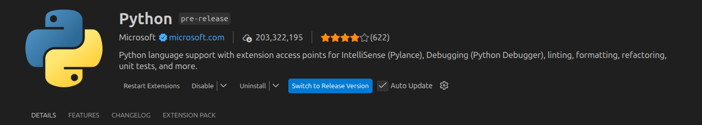
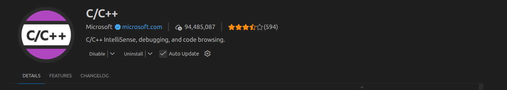
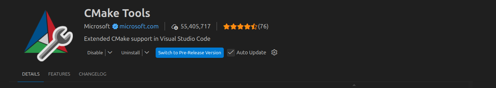
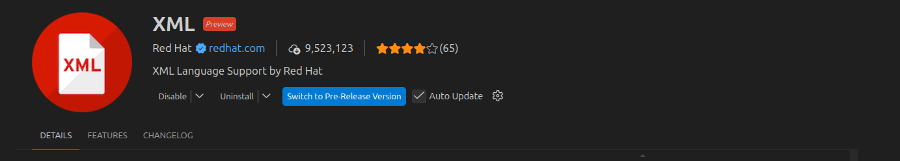
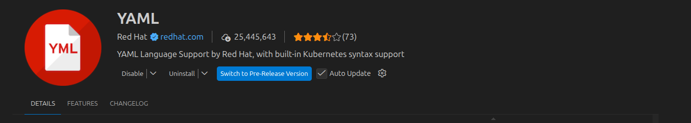
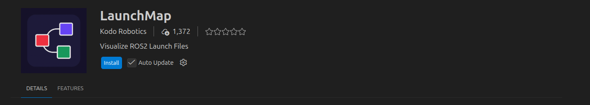

# Linux Basics for ROS 2 Development

---

## Table of Contents

- [Opening of This Repository](#opening-of-this-repository)
- [Why Linux Is Fundamental for ROS 2](#why-linux-is-fundamental-for-ros-2)
  - [Linux as the Execution Layer of ROS 2](#linux-as-the-execution-layer-of-ros-2)
  - [Why Ubuntu Is the Reference Platform](#why-ubuntu-is-the-reference-platform)
  - [Why Terminal-Based Workflows Are Mandatory](#why-terminal-based-workflows-are-mandatory)
  - [Critical Terminal Workflows in ROS 2](#critical-terminal-workflows-in-ros-2)
- [Linux Overview & Scope of This Course](#linux-overview--scope-of-this-course)
  - [What Linux Means in This Course](#what-linux-means-in-this-course)
  - [Ubuntu 24.04 LTS](#ubuntu-2404-lts)
  - [The Terminal as the Control Interface](#the-terminal-as-the-control-interface)
  - [Course Scope](#course-scope)
- [Downloads & System Preparation](#downloads--system-preparation)
  - [Prerequisites](#prerequisites)
  - [🖥 Virtual Machine Setup](#-virtual-machine-setup)
  - [💽 Dual Boot Setup](#-dual-boot-setup)
  - [ROS 2 Jazzy Jalisco Installation](#ros-2-jazzy-jalisco-installation)
- [The .bashrc File](#the-bashrc-file)
  - [What Is .bashrc?](#what-is-bashrc)
  - [When .bashrc Runs](#when-bashrc-runs)
  - [Why ROS 2 Depends on .bashrc](#why-ros-2-depends-on-bashrc)
- [VS Code Installation](#vs-code-installation)
  - [What is VS Code?](#what-is-vs-code)
  - [Why Install It Now?](#why-install-it-now)
  - [Let's Download VS Code](#lets-download-vs-code)
  - [Install VS Code From Terminal](#install-vs-code-from-terminal)
  - [Launch VS Code](#launch-vs-code)
  - [Essential VS Code Extensions for ROS 2](#essential-vs-code-extensions-for-ros-2)
  - [Install All Extensions (Quick Method)](#install-all-extensions-quick-method)
  - [Install Extensions Manually (Alternative)](#install-extensions-manually-alternative)
- [Core Linux Environment Concepts](#core-linux-environment-concepts)
  - [Files vs Folders: Understanding the Linux File System](#files-vs-folders-understanding-the-linux-file-system)
- [Command Line Foundations](#command-line-foundations)
  - [Understanding the Terminal Prompt](#understanding-the-terminal-prompt)
  - [Why the Command Line Exists](#why-the-command-line-exists)
  - [ROS 2 Terminal Workflows](#ros-2-terminal-workflows)
- [Essential ROS 2 Packages Installation](#essential-ros-2-packages-installation)
  - [Controllers + ros2_control](#controllers--ros2_control)
  - [Install MoveIt2](#install-moveit2)
- [Next Steps](#next-steps)
- [Resources](#resources)
  - [Official Documentation](#official-documentation)
  - [Learning Resources](#learning-resources)
  - [Cheat Sheets](#cheat-sheets)
  - [Community](#community)
- [Quick Reference](#quick-reference)
  - [Essential Linux Commands](#essential-linux-commands)
  - [Essential APT Commands](#essential-apt-commands)
  - [Essential ROS 2 Commands](#essential-ros-2-commands)
- [Common Issues and Solutions](#common-issues-and-solutions)
- [Workshop Tips](#workshop-tips)
- [Key Skills Summary](#key-skills-summary)
- [What's Next](#whats-next)
- [Tasks Index](#tasks-index)
- [Contributing](#contributing)
- [License](#license)

---

## Opening of This Repository

Welcome! This course teaches you Linux skills needed for ROS 2 robotics. No prior experience required.

**Who is this for?**
- Never used Linux before? Perfect.
- Starting with ROS 2? You're in the right place.
- Need to control robots from the terminal? Let's do it.

**What we'll cover:**
- Using the terminal (no mouse needed!)
- Creating and managing files
- Installing software packages
- Setting up VS Code for robotics
- Getting ROS 2 ready to work
- Building your first robot workspace

**What you'll learn to do:**
- Navigate Linux using only commands
- Set permissions so hardware works
- Install tools with APT
- Configure VS Code for ROS 2
- Run ROS 2 commands correctly
- Build a complete robotics setup

**How to use this guide:**  
Follow the sections in order. Each one builds on what came before. Do the exercises as you go.

---

## Why Linux Is Fundamental for ROS 2

Let me explain why we're learning Linux to work with ROS 2.

### Linux as the Execution Layer of ROS 2

**Think of it this way:** ROS 2 runs ON TOP of Linux. It needs Linux to work.

Here's what ROS 2 uses from Linux:
- **Processes:** Each ROS 2 node is a Linux process running in the background
- **Communication:** ROS 2 uses Linux tools to share data between nodes
- **File organization:** ROS 2 packages are organized using Linux folder rules
- **Environment setup:** ROS 2 needs Linux environment variables to know where things are
- **Package installation:** We install ROS 2 packages using Linux's APT tool

**Bottom line:** No Linux knowledge = No ROS 2 control.

### Why Ubuntu Is the Reference Platform

**We're using Ubuntu 24.04 LTS specifically. Here's why:**

- **Long support:** 5 years of updates (2024-2029) — your setup won't break
- **Official target:** ROS 2 Jazzy is built FOR Ubuntu 24.04
- **Easy packages:** All ROS 2 tools install smoothly with APT
- **Community help:** Most tutorials assume you're on Ubuntu

**Translation:** Ubuntu 24.04 = Least problems for beginners.

### Why Terminal-Based Workflows Are Mandatory

**Real robotics happens without screens.** Here's the reality:

- **Remote robots:** You connect via SSH — terminal only, no mouse
- **Production systems:** Robots don't have monitors attached
- **Automation:** Scripts run robots automatically — all terminal commands
- **Performance:** Graphics waste CPU power needed for robot control
- **Debugging tools:** ROS 2 diagnostic tools are terminal-based

**The hard truth:** If you can't use the terminal, you can't operate real robots.

### Critical Terminal Workflows in ROS 2

**Everything important happens in the terminal:**

1. **Activating ROS 2:** Type `source setup.bash` before working
2. **Building code:** Run `colcon build` to compile packages
3. **Running nodes:** Launch programs with `ros2 run` and `ros2 launch`
4. **Checking topics:** Inspect data flow with `ros2 topic list`
5. **Managing nodes:** Monitor running nodes with `ros2 node list`
6. **Hardware access:** Fix USB permissions with `sudo` commands

**Remember this:**  
Terminal = Required skill for ROS 2. Not optional.

---

## Linux Overview & Scope of This Course

### What Linux Means in This Course

**Simple definition:** Linux is an operating system (like Windows or macOS), but it's free and open-source.

**Why robotics uses Linux:**
- **Open source:** Change anything to fit your robot
- **Rock solid:** Runs servers and critical systems worldwide
- **Real-time ready:** Can be configured for precise robot control
- **Fast:** Uses less resources than Windows
- **Big community:** Tons of robotics tools and help available

**For this course:** We're learning Linux ONLY to make ROS 2 work. That's it.

### Ubuntu 24.04 LTS

**What is Ubuntu?**  
Ubuntu is a VERSION of Linux. Think of it like: Linux = car brand, Ubuntu = specific model.

**LTS means Long Term Support:**
- 5 years of updates (2024-2029)
- Nothing suddenly breaks
- ROS 2 Jazzy is built specifically for this version

**Translation:** Use Ubuntu 24.04 LTS = Everything works smoothly together.

### The Terminal as the Control Interface

**What is the terminal?**  
It's a window where you type commands. No clicking, no mouse — just keyboard.

**How it works:**
- You type a command
- Press Enter
- The computer does it
- Shows you the result

**In robotics:**  
The terminal is NOT a backup tool. It's THE tool. When you SSH into a robot, there's no screen — only terminal.

**Get used to this idea:** Terminal = Your main robot control center.

### Course Scope

**What we're covering (the essentials):**
- How to move around in the terminal
- Creating and managing files
- Setting file permissions correctly
- Installing software with APT
- Editing text files with nano
- Setting up VS Code for robotics
- Activating ROS 2 environment
- Running basic ROS 2 commands

**What we're NOT covering yet:**
- Writing bash scripts
- Creating ROS 2 packages from scratch
- Writing launch files
- Compiling C++ code
- Using Git for version control
- Advanced kernel tweaks

**Why?** We're building foundations first. Walk before you run.

---

## Downloads & System Preparation

### Prerequisites

**Before starting, make sure you have:**

- ✅ Ubuntu 24.04 LTS installed (VM or dual boot — doesn't matter which)
- ✅ ROS 2 Jazzy Jalisco installed (we'll verify it later)
- ✅ Internet connection working
- ✅ Computer turned on and running
- ✅ Can open a terminal

## 🖥 Virtual Machine Setup

Follow the full setup guide here:

➡️ [Ubuntu 24.04 VirtualBox Installation Guide](VM.md)

## 💽 Dual Boot Setup

Follow the full dual boot installation guide here:

➡️ [Ubuntu 24.04 Dual Boot Installation Guide](Dual_Boot.md)

**Let's test your terminal access right now:**

Press `Ctrl + Alt + T` on your keyboard.

**Or:** Click the application menu and search "Terminal".

**You should see something like:**  
`username@hostname:~$`

**If you see that prompt?** Perfect. You're ready. Let's go.

---

### ROS 2 Jazzy Jalisco Installation

**CRITICAL RULE:** Only use official ROS 2 docs. Random tutorials get outdated fast and break your setup.

**Official installation page:**  
[https://docs.ros.org/en/jazzy/Installation.html](https://docs.ros.org/en/jazzy/Installation.html)

**Why must we use official docs?**
- Keys and links change with each ROS 2 version
- Package names are version-specific
- Third-party guides cause weird errors

#### Let's Install ROS 2 Step by Step

Open the link above and click **"Ubuntu (Debian packages)"**. Follow these steps:

##### Step 1: Set Up Your Locale

**What this does:** Makes sure your system uses UTF-8 encoding (needed for ROS 2).

```bash
locale  # Check current settings

sudo apt update && sudo apt install locales
sudo locale-gen en_US en_US.UTF-8
sudo update-locale LC_ALL=en_US.UTF-8 LANG=en_US.UTF-8
export LANG=en_US.UTF-8

locale  # Verify it worked
```

##### Step 2: Add ROS 2 Software Sources

**What this does:** Tells Ubuntu where to download ROS 2 from.

```bash
# Enable Ubuntu Universe repository
sudo apt install software-properties-common
sudo add-apt-repository universe

# Add ROS 2 security key
sudo apt update && sudo apt install curl -y
sudo curl -sSL https://raw.githubusercontent.com/ros/rosdistro/master/ros.key -o /usr/share/keyrings/ros-archive-keyring.gpg

# Add ROS 2 to your sources list
echo "deb [arch=$(dpkg --print-architecture) signed-by=/usr/share/keyrings/ros-archive-keyring.gpg] http://packages.ros.org/ros2/ubuntu $(. /etc/os-release && echo $UBUNTU_CODENAME) main" | sudo tee /etc/apt/sources.list.d/ros2.list > /dev/null
```

##### Step 3: Install ROS 2 Packages

**Update your package list first:**

```bash
sudo apt update
sudo apt upgrade
```

**Now choose your installation:**

**Option 1: Desktop Install (Recommended for beginners)**

```bash
sudo apt install ros-jazzy-desktop
```

This gives you: ROS 2 + RViz (visualization) + demos + tutorials.

**Option 2: ROS-Base Install (Minimal)**

```bash
sudo apt install ros-jazzy-ros-base
```

This gives you: Just ROS 2 communication libraries. No GUI tools.

**Which should you pick?** Desktop. You'll want RViz for debugging later.

##### Step 4: Activate ROS 2

**Test that it installed:**

```bash
source /opt/ros/jazzy/setup.bash
```

##### Step 5: Verify It Works

```bash
ros2 --help
```

**What you should see:** A list of ROS 2 commands.

**If you see that?** Success! ROS 2 is installed.

**Next:** We'll make ROS 2 activate automatically. Keep reading — it's in the `.bashrc` section below.

---

## The .bashrc File

### What Is .bashrc?

`.bashrc` is a shell configuration file that runs every time a new terminal session is opened. It is located at `~/.bashrc` in your home directory. The leading dot (`.`) makes it a hidden file.

### When .bashrc Runs

`.bashrc` executes automatically when:

- A new terminal window or tab is opened
- An SSH session is established
- A terminal is launched within VS Code

It does NOT run when the system boots or when scripts execute (unless explicitly sourced).

### Why ROS 2 Depends on .bashrc

ROS 2 requires environment variables before commands are available:

- `ROS_DISTRO`: ROS 2 distribution (e.g., `jazzy`)
- `ROS_VERSION`: ROS version (1 or 2)
- `PYTHONPATH`: ROS 2 Python libraries path
- `PATH`: ROS 2 executable directories
- `LD_LIBRARY_PATH`: ROS 2 shared libraries
- Without these variables, commands like `ros2`, `colcon`, and `rviz2` will not be found.

---

## VS Code Installation

### What is VS Code?

**Simple answer:** It's a code editor — your workspace for writing robot programs.

**What it gives you:**
- Colors your code (syntax highlighting)
- Suggests completions as you type
- Built-in terminal (no switching windows)
- Debugging tools
- Git support
- Tons of extensions

**Why VS Code?** It's the industry standard for ROS 2. Python support + C++ support + ROS extensions = perfect robotics IDE.

### Why Install It Now?

**Because you'll use it for everything:**
- Writing ROS 2 nodes (robot programs)
- Creating launch files
- Editing config files
- Debugging your code
- Managing workspaces

**Better to set it up now** than interrupt your flow later.

### Let's Download VS Code

**Official download page:**  
[https://code.visualstudio.com/](https://code.visualstudio.com/)

**Do this:**
1. Open your web browser
2. Go to the link above
3. Click **"Download for Linux"**
4. Select **".deb"** (this is Ubuntu's package format)
5. Save it to your Downloads folder

### Install VS Code From Terminal

**Open terminal and type:**

```bash
cd ~/Downloads
sudo apt install ./code_*.deb -y
```

**What just happened?**
- `cd ~/Downloads` = Go to Downloads folder
- `sudo` = Run as administrator (needed for installation)
- `apt install ./code_*.deb` = Install the package
- `-y` = Automatically say "yes" to prompts

**Check if it worked:**

```bash
code --version
```

**You should see:** Version number, commit hash, and architecture.

**If you see that?** VS Code is installed!

### Launch VS Code

**From terminal:**

```bash
code
```

**From applications menu:**  
Search for "Visual Studio Code" and click it.

---

### Essential VS Code Extensions for ROS 2

**These extensions supercharge VS Code for robotics.**

---

#### 1. Python (Microsoft)
Makes Python coding smooth — debugging, error checking, autocomplete.



---

#### 2. Pylance (Microsoft)
Advanced Python features — faster completions, type checking.


---

#### 3. ROS (Microsoft)
ROS 2 integration — launch file support, URDF previews.


---

#### 4. C/C++ (Microsoft)
C++ support — needed when you write ROS 2 nodes in C++.



---

#### 5. CMake (twxs)
Helps with CMakeLists.txt files used in ROS 2 C++ packages.



---

#### 6. XML (Red Hat)
Highlights and validates package.xml and launch files.



---

#### 7. YAML (Red Hat)
Highlights YAML config files used in ROS 2.



---

#### 8. LaunchMap (launchmap)
Visualize and manage complex launch file systems.




### Install All Extensions (Quick Method)

**Copy and paste these commands into terminal:**

```bash
code --install-extension ms-python.python
code --install-extension ms-python.vscode-pylance
code --install-extension ms-iot.vscode-ros
code --install-extension ms-vscode.cpptools
code --install-extension twxs.cmake
code --install-extension redhat.vscode-xml
code --install-extension redhat.vscode-yaml
code --install-extension eamodio.gitlens
code --install-extension launchmap.launchmap
```

**Watch the terminal** — each extension will install one by one.

### Install Extensions Manually (Alternative)

**If you prefer clicking:**

1. Open VS Code
2. Press `Ctrl + Shift + X` (opens Extensions panel)
3. Search for each extension name
4. Click **Install** on each one

**Important:** Don't configure anything yet. No settings, no Python paths. We'll do that after workspace setup.

---

## Core Linux Environment Concepts

### Files vs Folders: Understanding the Linux File System

#### The Big Picture

**Linux organizes everything in a tree structure.**

- **Files:** Hold data (code, text, images, programs)
- **Folders (Directories):** Hold files and other folders
- **Root:** The top-level folder (`/`) — everything starts here

**Important concept:** In Linux, EVERYTHING is either a file or a folder. Even hardware like USB devices show up as files in `/dev`.

#### The Linux Folder Tree

**Here's how it's organized:**

```
/                           # Root (top of everything)
├── home/                   # User folders live here
│   └── username/           # Your personal folder (same as ~)
│       ├── Documents/
│       ├── Downloads/
│       └── ros2_ws/        # Your ROS 2 workspace
├── opt/                    # Optional software
│   └── ros/jazzy/          # ROS 2 installed here
├── usr/                    # System programs
│   ├── bin/                # Executable programs
│   ├── lib/                # Shared libraries
│   └── local/              # Locally compiled stuff
└── etc/                    # Configuration files
```

**Key folders you'll use:**
- `~` (home) = Your workspace
- `/opt/ros/jazzy/` = Where ROS 2 lives
- `/usr/bin/` = Where commands like `python3` are

#### Let's Build a Real ROS 2 Workspace

**Follow along and type these commands:**

```bash
cd ~
mkdir ros2_workshop
cd ros2_workshop
mkdir -p practice/src/my_robot_pkg    # -p creates parent folders too
cd practice/src/my_robot_pkg
touch package.xml setup.py setup.cfg  # Create empty files
mkdir my_robot_pkg
touch my_robot_pkg/__init__.py        # Makes it a Python package
ls -la                                # List everything
```

**What did we just do?** Created a proper ROS 2 Python package structure.

**Let's visualize the tree:**

```bash
cd ../../..                           # Go up 3 levels
pwd                                   # Check where you are
sudo apt install -y tree              # Install tree viewer
tree                                  # Show the structure
```

**You should see:**

```
.
└── practice
    └── src
        └── my_robot_pkg
            ├── my_robot_pkg
            │   └── __init__.py
            ├── package.xml
            ├── setup.cfg
            └── setup.py

3 directories, 4 files
```

**What each file does:**
- `package.xml` = Package info (name, dependencies, version)
- `setup.py` = Python installation instructions
- `setup.cfg` = Python configuration
- `__init__.py` = Marks the folder as a Python module

**This is standard ROS 2 structure.** You'll create this again when building real packages.

---

## Command Line Foundations

### Understanding the Terminal Prompt

**When you open a terminal, you see something like:**

`username@hostname:~$`

**Let's break it down:**
- `username` = Your login name
- `hostname` = Computer name (often "ubuntu")
- `~` = Current location (home directory)
- `$` = You're a regular user (`#` means root/admin)

**The `~` changes as you move around.** If you're in `/opt/ros`, it shows `/opt/ros` instead.

### Why the Command Line Exists

**Think of the terminal as direct access to the computer's brain.**

**Why robotics engineers live in the terminal:**
- **Precise:** Commands do exactly what you type
- **Repeatable:** Same command = same result every time
- **Automatable:** Write scripts to run tasks automatically
- **Remote-friendly:** Control robots over SSH (no screen needed)
- **Fast:** No graphics overhead
- **Shareable:** Copy/paste exact commands to teammates

**Reality check:** In professional robotics, the terminal isn't optional. It's THE interface.

### ROS 2 Terminal Workflows

**Every ROS 2 task uses the terminal:**

1. **Build your code:** `colcon build`
2. **Run a node:** `ros2 run package_name node_name`
3. **Launch multiple nodes:** `ros2 launch package_name launch_file.py`
4. **Check topics:** `ros2 topic list`, `ros2 topic echo /scan`
5. **Check nodes:** `ros2 node list`, `ros2 node info /my_node`
6. **Set parameters:** `ros2 param list`, `ros2 param set`

**No GUI alternatives exist for most of these.** Terminal skills = robotics skills.

---

## Essential ROS 2 Packages Installation

**Now that ROS 2 is installed, let's add the advanced tools you'll need later.**

These packages extend ROS 2 for real robot control and motion planning. Install them now so they're ready when you need them.

### Controllers + ros2_control

#### What is ros2_control?

**Simple explanation:** It's the framework for controlling robot hardware in ROS 2.

**What it does:**
- Manages robot joints (motors, servos, actuators)
- Handles sensor data from encoders
- Provides standard interfaces for robot control
- Works with simulation AND real hardware

**When you'll use it:** When controlling robot arms, mobile bases, grippers — any robot with moving parts.

#### Why do we need controllers?

**Think of it this way:**
- **Hardware:** Motors that need voltage commands
- **Controllers:** Convert high-level commands (like "move 10cm") into motor voltages
- **ros2_control:** Manages all controllers in one system

**Popular controllers:**
- Joint trajectory controllers (for arms)
- Differential drive controllers (for wheeled robots)
- Gripper controllers (for end effectors)

#### Install ros2_control Now

**Main control framework:**

```bash
sudo apt install \
  ros-jazzy-ros2-control \
  ros-jazzy-ros2-controllers \
  ros-jazzy-controller-manager -y
```

**Build tools (needed when creating custom controllers):**

```bash
sudo apt install ros-jazzy-ros2-control-cmake -y
```

**RQT tools (visualization and debugging):**

```bash
sudo apt install ros-jazzy-rqt ros-jazzy-rqt-gui ros-jazzy-rqt-common-plugins -y
```

**Controller manager GUI:**

```bash
sudo apt install ros-jazzy-rqt-controller-manager -y
```

**What did we just install?**
- The control framework itself
- Pre-built controllers for common tasks
- Tools to manage and switch controllers
- GUI for debugging control systems

### Install MoveIt2

#### What is MoveIt2?

**Simple explanation:** It's a motion planning framework for robot arms.

**What it does:**
- Plans collision-free paths for robot arms
- Handles inverse kinematics (figuring out joint angles)
- Avoids obstacles automatically
- Works with pick-and-place tasks

**When you'll use it:** Manipulator robots, robotic arms, pick-and-place systems.

**Think of it like GPS for robot arms** — you tell it where to go, it figures out the safe path.

#### Install MoveIt2 Now

```bash
sudo apt install ros-jazzy-moveit -y
```

**This installs:**
- Motion planning libraries
- Collision detection
- Inverse kinematics solvers
- Integration with RViz for visualization

**Note:** MoveIt2 is complex. We're just installing it now. You'll learn to use it in later robotics courses.

---

## Next Steps

**Congratulations! You've built your foundation.**

**Here's what you can do now:**
- ✅ Navigate Linux with the terminal
- ✅ Install software packages with APT
- ✅ Edit files with nano
- ✅ Use VS Code with ROS 2 extensions
- ✅ Activate ROS 2 automatically in every terminal
- ✅ Understand Linux file system structure
- ✅ Run basic ROS 2 commands

**Where to go from here:**
- Create your first ROS 2 package
- Learn `colcon build` workflow
- Write Python nodes (publishers and subscribers)
- Author launch files for multi-node systems
- Build C++ nodes for performance
- Use Git to manage your robot code

**Remember:** You just learned the essentials. Everything else builds on this foundation.

**Keep practicing. You're ready for real ROS 2 development!**

---

## Resources

### Official Documentation

- [ROS 2 Official Documentation](https://docs.ros.org/en/jazzy/)
- [ROS 2 Installation Guide (Ubuntu)](https://docs.ros.org/en/jazzy/Installation/Ubuntu-Install-Debs.html)
- [VS Code Linux Setup](https://code.visualstudio.com/docs/setup/linux)

### Learning Resources

- [Linux Journey](https://linuxjourney.com/)
- [The Linux Command Line (free book)](http://linuxcommand.org/tlcl.php)
- [ROS 2 Tutorials](https://docs.ros.org/en/jazzy/Tutorials.html)

### Cheat Sheets

- [Linux Cheat Sheet (PDF)](https://drive.google.com/file/d/1vddIJlermV-xZ7TZ8eSUCvzHKv_Poj2A/view)
- [ROS 2 Cheat Sheet (PDF)](https://drive.google.com/file/d/1vlimFy3CSk26AfZjB73rtG6GKqPZVUT9/view)

### Community

- [ROS Discourse](https://discourse.ros.org/)
- [ROS Answers](https://answers.ros.org/)

---

## Quick Reference

### Essential Linux Commands

```bash
pwd                        # Print working directory
ls                         # List files
ls -la                     # List all files with details
cd [directory]             # Change directory
cd ~                       # Go to home directory
cd ..                      # Go up one level
mkdir [name]               # Create directory
mkdir -p [path]            # Create nested directories
touch [file]               # Create empty file
echo "text" > [file]       # Write text to file
cat [file]                 # Display file contents
nano [file]                # Edit file
cp [source] [dest]         # Copy file
cp -r [source] [dest]      # Copy directory
mv [source] [dest]         # Move or rename
rm [file]                  # Delete file
rm -r [directory]          # Delete directory
chmod +x [file]            # Make file executable
chmod 755 [file]           # Set permissions (rwxr-xr-x)
```

### Essential APT Commands

```bash
sudo apt update            # Update package lists
sudo apt upgrade           # Upgrade installed packages
sudo apt install [pkg]     # Install package
sudo apt remove [pkg]      # Uninstall package
sudo apt autoremove        # Remove unused dependencies
apt search [keyword]       # Search for packages
apt show [pkg]             # Show package information
apt list --installed       # List installed packages
```

### Essential ROS 2 Commands

```bash
source /opt/ros/jazzy/setup.bash    # Source ROS 2 environment
ros2 --version                      # Check ROS 2 version
ros2 run [pkg] [node]               # Run a node
ros2 launch [pkg] [launch]          # Launch nodes from file
ros2 node list                      # List active nodes
ros2 node info [node]               # Show node information
ros2 topic list                     # List active topics
ros2 topic echo [topic]             # Display topic messages
ros2 topic pub [topic] [msg] [data] # Publish to topic
ros2 pkg list                       # List installed packages
ros2 pkg create [name]              # Create new package
```

---

## Common Issues and Solutions

| Issue | Cause | Solution |
|-------|-------|----------|
| `ros2: command not found` | ROS 2 environment not sourced | Run `source /opt/ros/jazzy/setup.bash` |
| `sudo` asks for password repeatedly | Incorrect password | Re-enter correct user password |
| `apt update` fails | No network connection | Check network connectivity |
| VS Code won't launch | Installation incomplete | Run `sudo apt install ./code_*.deb -y` again |
| `tree` command not found | Package not installed | Run `sudo apt install -y tree` |
| Permission denied when running script | No execute permission | Run `chmod +x script.sh` |
| File not found error | Incorrect path or typo | Verify path with `ls` and `pwd` |
| Turtlesim window doesn't appear | Package not installed | Run `sudo apt install ros-jazzy-turtlesim` |

---

## Workshop Tips

- **Tab completion**: Autocomplete file/directory names to prevent typos
- **Check location**: Run `pwd` to confirm correct directory before executing commands
- **Verify output**: Check command output to ensure operation succeeded
- **Read errors**: Error messages explain what went wrong and how to fix it
- **Practice regularly**: Terminal skills improve with consistent practice
- Some tasks may be completed outside of the session
- TAB completion prevents typing errors and saves time
- `pwd` confirms your current location before executing commands
- Always verify the output of a command before proceeding

---

## Key Skills Summary

Upon completion, you will be able to:

- Navigate file system (`cd`, `ls`, `pwd`)
- Create and organize files/directories (`touch`, `mkdir`, `cp`, `mv`)
- Edit files (`nano`)
- Manage file permissions (`chmod`)
- Install and manage packages (APT)
- Configure VS Code for ROS 2
- Source ROS 2 environment via `.bashrc`
- Verify ROS 2 installation and run basic commands
- Inspect nodes and topics using `ros2` CLI tools

By the end of this session, you should be able to:

- Navigate the file system using `cd`, `ls`, and `pwd`
- Create files and directories using `touch` and `mkdir`
- Organize files using `cp` and `mv`
- Install software using APT
- Use VS Code as a code editor

---

## What's Next

**Next session topics:**

- ROS 2 concepts: nodes, topics, messages, services
- Creating your first ROS 2 package
- Writing publisher and subscriber nodes
- Understanding ROS 2 computational graph
- Launching multiple nodes with launch files

**Prerequisites:**

- All tasks in this session completed
- VS Code configured with extensions
- ROS 2 environment sourced automatically
- Turtlesim successfully tested

The next session will cover:

- ROS 2 environment sourcing
- ROS 2 concepts (nodes, topics, messages)
- Creating ROS 2 packages
- Writing ROS 2 nodes

> Ensure all tasks in this session are completed before proceeding.

---

## Tasks Index

All hands-on tasks are located in the [tasks/](tasks/) directory:

- **[tasks/task.md](tasks/task.md)** - Final comprehensive task with submission requirements

---

## Contributing

**Want to improve this course?** Contributions are welcome!

Keep the hands-on, beginner-friendly style. No jargon. Clear steps. Real examples.

## License

This course is for educational use.

---

**Now go build robots! 🤖** 