# Ubuntu 24.04 Installation on VirtualBox

**Document Version:** 1.0 &nbsp;|&nbsp; **Last Updated:** February 2026 &nbsp;|&nbsp; **Target:** Ubuntu 24.04 LTS · ROS 2 Jazzy Jalisco · VirtualBox 7.0+

---

## Table of Contents

1. [Introduction](#introduction)
2. [Before You Start](#before-you-start)
3. [Key Terms Explained](#key-terms-explained)
4. [System Requirements](#system-requirements)
5. [Part 1 — Install VirtualBox](#part-1--install-virtualbox)
   - [Step 1: Download Ubuntu 24.04](#step-1--download-ubuntu-2404)
   - [Step 2: Open the VirtualBox Website](#step-2--open-the-virtualbox-website)
   - [Step 3: Download VirtualBox](#step-3--download-virtualbox)
   - [Step 4: Run the VirtualBox Installer](#step-4--run-the-virtualbox-installer)
   - [Step 5: Confirm the Installation Warning](#step-5--confirm-the-installation-warning)
   - [Step 6: Complete the Installation](#step-6--complete-the-installation)
   - [Step 7: Finish and Launch VirtualBox](#step-7--finish-and-launch-virtualbox)
6. [Part 2 — Create and Configure the Virtual Machine](#part-2--create-and-configure-the-virtual-machine)
   - [Step 8: Create a New Virtual Machine](#step-8--create-a-new-virtual-machine)
   - [Step 9: Name Your VM and Attach the ISO](#step-9--name-your-vm-and-attach-the-iso)
   - [Step 10: Set the RAM and CPU](#step-10--set-the-ram-and-cpu)
   - [Step 11: Create a Virtual Hard Disk](#step-11--create-a-virtual-hard-disk)
   - [Step 12: Review and Finish VM Creation](#step-12--review-and-finish-vm-creation)
   - [Step 13: Open VM Settings](#step-13--open-vm-settings)
   - [Step 14: System Settings — Motherboard Tab](#step-14--system-settings--motherboard-tab)
   - [Step 15: System Settings — Processor Tab](#step-15--system-settings--processor-tab)
   - [Step 16: Display Settings](#step-16--display-settings)
   - [Step 17: Storage Settings — Attach the ISO](#step-17--storage-settings--attach-the-iso)
   - [Step 18: Network Settings](#step-18--network-settings)
   - [Step 19: Verify Your VM Settings](#step-19--verify-your-vm-settings)
7. [Part 3 — Install Ubuntu](#part-3--install-ubuntu)
   - [Step 20: Start the Virtual Machine](#step-20--start-the-virtual-machine)
   - [Step 21: Select "Try or Install Ubuntu"](#step-21--select-try-or-install-ubuntu)
   - [Step 22: Choose Your Language](#step-22--choose-your-language)
   - [Step 23: Accessibility Options](#step-23--accessibility-options)
   - [Step 24: Select Your Keyboard Layout](#step-24--select-your-keyboard-layout)
   - [Step 25: Connect to the Internet](#step-25--connect-to-the-internet)
   - [Step 26: Choose Installation Type](#step-26--choose-installation-type)
   - [Step 27: Select Installation Options](#step-27--select-installation-options)
   - [Step 28: Choose What to Install](#step-28--choose-what-to-install)
   - [Step 29: Install Third-Party Software](#step-29--install-third-party-software)
   - [Step 30: Disk Setup](#step-30--disk-setup)
   - [Step 31: Create Your User Account](#step-31--create-your-user-account)
   - [Step 32: Choose Your Timezone](#step-32--choose-your-timezone)
   - [Step 33: Review and Begin Installation](#step-33--review-and-begin-installation)
   - [Step 34: Installation Complete — Restart](#step-34--installation-complete--restart)
   - [Step 35: Ubuntu is Ready](#step-35--ubuntu-is-ready)
8. [After Installation Checklist](#after-installation-checklist)
9. [Taking a Snapshot (Important)](#taking-a-snapshot-important)
10. [Common Mistakes](#common-mistakes)
11. [Troubleshooting Quick Fixes](#troubleshooting-quick-fixes)
12. [What's Next — ROS 2 Installation](#whats-next--ros-2-installation)
13. [Additional Resources](#additional-resources)

---

## Introduction

### What You Will Achieve

By the end of this guide, you will have a fully working Ubuntu 24.04 Linux environment running inside your existing computer. This environment is completely separate from your main operating system — you can safely experiment, break things, and start over without any risk to your personal files.

### Why This Matters for ROS 2

ROS 2 (Robot Operating System 2) is the industry-standard framework for robotics development. It runs natively on Ubuntu Linux. Rather than replacing your current operating system, you will run Ubuntu inside a **virtual machine** — a safe, isolated workspace that sits inside your Windows or macOS computer like an app.

Setting up this environment is your first real step into the world of robotics software. Everything you build in this course will happen inside this virtual machine.

### Estimated Time

- **Installing VirtualBox:** 10–15 minutes
- **Configuring the virtual machine:** 10–15 minutes
- **Installing Ubuntu:** 20–30 minutes
- **Total:** approximately 45–60 minutes

### What You Need Before Starting

- A computer running Windows, macOS, or Linux
- At least 8 GB of RAM (16 GB or more is recommended)
- At least 60 GB of free disk space
- A stable internet connection
- About one hour of uninterrupted time

---

## Before You Start

Work through this checklist before proceeding. Each item matters.

- [ ] My computer has at least **8 GB of RAM**
- [ ] I have at least **60 GB of free disk space** available
- [ ] I am connected to the **internet**
- [ ] I have **closed unnecessary applications** to free up memory
- [ ] I have **downloaded the Ubuntu 24.04 ISO file** (see Step 1)
- [ ] I understand that this process will **not affect my personal files** — it only creates a virtual disk

> ✅ If all boxes are checked, you are ready to begin.

---

## Key Terms Explained

You will encounter these terms throughout the guide. Here is what each one means:

**Virtual Machine (VM):** A computer running inside your computer. It behaves like a real PC, but it is completely contained in software. Think of it as a safe sandbox.

**ISO File:** A single file that contains a complete operating system installer — like a digital version of a DVD. You will use the Ubuntu ISO file to install Ubuntu inside the virtual machine.

**Virtual Disk:** A large file on your computer that the virtual machine uses as its own internal hard drive. It does not affect your real hard drive in any way.

**NAT Network:** A networking mode that lets the virtual machine access the internet through your computer's connection, without being directly exposed to your network. It is the safest and simplest option for beginners.

---

## System Requirements

| Setting | Minimum | Recommended |
|---|---|---|
| RAM | 8 GB | 16 GB or more |
| CPU | 2 physical cores | 4 physical cores |
| Free Disk Space | 60 GB | 80 GB or more |
| Operating System | Windows 10, macOS 11, or Ubuntu 20.04+ | Latest version |

---

## Part 1 — Install VirtualBox

---

### Step 1 — Download Ubuntu 24.04

Go to the official Ubuntu website and download the Ubuntu 24.04 ISO file.

Visit: [https://ubuntu.com/download/desktop](https://ubuntu.com/download/desktop)

The downloaded file will be named something like `ubuntu-24.04-desktop-amd64.iso`. Save it somewhere you can easily find it — your Desktop or Downloads folder works well.

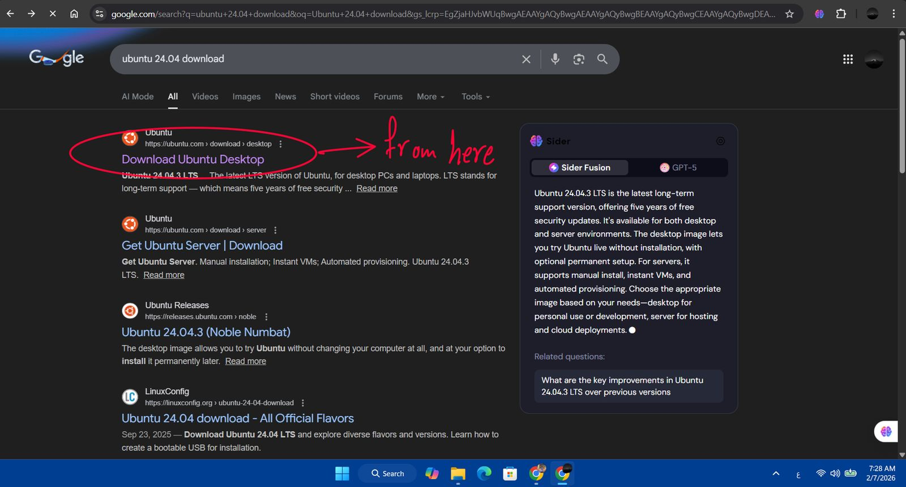

---

### Step 2 — Open the VirtualBox Website

Go to the official VirtualBox website to find the installer.

Visit: [https://www.virtualbox.org/wiki/Downloads](https://www.virtualbox.org/wiki/Downloads)

Select the download link that matches your operating system: Windows, macOS, or Linux.

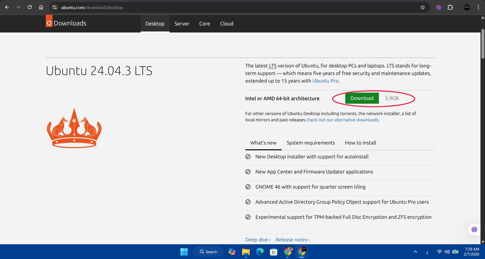

---

### Step 3 — Download VirtualBox

Click the download link for your operating system. The file will begin downloading automatically. Wait for it to finish completely before moving on.

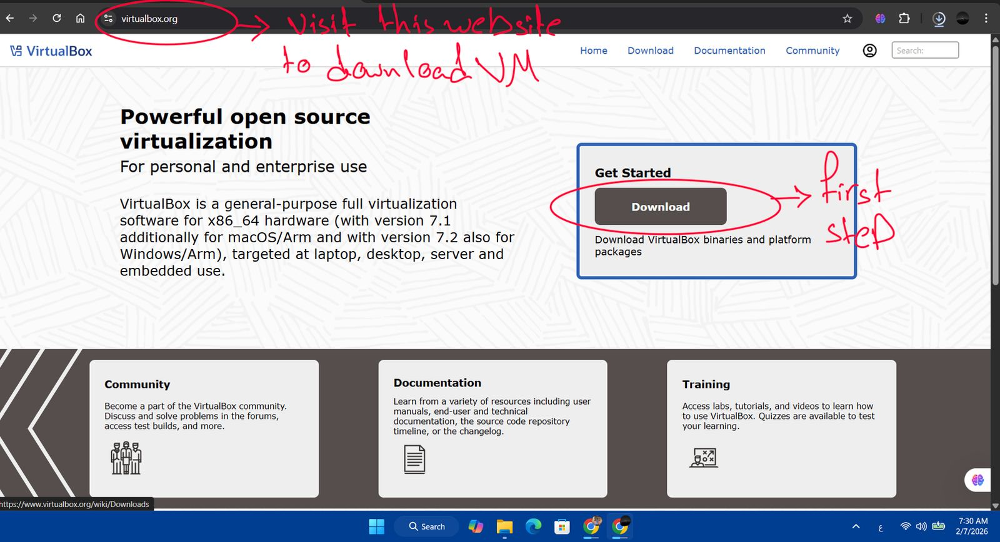

---

### Step 4 — Run the VirtualBox Installer

Open the downloaded installer file. Follow the on-screen steps and keep all the default options selected. Click **Next** to advance through each screen until the installation begins.

💡 You do not need to change any of the default installer settings. The defaults are correct.

---

### Step 5 — Confirm the Installation Warning

During installation, a warning may appear saying your network connection will be temporarily interrupted. This is completely normal. It means VirtualBox is setting up a virtual network adapter.

Click **Yes** to continue.

> ✅ This temporary interruption is expected. Your internet connection will be restored automatically once installation finishes.

---

### Step 6 — Complete the Installation

Click **Install** to begin copying files to your computer. A progress bar will appear. This may take a few minutes — please wait for it to complete without closing the window.

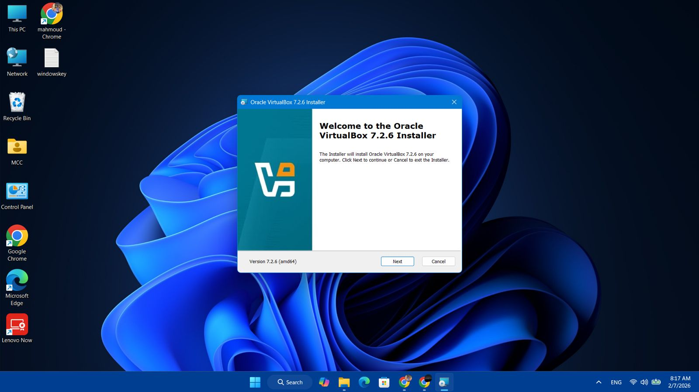

---

### Step 7 — Finish and Launch VirtualBox

When the progress bar finishes, click **Finish**. VirtualBox will open automatically.

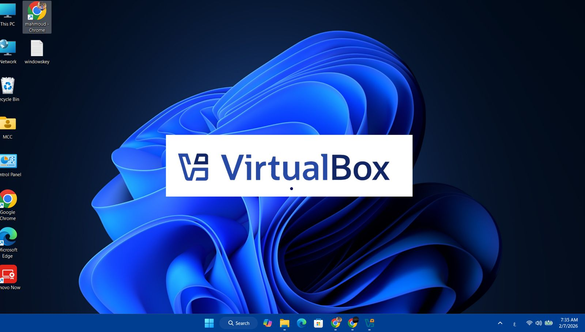

> ✅ If you can see the VirtualBox Manager window, Part 1 is complete. VirtualBox is installed and ready.

---

## Part 2 — Create and Configure the Virtual Machine

This section creates and configures the virtual machine that will run Ubuntu. Pay close attention to each setting — incorrect values here are the most common cause of problems during installation.

---

### Step 8 — Create a New Virtual Machine

In the VirtualBox Manager window, click the **New** button. A setup wizard will appear to walk you through the creation process.

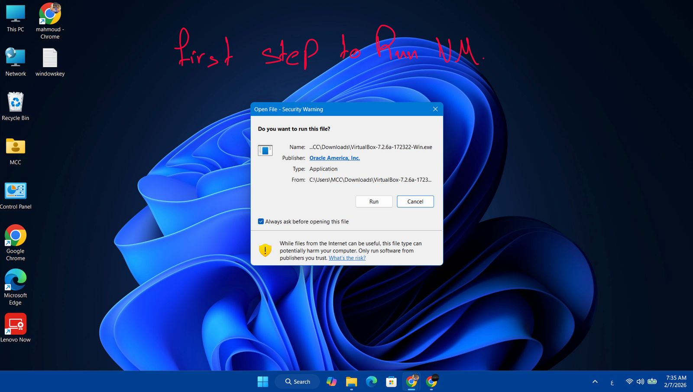

---

### Step 9 — Name Your VM and Attach the ISO

Fill in the following fields:

- **Name:** Give your virtual machine a recognizable name, such as `Ubuntu-24.04`
- **ISO Image:** Click the dropdown and browse to select the Ubuntu ISO file you downloaded in Step 1
- **Skip Unattended Installation:** Make sure this box is **checked**

> ⚠️ If you do not check **Skip Unattended Installation**, the setup process will run differently and may cause issues. Always check this box.

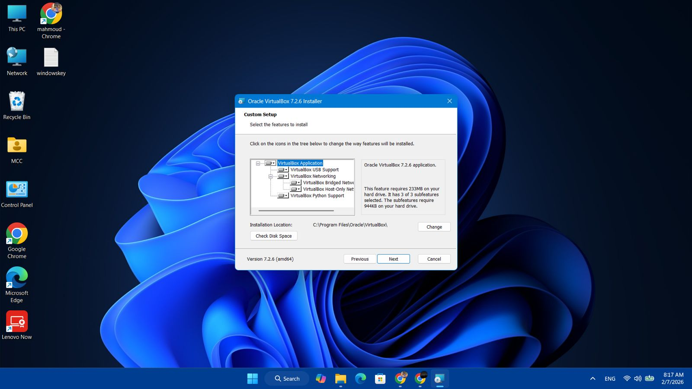

---

### Step 10 — Set the RAM and CPU

Configure the memory and processor based on your computer's specifications:

**Memory (RAM):**
- If your computer has 8 GB of RAM → set **4096 MB**
- If your computer has 16 GB of RAM → set **6144 MB**

**CPU Cores:**
- Set to **2 or more**
- Stay within the **green zone** shown on the slider

> ⚠️ Do not allocate more than half of your total RAM or CPU cores. Doing so can cause both your virtual machine and your main computer to slow down significantly.

---

### Step 11 — Create a Virtual Hard Disk

Select **Create a Virtual Hard Disk Now**. Set the disk size to **50 GB**. This gives Ubuntu enough space for the operating system, your course files, and ROS 2.

Click **Next** to continue.

💡 This virtual disk is just a file on your computer. It will not immediately take up 50 GB — it grows gradually as you use it.

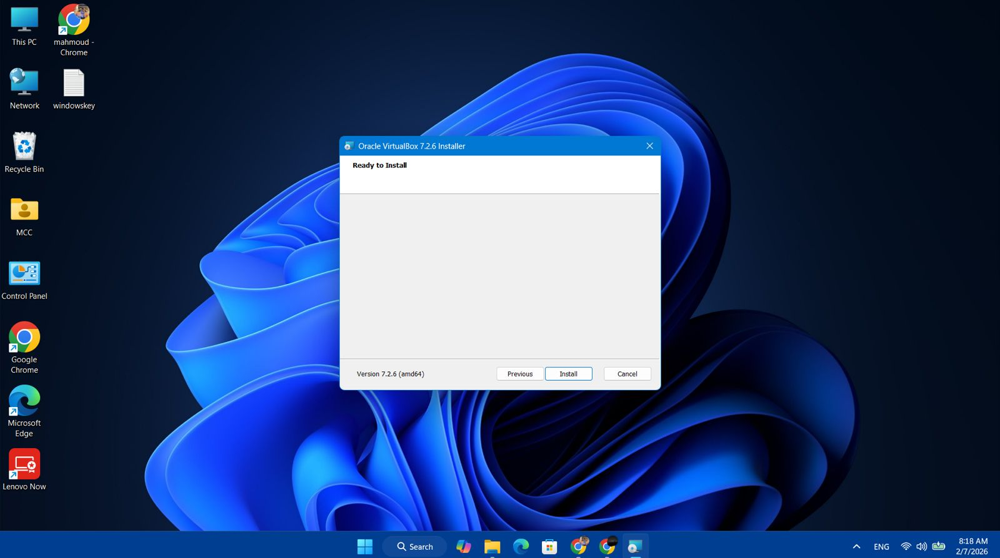

---

### Step 12 — Review and Finish VM Creation

A summary screen will show all your chosen settings. Take a moment to review them, then click **Finish** to create the virtual machine.

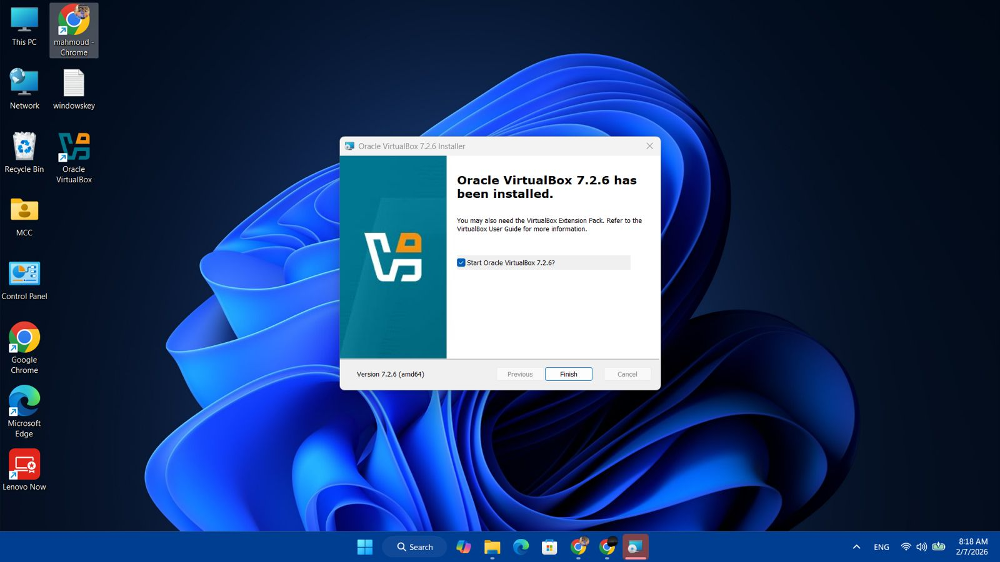

> ✅ Your virtual machine now appears in the VirtualBox Manager list on the left side. It has been created but not yet configured or started.

---

### Step 13 — Open VM Settings

Before starting the virtual machine, you need to adjust a few important settings. Click on your newly created VM to select it, then click the **Settings** icon (the gear icon).

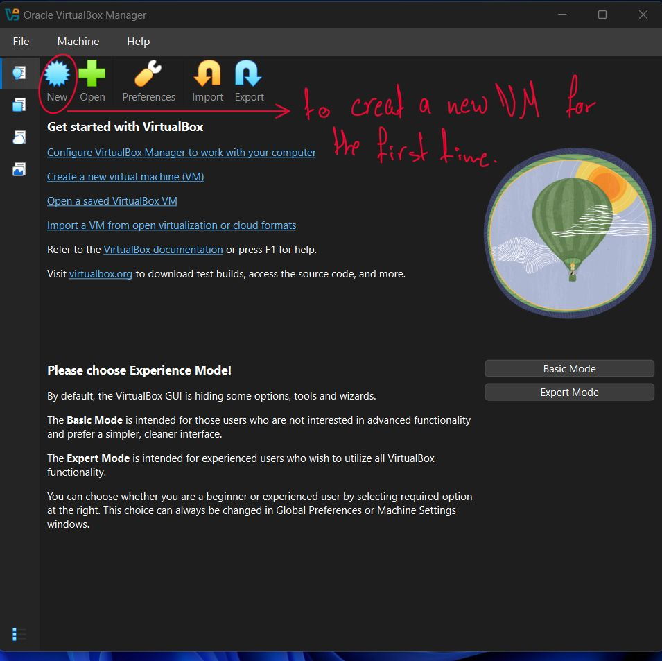

---

### Step 14 — System Settings — Motherboard Tab

Navigate to **Settings → System → Motherboard**.

Make the following changes:

- **Boot Order:** Ensure **Optical** is listed first and **Hard Disk** is second. Use the arrows to reorder if needed.
- **Enable EFI:** Make sure this is **unchecked** (turned OFF)

> ⚠️ Leaving EFI enabled is one of the most common causes of installation failure. Always confirm it is turned OFF before proceeding.

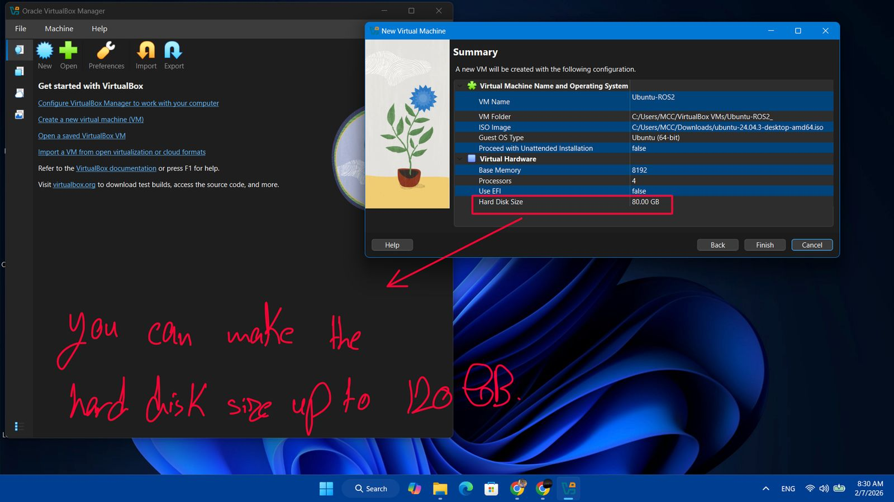

---

### Step 15 — System Settings — Processor Tab

Navigate to **Settings → System → Processor**.

Make the following changes:

- **Number of Processors:** Set to **2 or more** (stay within the green zone)
- **Enable PAE/NX:** Make sure this is **checked** (turned ON)

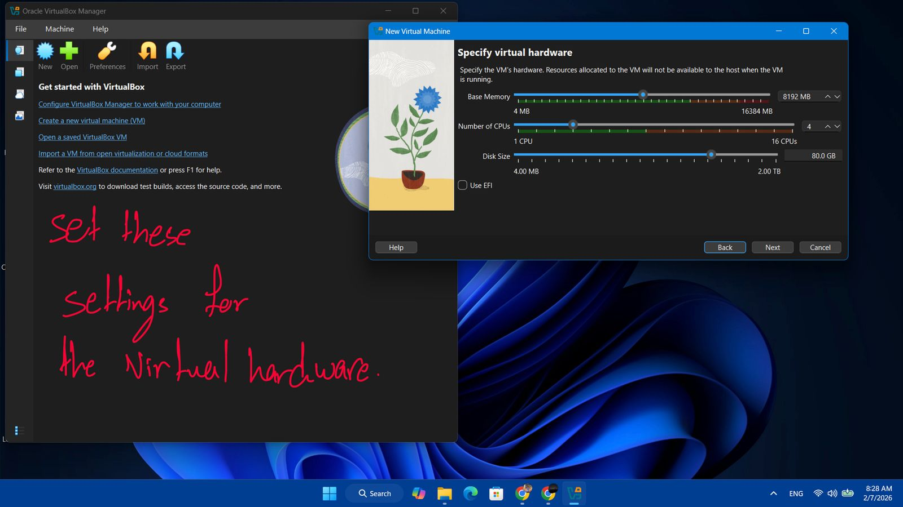

---

### Step 16 — Display Settings

Navigate to **Settings → Display → Screen**.

Make the following changes:

- **Video Memory:** Drag the slider all the way to the right to set **128 MB**
- **Graphics Controller:** Set to **VMSVGA**
- **Enable 3D Acceleration:** Make sure this is **unchecked** (turned OFF)

> ⚠️ These display settings are critical. Using the wrong graphics controller or enabling 3D Acceleration are frequent causes of black screens and VM crashes.

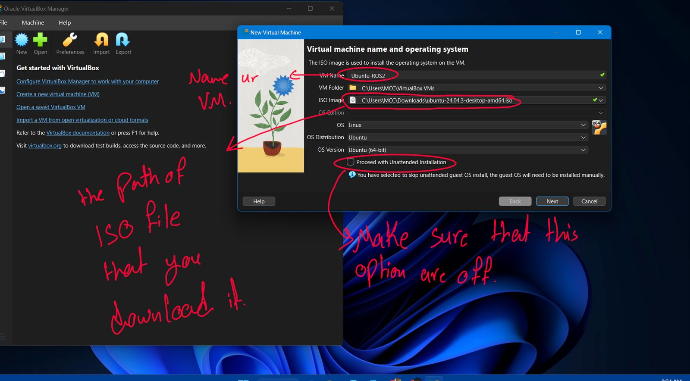

---

### Step 17 — Storage Settings — Attach the ISO

Navigate to **Settings → Storage**.

In the storage tree, click on the **Empty** item listed under Controller: IDE (the optical drive icon). On the right-hand panel, click the small **CD icon** and choose your downloaded Ubuntu ISO file.

This tells the virtual machine to boot from the Ubuntu installer when it starts for the first time.

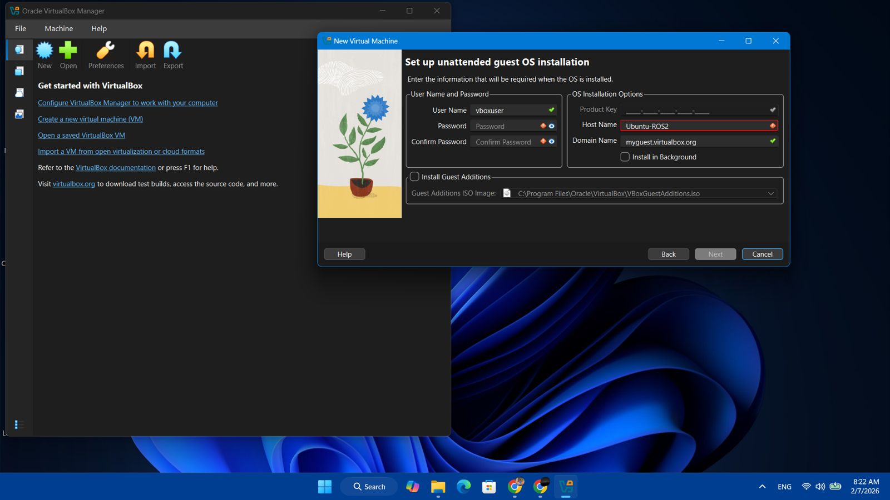

---

### Step 18 — Network Settings

Navigate to **Settings → Network**.

Confirm the following:

- **Adapter 1** is **enabled**
- The connection type is set to **NAT**

Click **OK** to save all your settings.

💡 NAT mode gives your virtual machine internet access through your computer's existing connection. No additional configuration is needed.

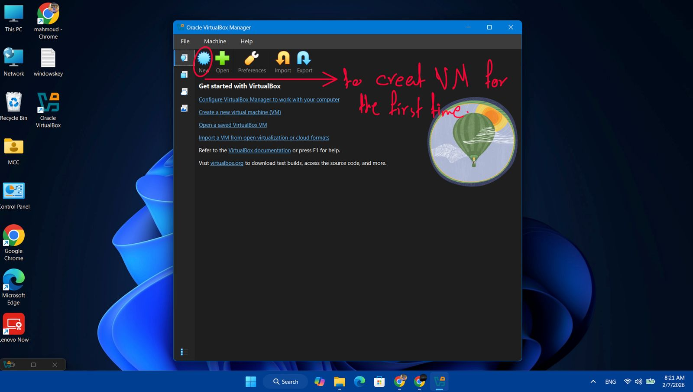

---

### Step 19 — Verify Your VM Settings

Before starting the virtual machine, take a moment to confirm your settings against these two reference images.

**VM19-1** shows the correct **System** settings:
- EFI is **disabled**
- Boot order is correct (Optical first, Hard Disk second)

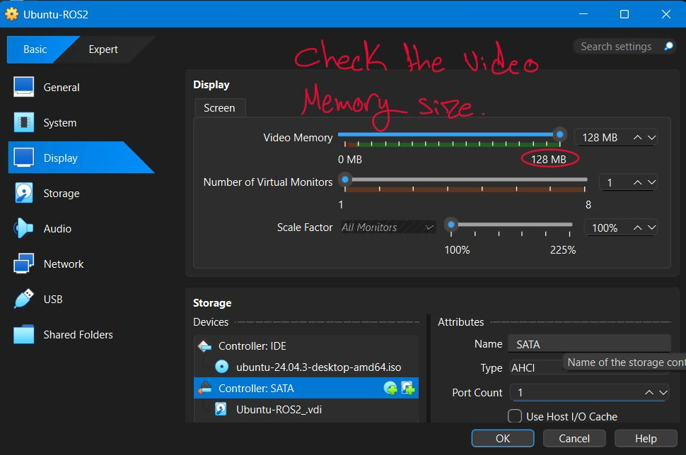

**VM19-2** shows the correct **Display** settings:
- Video Memory is **128 MB**
- Graphics Controller is **VMSVGA**
- 3D Acceleration is **disabled**

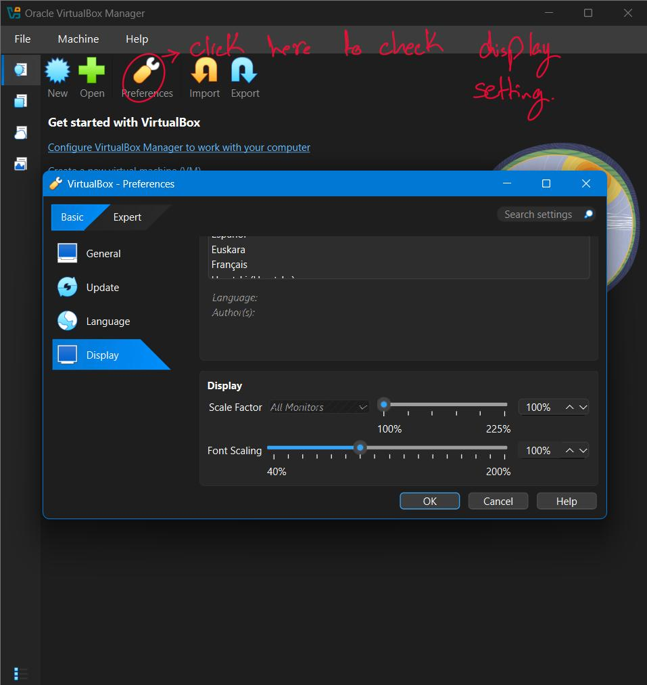

> ✅ If your settings match both screenshots, your virtual machine is correctly configured and ready to start.

---

## Part 3 — Install Ubuntu

---

### Step 20 — Start the Virtual Machine

Click the **Start** button (the green arrow) in the VirtualBox Manager. A new window will open. This is your virtual machine booting for the first time. You will see a black screen with text — this is normal.

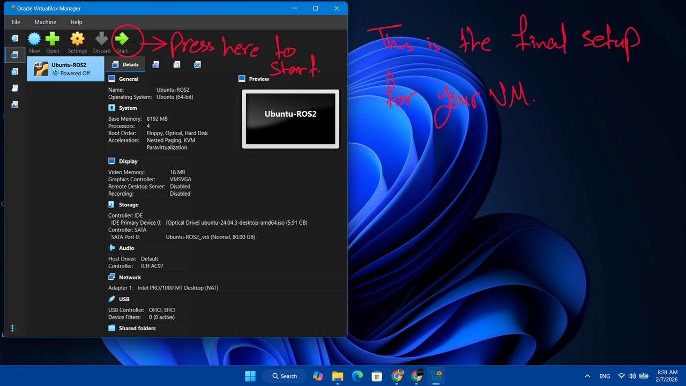

---

### Step 21 — Select "Try or Install Ubuntu"

The Ubuntu boot menu will appear with a list of options. Use the arrow keys to highlight **Try or Install Ubuntu** and press **Enter**.

Wait a moment for the Ubuntu installer to load. This can take up to a minute.

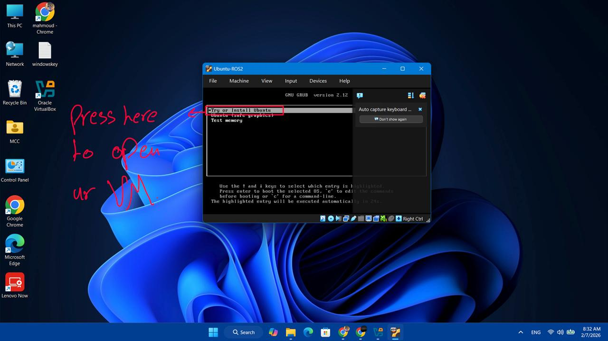

> ✅ If you see this screen, your virtual machine has successfully booted from the ISO file. Everything is working correctly.

---

### Step 22 — Choose Your Language

The Ubuntu installer will open with a language selection screen. Select your preferred language — **English** is recommended for this course. Click **Next**.

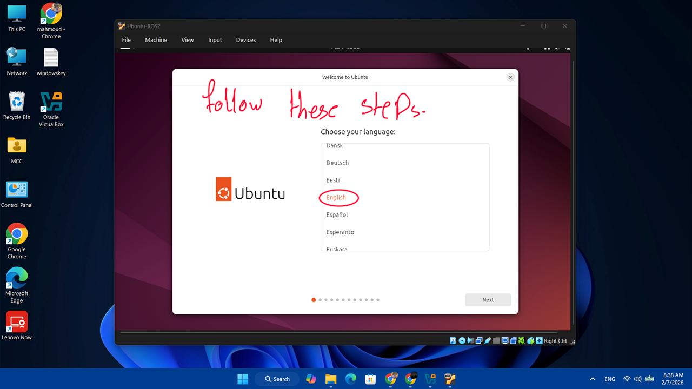

---

### Step 23 — Accessibility Options

This screen presents optional accessibility settings such as screen magnification and text-to-speech. You do not need to enable anything here unless you require these features.

Click **Next** to continue.

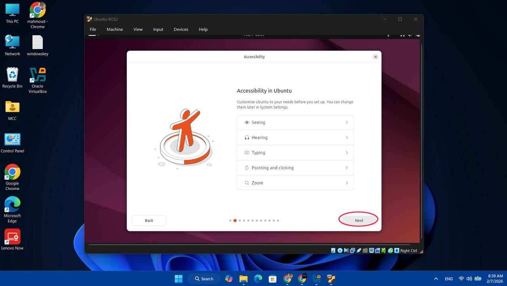

---

### Step 24 — Select Your Keyboard Layout

Choose the keyboard layout that matches your physical keyboard. If you are unsure, leave the default selection. You can test your keyboard in the text field provided on this screen.

Click **Next** to continue.

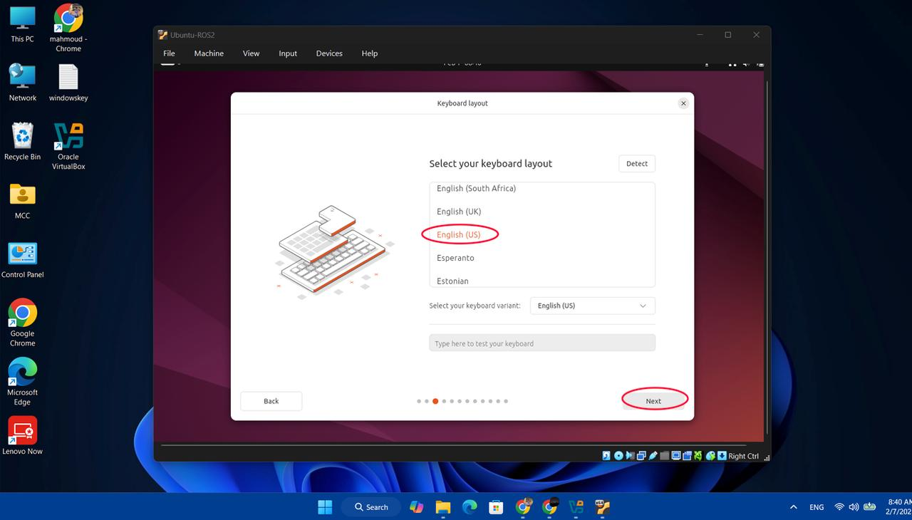

---

### Step 25 — Connect to the Internet

If prompted to connect to the internet, select your network or choose **Use wired connection**. An internet connection allows Ubuntu to download the latest updates and drivers during installation, which is recommended.

💡 If no connection appears, you can skip this step and connect later from within Ubuntu.

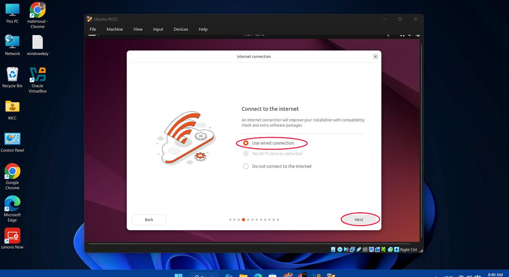

---

### Step 26 — Choose Installation Type

Select **Install Ubuntu** (not "Try Ubuntu"). Choosing "Try Ubuntu" runs Ubuntu temporarily without installing it — that is not what you want here.

Click **Next** to continue.

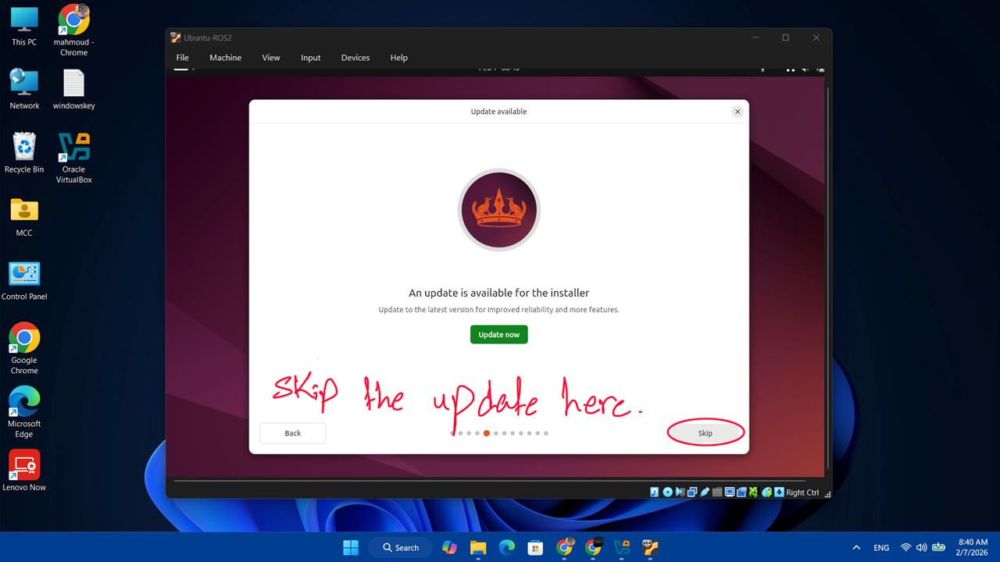

---

### Step 27 — Select Installation Options

Choose **Interactive installation**. This walks you through the setup manually and gives you full control over your configuration.

Click **Next** to continue.

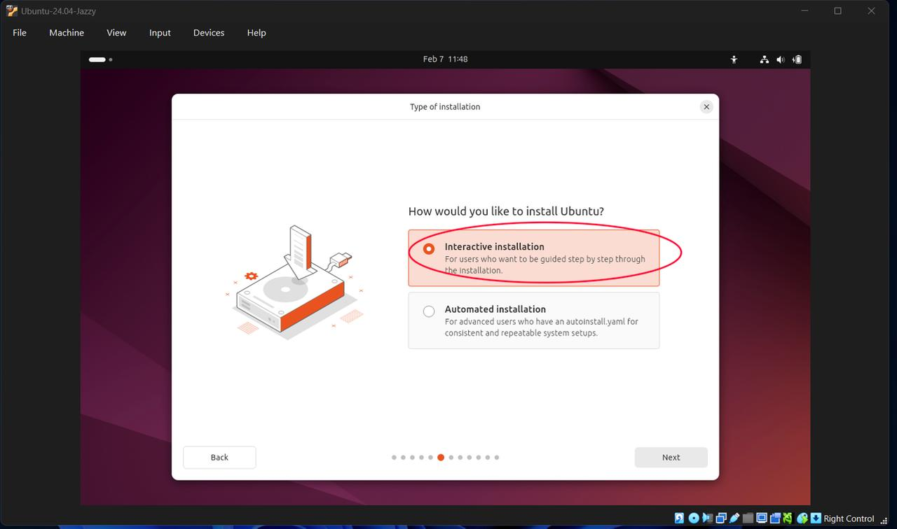

---

### Step 28 — Choose What to Install

Select **Default selection**. This installs a standard set of applications and tools — exactly what you need for this course.

Click **Next** to continue.

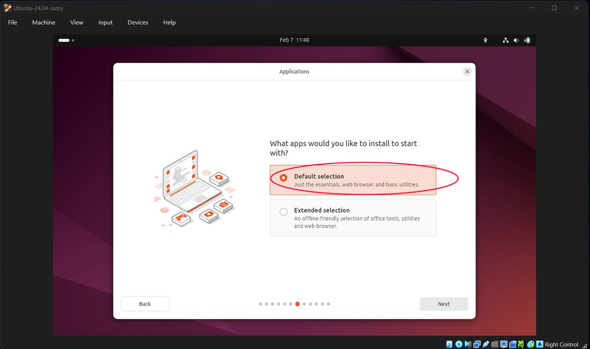

---

### Step 29 — Install Third-Party Software

Check both boxes on this screen to install third-party software and download updates during installation. This improves hardware compatibility and ensures your system is up to date from the start.

Click **Next** to continue.

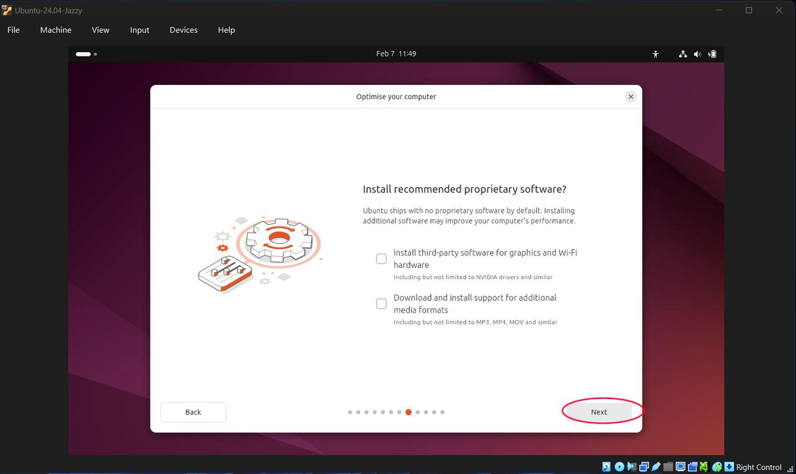

---

### Step 30 — Disk Setup

Select **Erase disk and install Ubuntu**.

> ✅ This only erases the **virtual disk** you created in Step 11 — not your real computer's hard drive. Your personal files and operating system are completely safe.

Click **Next** to continue.

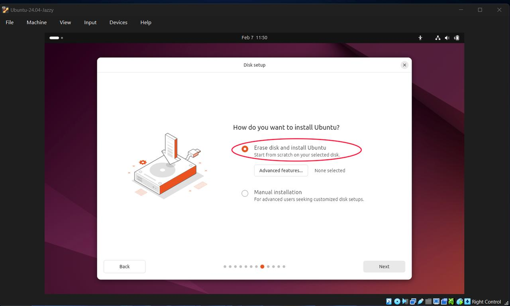

---

### Step 31 — Create Your User Account

Fill in the following fields carefully. You will use this information every time you log in:

- **Your name:** Your full name
- **Computer name:** A simple label for this machine, such as `ubuntu-vm`
- **Username:** A short, lowercase name with no spaces (example: `student`)
- **Password:** Choose a password you will remember

> ⚠️ Write your username and password down somewhere safe. You will need them every time you start your virtual machine.

Click **Next** to continue.

---

### Step 32 — Choose Your Timezone

Select your timezone from the map or use the search field to find your location. This ensures your clock and system time are correct.

Click **Next** to continue.

---

### Step 33 — Review and Begin Installation

A final summary screen will show all your chosen settings. Review each item. If everything looks correct, click **Install** to begin.

The installation will take approximately 10–20 minutes depending on your computer speed and internet connection. Do not close the window or shut down your computer during this process.

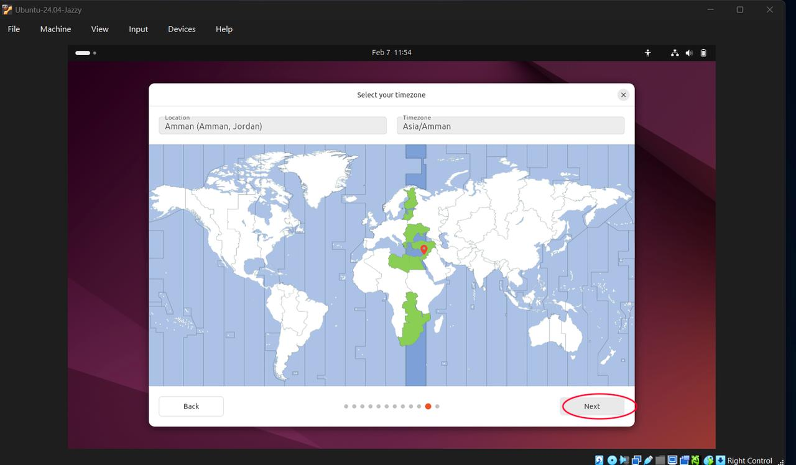

---

### Step 34 — Installation Complete — Restart

When the installation finishes, a message will appear confirming it is complete. Click **Restart Now**.

When the screen prompts you to "remove the installation medium and press Enter," do the following:

1. In the VirtualBox menu bar, go to **Devices → Optical Drives → Remove Disk from Virtual Drive**
2. Then click inside the VM window and press **Enter**

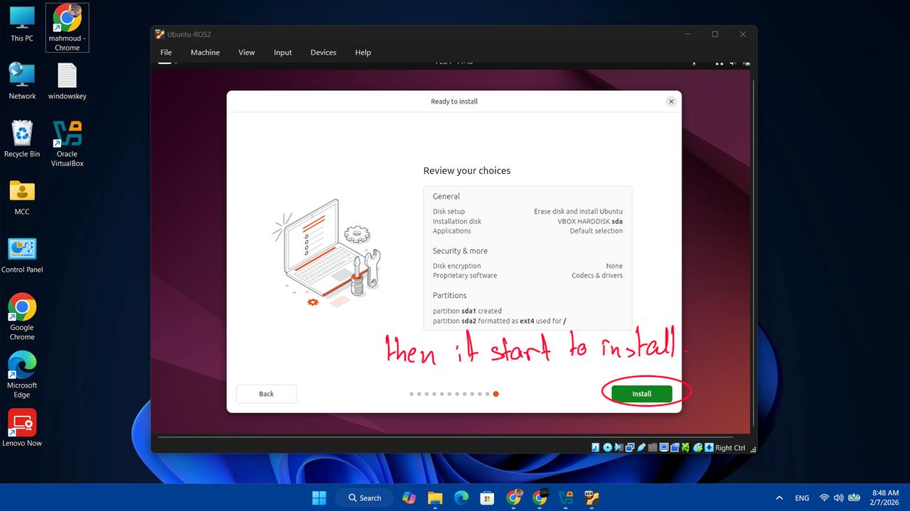

---

### Step 35 — Ubuntu is Ready

Your virtual machine will restart and boot directly into Ubuntu 24.04. Log in with the username and password you created in Step 31.

Welcome to your new Ubuntu environment. 🎉

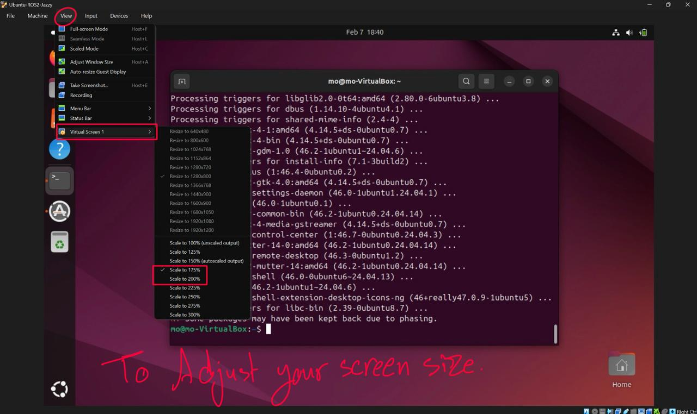

> ✅ If you have reached this screen and logged in successfully, the installation is complete. Your Ubuntu virtual machine is fully operational.

---

## After Installation Checklist

Before moving on to ROS 2, confirm the following:

- [ ] Ubuntu boots successfully and you can log in
- [ ] The desktop loads without any errors or black screens
- [ ] You can open a terminal (press `Ctrl + Alt + T` or search for "Terminal")
- [ ] You have internet access (try opening the Firefox browser and loading a website)
- [ ] You have taken a snapshot of your clean installation (see the next section)

---

## Taking a Snapshot (Important)

A **snapshot** saves the exact current state of your virtual machine. If something goes wrong later — a failed installation, a misconfiguration, or an accidental deletion — you can restore your machine to this clean state in seconds.

**Take a snapshot now, before installing anything else.**

### How to Take a Snapshot

1. In the VirtualBox Manager, select your Ubuntu virtual machine from the list
2. Click the menu icon next to the VM name and choose **Snapshots**
3. Click **Take** to create a new snapshot
4. Give it a clear name such as: `Clean Ubuntu 24.04 - Before ROS2`
5. Add an optional description, then click **OK**

> ✅ Your snapshot is saved. You can return to this exact state at any time by selecting it in the Snapshots view and clicking **Restore**.

💡 Take additional snapshots at important milestones — for example, after completing each major installation or configuration step.

---

## Common Mistakes

These are the most frequent errors students encounter. Review this list so you can avoid them.

**EFI left enabled.** This is the single most common cause of installation failure. Always confirm that Enable EFI is turned OFF in Settings → System → Motherboard before starting the VM.

**Wrong graphics controller selected.** Using VBoxVGA or VBoxSVGA instead of VMSVGA often causes black screens after Ubuntu loads. Always set it to VMSVGA.

**3D Acceleration left enabled.** This causes crashes and graphical glitches on most systems. Keep it turned OFF.

**ISO file not attached before starting.** If you forget to attach the Ubuntu ISO in the Storage settings (Step 17), the VM will show an error and fail to boot.

**Not enough RAM allocated.** Allocating less than 2 GB of RAM to the virtual machine will cause Ubuntu to run extremely slowly or fail to load the installer. Use the recommended values from Step 10.

**Skipping the snapshot.** Students who skip taking a snapshot often spend hours reinstalling Ubuntu after something goes wrong. Always take a snapshot after a clean installation.

---

## Troubleshooting Quick Fixes

**The VM shows a black screen after starting.**
Go to Settings → Display and confirm that Graphics Controller is set to VMSVGA and that 3D Acceleration is disabled. Also confirm EFI is disabled in Settings → System → Motherboard.

**The installer does not appear — only a command line.**
This usually means the ISO was not properly attached. Shut down the VM, go to Settings → Storage, click the optical drive, and reattach the Ubuntu ISO file.

**Ubuntu runs very slowly.**
Allocate more RAM in Settings → System → Motherboard. Also close unnecessary applications on your host computer before starting the VM.

**The VM window is very small and cannot be resized.**
After Ubuntu finishes installing and you are logged in, install VirtualBox Guest Additions. In the VirtualBox menu bar, go to Devices → Insert Guest Additions CD Image and follow the on-screen instructions.

**"No bootable medium found" error on startup.**
The VM is trying to boot but cannot find an operating system. This usually happens if the ISO was removed before installation was complete, or if the boot order is incorrect. Check Settings → System → Motherboard and confirm Optical is first in the boot order.

**The keyboard or mouse does not respond inside the VM.**
Click inside the VM window to capture input. To release the mouse back to your host computer, press the **Right Ctrl** key (Windows/Linux) or **Left Command** key (macOS).

---

## What's Next — ROS 2 Installation

Now that Ubuntu 24.04 is running, you are ready to install ROS 2 Jazzy Jalisco — the robotics framework this course is built around.

Before proceeding, make sure you have:

- Completed the **After Installation Checklist** above
- Taken a **snapshot** of your clean Ubuntu installation
- Confirmed that you have **internet access** inside the virtual machine

The next guide will walk you through installing ROS 2 Jazzy step by step, using the terminal inside your new Ubuntu environment.

💡 All commands in the ROS 2 guide will be run inside the terminal of your virtual machine — not on your main computer. This is why having a stable, clean Ubuntu environment is so important.

**Next guide:** ROS 2 Jazzy Jalisco Installation on Ubuntu 24.04

---

## Additional Resources

### Official Documentation

- **Ubuntu:** [https://help.ubuntu.com](https://help.ubuntu.com)
- **VirtualBox:** [https://www.virtualbox.org/manual/](https://www.virtualbox.org/manual/)
- **ROS 2 Jazzy:** [https://docs.ros.org/en/jazzy/](https://docs.ros.org/en/jazzy/)

### Community Support

- **ROS Discourse:** [https://discourse.ros.org](https://discourse.ros.org)
- **Ubuntu Forums:** [https://ubuntuforums.org](https://ubuntuforums.org)
- **Stack Overflow:** Tag your questions with `ros2`, `ubuntu`, or `virtualbox`

### Learning Resources

- **ROS 2 Tutorials:** [https://docs.ros.org/en/jazzy/Tutorials.html](https://docs.ros.org/en/jazzy/Tutorials.html)
- **Linux Command Line Basics:** [https://ubuntu.com/tutorials/command-line-for-beginners](https://ubuntu.com/tutorials/command-line-for-beginners)
- **Git Tutorial:** [https://git-scm.com/book/en/v2](https://git-scm.com/book/en/v2)

---

*Maintained by the Course Technical Team &nbsp;|&nbsp; Document Version 1.0 &nbsp;|&nbsp; Last Updated: February 2026*
