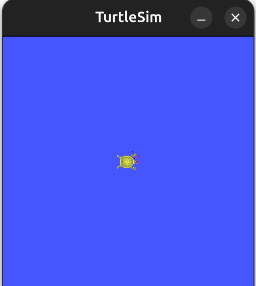

# ROS 2 Services and Actions (Python)

## BEFORE THE WORKSHOP

### Prerequisites Check

You should have already completed:

☐ **Linux Basics Workshop**  
☐ **Python for Robotics Workshop**  
☐ **ROS 2 Nodes and Topics Workshop** ← Required!

### System Requirements

☐ **Ubuntu 24.04** installed and working  
☐ **ROS 2 Jazzy** installed  
☐ **Workspace `~/ros2_ws`** created  
☐ **Comfortable with Publisher/Subscriber** concepts

### Verify ROS 2 and Workspace

```bash
ros2 --version
ls ~/ros2_ws/src
```

**If workspace doesn't exist or ros2 command fails, review the previous workshop.**

---

### Install Required Packages

```bash
sudo apt install ros-jazzy-turtlesim
sudo apt install ros-jazzy-example-interfaces
```

Verify installation:

```bash
ros2 pkg list | grep turtlesim
ros2 pkg list | grep example_interfaces
```

---

## Table of Contents

- [Session Goal](#session-goal)
- [1. Turtlesim Demo](#1-turtlesim-demo)
- [2. Workspace and Package Setup](#2-workspace-and-package-setup)
- [3. Services vs Topics](#3-services-vs-topics)
- [4. Service Example - Teleport Client](#4-service-example---teleport-client)
- [5. Actions Concept](#5-actions-concept)
- [6. Action Client](#6-action-client)
- [7. Testing Actions](#7-testing-actions)
- [8. Hands-on Practice](#8-hands-on-practice)
- [9. Task (Mandatory)](#9-task-mandatory)
- [Common Errors and Solutions](#common-errors-and-solutions)
- [Troubleshooting Checklist](#troubleshooting-checklist)
- [Quick Reference](#quick-reference)
- [Communication Patterns Summary](#communication-patterns-summary)
- [Why This Matters for ROS 2](#why-this-matters-for-ros-2)
- [Resources](#resources)
- [Bonus Content](#bonus-content)
- [What's Next](#whats-next)

---

## Session Goal

Enable students to:

- Understand the difference between Topics, Services, and Actions
- Use existing Services via CLI and Python clients
- Create Action Clients for long-running tasks
- Use Actions with real robot simulation (Turtlesim)
- Choose the right communication pattern for different scenarios

---

## 1. Turtlesim Demo

### What is Turtlesim?

Turtlesim is a simple 2D robot simulator for learning ROS 2 concepts.

It demonstrates:
- Topics (continuous data)
- Services (instant operations)
- Actions (long-running tasks)

---

### Launch Turtlesim

**Terminal 1:**

```bash
ros2 run turtlesim turtlesim_node
```

**Expected:** A blue window with a turtle appears.



---

### Control Turtle with Keyboard

**Terminal 2:**

```bash
ros2 run turtlesim turtle_teleop_key
```

**Expected output:**

```
Reading from keyboard
---------------------------
Use arrow keys to move the turtle.
Use G|B|V|C|D|E|R|T keys to rotate to absolute orientations. 'F' to cancel a rotation.
```

**Try it:**
- Press arrow keys to move the turtle
- The turtle draws a line as it moves
- This uses **Topics** for continuous control

---

### Inspect Communication

**Terminal 3:**

```bash
ros2 topic list
```

**Expected output:**

```
/turtle1/cmd_vel
/turtle1/color_sensor
/turtle1/pose
...
```

Check the velocity topic:

```bash
ros2 topic echo /turtle1/cmd_vel
```

**Press arrow keys in Terminal 2 and watch the velocity commands appear!**

This shows how keyboard control publishes to topics continuously.

---

## 2. Workspace and Package Setup

### Create Test Workspace

Before working with Services and Actions, create a dedicated workspace for practice.

```bash
mkdir -p ~/ros2_test/src
cd ~/ros2_test
colcon build
source install/setup.bash
```

**Expected output:**

```
Summary: 0 packages finished [0.19s]
```

---

### Create Python Package

```bash
cd ~/ros2_test/src
ros2 pkg create python_pkg \
  --build-type ament_python \
  --dependencies rclpy
```

**Expected output:**

```
going to create a new package
package name: python_pkg
...
```

---

### Package Structure

Your workspace should now look like this:

```
~/ros2_test/
├── build/
├── install/
├── log/
└── src/
    └── python_pkg/
        ├── python_pkg/
        │   └── __init__.py
        ├── package.xml
        ├── setup.py
        ├── setup.cfg
        └── resource/
```

---

### Verify Package Creation

```bash
cd ~/ros2_test
colcon build --packages-select python_pkg
source install/setup.bash
```

**Expected output:**

```
Starting >>> python_pkg
Finished <<< python_pkg [0.Xs]

Summary: 1 package finished
```

**Your workspace is ready for development!**

---

## 3. Services vs Topics

### Communication Patterns in ROS 2

| Pattern | Use Case | Example |
|---------|----------|---------|
| **Topic** | Continuous data stream | Camera images, sensor data |
| **Service** | Request/response (one-time) | "Add two numbers", "Get robot pose" |
| **Action** | Long-running task with feedback | "Move to position", "Pick object" |

---

### Topic vs Service

**Topic (Asynchronous):**

```
Publisher → /topic → Subscriber
(continuous, one-way)
```

**Service (Synchronous):**

```
Client → [Request] → Server
Client ← [Response] ← Server
(one-time, two-way)
```

**Note:** Each one has its own purpose and architecture.

---

### Real-World Examples

**Use Topic when:**
- Sensor data (lidar, camera)
- Robot state updates
- Continuous monitoring

**Use Service when:**
- Start/stop a process
- Query information once
- Trigger an action
- Perform calculations

---

### Visual Comparison

**Topic Communication:**


**Service Communication:**


---

### Service Discovery with CLI

#### Step 1: Discover Available Services

List available services:

```bash
ros2 service list
```

**Expected output:**

```
/turtle1/teleport_absolute
/turtle1/teleport_relative
...
```

---

#### Step 2: Check Service Type

```bash
ros2 service type /turtle1/teleport_absolute
```

**Output:**

```
turtlesim/srv/TeleportAbsolute
```

Inspect its interface:

```bash
ros2 interface show turtlesim/srv/TeleportAbsolute
```

**Output:**

```
float32 x
float32 y
float32 theta
---
```

---

#### Step 3: Call Service via CLI

```bash
ros2 service call /turtle1/teleport_absolute turtlesim/srv/TeleportAbsolute "{x: 5.0, y: 5.0, theta: 0.0}"
```

**Expected behavior:**  
The turtle instantly moves to position (5, 5) with orientation 0.

---

#### What Does This Show?

**Key concepts:**
- Services exist on the ROS 2 network
- You can discover services using CLI tools
- You can call services without writing server code
- Services provide immediate response

**Comparison:**
- **Topic (keyboard control):** Continuous velocity commands, smooth movement
- **Service (teleport):** Single request, instant jump to position

**This is how robots interact with existing functionality!**

---

## 4. Service Example - Teleport Client

### Goal of This Example

In this example, we will create a Python node that uses the service `/turtle1/teleport_absolute` to change the position of turtle1.

This demonstrates how to write a service client in Python.

---

### What Does "Teleport Absolute" Mean?

**Teleport:** Instant movement (no animation, no velocity)

**Absolute:** Move to an exact coordinate in the simulator

The turtlesim window uses a coordinate system:
- **X axis** → horizontal
- **Y axis** → vertical
- **Theta** → rotation angle (in radians)

---

### Service Interface

This service requires **3 inputs (Request fields):**

- `x` → target x position
- `y` → target y position
- `theta` → target orientation (in radians)

There is **no response data**, it only executes the movement.

---

### File Location

Create the teleport client node:

```
~/ros2_test/src/python_pkg/python_pkg/teleport_client.py
```

---

### Create Teleport Client File

```bash
cd ~/ros2_test/src/python_pkg/python_pkg
touch teleport_client.py
nano teleport_client.py
```

---

### Teleport Client Code

```python
# Import ROS2 Python client library
import rclpy
from rclpy.node import Node

# Import the TeleportAbsolute service definition from turtlesim
from turtlesim.srv import TeleportAbsolute


class TeleportClient(Node):
    def __init__(self):
        # Initialize the node with the name 'teleport_client'
        super().__init__('teleport_client')

        # Create a service client
        # Arguments: Service type, Service name
        self.client = self.create_client(
            TeleportAbsolute,
            '/turtle1/teleport_absolute'
        )

        # Wait until the service becomes available (checks every 1 second)
        while not self.client.wait_for_service(timeout_sec=1.0):
            self.get_logger().info('Waiting for service...')

        # Once the service is available, send the request
        self.send_request()

    def send_request(self):
        # Create a request object for the TeleportAbsolute service
        request = TeleportAbsolute.Request()

        # Set the target position (absolute coordinates)
        request.x = 5.0      # Target X position
        request.y = 5.0      # Target Y position
        request.theta = 0.0  # Target orientation (in radians)

        # Call the service asynchronously (returns a future object)
        future = self.client.call_async(request)

        # Wait until the service call is completed
        rclpy.spin_until_future_complete(self, future)

        # Confirm teleport is done
        self.get_logger().info('Teleport completed')


def main():
    # Initialize ROS2 communication
    rclpy.init()

    # Create the node object
    node = TeleportClient()

    # Shutdown ROS2 cleanly
    rclpy.shutdown()


if __name__ == '__main__':
    main()
```

---

### Code Explanation

**Key components:**

```python
self.create_client(TeleportAbsolute, '/turtle1/teleport_absolute')
# Service type, Service name
```

```python
self.client.wait_for_service(timeout_sec=1.0)
# Wait for server to be ready before sending request
```

```python
future = self.client.call_async(request)
# Asynchronous call - doesn't block

rclpy.spin_until_future_complete(self, future)
# Wait for response
```

---

### Configure setup.py

**File location:** `~/ros2_test/src/python_pkg/setup.py`

```bash
nano ~/ros2_test/src/python_pkg/setup.py
```

Find the `entry_points` section and add:

```python
entry_points={
    'console_scripts': [
        'teleport_client = python_pkg.teleport_client:main',
    ],
},
```

---

### Build and Source

```bash
cd ~/ros2_test
colcon build --packages-select python_pkg
source install/setup.bash
```

**Expected output:**

```
Starting >>> python_pkg
Finished <<< python_pkg [X.Xs]

Summary: 1 package finished
```

---

### Test Teleport Client

**Terminal 1 (Turtlesim):**

```bash
ros2 run turtlesim turtlesim_node
```

**Terminal 2 (Teleport Client):**

```bash
cd ~/ros2_test
source install/setup.bash
ros2 run python_pkg teleport_client
```

**Expected output:**

```
[INFO] [teleport_client]: Waiting for service...
[INFO] [teleport_client]: Teleport completed
```

**Expected behavior:**  
The turtle instantly jumps to position (5, 5) with orientation 0 radians (facing right).

---

## 5. Actions Concept

### What Are Actions?

Actions are for **long-running tasks** that need:
- **Goal:** What you want to achieve
- **Feedback:** Progress updates during execution
- **Result:** Final outcome


---

### Actions vs Services vs Topics

| Aspect | Topic | Service | Action |
|--------|-------|---------|--------|
| Direction | One-way | Two-way | Two-way |
| Duration | Continuous | Quick (< 1 second) | Long (seconds/minutes) |
| Feedback | No | No | Yes (continuous) |
| Cancellation | No | No | Yes |
| Example | "Sensor data" | "Add two numbers" | "Move robot to position" |

---

### Action Flow

```
Client sends Goal
    ↓
Server accepts/rejects
    ↓
Server executes (sends Feedback repeatedly)
    ↓
Server returns Result
```

---

### Real-World Examples

**Use Topic when:**
- Continuous sensor data streams
- Real-time robot state updates
- Keyboard teleoperation

**Use Service when:**
- Start/stop a process
- Query information once
- Instant position changes

**Use Actions when:**
- Moving robot arm to target
- Navigating to a goal position
- Picking up an object
- Autonomous exploration
- Any task that takes time and needs progress updates

---

### Turtlesim Action Example

Turtlesim has a built-in action: `/turtle1/rotate_absolute`

This action rotates the turtle smoothly (unlike service teleport which is instant).

---

#### Discover Available Actions

```bash
ros2 action list
```

**Expected output:**

```
/turtle1/rotate_absolute
```

---

#### Get Action Information

```bash
ros2 action info /turtle1/rotate_absolute
```

**Expected output:**

```
Action: /turtle1/rotate_absolute
Action clients: 0
Action servers: 1
```

---

#### Check Action Interface

```bash
ros2 interface show turtlesim/action/RotateAbsolute
```

**Expected output:**

```
# Goal
float32 theta
---
# Result
float32 delta
---
# Feedback
float32 remaining
```

This shows:
- **Goal:** Target angle (theta)
- **Result:** How much it rotated (delta)
- **Feedback:** Remaining rotation (remaining)

---

#### Test Action via CLI

```bash
ros2 action send_goal /turtle1/rotate_absolute turtlesim/action/RotateAbsolute "{theta: 1.57}" --feedback
```

**Expected behavior:**  
The turtle rotates to 90 degrees (1.57 radians) and you see feedback during rotation!

**Expected output:**

```
Waiting for an action server to become available...
Sending goal:
     theta: 1.57

Goal accepted with ID: ...

Feedback:
    remaining: 1.23

Feedback:
    remaining: 0.87
...

Result:
    delta: 1.57
```

---

#### Complete Comparison

**Now you've seen all three patterns with turtlesim:**

1. **Topic (`/turtle1/cmd_vel`):**
   - Keyboard control sends continuous velocity commands
   - Turtle moves smoothly as long as you hold keys
   - No response, just continuous data flow

2. **Service (`/turtle1/teleport_absolute`):**
   - Single request with target position
   - Turtle instantly jumps to location
   - Immediate response, no feedback during execution

3. **Action (`/turtle1/rotate_absolute`):**
   - Single request with target angle
   - Turtle rotates smoothly over time
   - Continuous feedback during execution
   - Final result when complete
   - Can be cancelled mid-execution

---

## 6. Action Client

### File Location

Create the action client node in your package:

```
~/ros2_test/src/python_pkg/python_pkg/turtle_action_client.py
```

---

### Create Action Client File

```bash
cd ~/ros2_test/src/python_pkg/python_pkg
touch turtle_action_client.py
nano turtle_action_client.py
```

---

### Action Client Code

```python
import rclpy
from rclpy.action import ActionClient
from rclpy.node import Node
from turtlesim.action import RotateAbsolute
import sys


class TurtleActionClient(Node):
    def __init__(self):
        super().__init__('turtle_action_client')
        
        # Create action client (Action type, Action name)
        self.action_client = ActionClient(
            self,
            RotateAbsolute,
            '/turtle1/rotate_absolute')
        
        self.get_logger().info('Action client created')

    def send_goal(self, theta):
        # Create goal message
        goal_msg = RotateAbsolute.Goal()
        goal_msg.theta = theta
        
        self.get_logger().info(f'Waiting for action server...')
        self.action_client.wait_for_server()
        
        self.get_logger().info(f'Sending goal: rotate to {theta} radians')
        
        # Send goal asynchronously with feedback callback
        self.send_goal_future = self.action_client.send_goal_async(
            goal_msg,
            feedback_callback=self.feedback_callback)
        
        # Add callback for when goal is accepted/rejected
        self.send_goal_future.add_done_callback(self.goal_response_callback)

    def goal_response_callback(self, future):
        # Check if goal was accepted
        goal_handle = future.result()
        
        if not goal_handle.accepted:
            self.get_logger().info('Goal rejected')
            return
        
        self.get_logger().info('Goal accepted')
        
        # Get result asynchronously
        self.get_result_future = goal_handle.get_result_async()
        self.get_result_future.add_done_callback(self.get_result_callback)

    def feedback_callback(self, feedback_msg):
        # This is called repeatedly during execution
        feedback = feedback_msg.feedback
        self.get_logger().info(f'Remaining: {feedback.remaining:.2f} radians')

    def get_result_callback(self, future):
        # Final result when action completes
        result = future.result().result
        self.get_logger().info(f'Result: Rotated {result.delta:.2f} radians')
        rclpy.shutdown()


def main():
    rclpy.init()
    
    # Check command line arguments
    if len(sys.argv) != 2:
        print('Usage: ros2 run python_pkg turtle_action_client <theta>')
        print('Example: ros2 run python_pkg turtle_action_client 1.57')
        return
    
    node = TurtleActionClient()
    theta = float(sys.argv[1])
    node.send_goal(theta)
    
    rclpy.spin(node)


if __name__ == '__main__':
    main()
```

---

### Code Explanation

**Key components:**

```python
ActionClient(self, RotateAbsolute, '/turtle1/rotate_absolute')
# Action type, Action name
```

```python
feedback_callback=self.feedback_callback
# Function called repeatedly during execution
```

```python
goal_handle.get_result_async()
# Get final result when action completes
```

---

### Configure setup.py

**File location:** `~/ros2_test/src/python_pkg/setup.py`

```bash
nano ~/ros2_test/src/python_pkg/setup.py
```

Update entry points:

```python
entry_points={
    'console_scripts': [
        'teleport_client = python_pkg.teleport_client:main',
        'turtle_action_client = python_pkg.turtle_action_client:main',
    ],
},
```

---

### Build and Source

```bash
cd ~/ros2_test
colcon build --packages-select python_pkg
source install/setup.bash
```

**Expected output:**

```
Starting >>> python_pkg
Finished <<< python_pkg [X.Xs]

Summary: 1 package finished
```

⚠️ **You must repeat `build + source` every time you change code.**

---

### Quick Setup Summary

**Steps to add any new node:**

1. **Create file** in `python_pkg/python_pkg/` directory
2. **Add entry point** in `setup.py`:
   ```python
   'node_name = python_pkg.file_name:main',
   ```
3. **Build package:**
   ```bash
   cd ~/ros2_test
   colcon build --packages-select python_pkg
   source install/setup.bash
   ```
4. **Run node:**
   ```bash
   ros2 run python_pkg node_name
   ```

---

## 7. Testing Actions

### Run Turtlesim

**Terminal 1:**

```bash
ros2 run turtlesim turtlesim_node
```

**Keep this running and watch the turtle!**

---

### Run the Action Client

**Terminal 2:**

```bash
cd ~/ros2_test
source install/setup.bash
ros2 run python_pkg turtle_action_client 1.57
```

**Expected output:**

```
[INFO] [turtle_action_client]: Action client created
[INFO] [turtle_action_client]: Waiting for action server...
[INFO] [turtle_action_client]: Sending goal: rotate to 1.57 radians
[INFO] [turtle_action_client]: Goal accepted
[INFO] [turtle_action_client]: Remaining: 1.23 radians
[INFO] [turtle_action_client]: Remaining: 0.87 radians
[INFO] [turtle_action_client]: Remaining: 0.42 radians
[INFO] [turtle_action_client]: Remaining: 0.05 radians
[INFO] [turtle_action_client]: Result: Rotated 1.57 radians
```

**Expected behavior:**  
The turtle rotates to 90 degrees (1.57 radians), and you see feedback updates during rotation!

---

### Test Different Angles

```bash
# Rotate to 180 degrees (π radians)
ros2 run python_pkg turtle_action_client 3.14

# Rotate to 270 degrees (3π/2 radians)
ros2 run python_pkg turtle_action_client 4.71

# Rotate back to 0 degrees
ros2 run python_pkg turtle_action_client 0
```

---

## 8. Hands-on Practice

### Goal

Students practice actions and service interaction through guided challenges.

---

### Guided Challenges

#### Challenge 1

Call the teleport service with different coordinates:

```bash
# Move to center
ros2 service call /turtle1/teleport_absolute turtlesim/srv/TeleportAbsolute "{x: 5.5, y: 5.5, theta: 0.0}"

# Move to corner
ros2 service call /turtle1/teleport_absolute turtlesim/srv/TeleportAbsolute "{x: 1.0, y: 1.0, theta: 1.57}"
```

Observe the instant movement (no animation).

---

#### Challenge 2

Combine service and action:

```bash
# Step 1: Teleport to position
ros2 service call /turtle1/teleport_absolute turtlesim/srv/TeleportAbsolute "{x: 5.5, y: 5.5, theta: 0.0}"

# Step 2: Rotate using action
ros2 run python_pkg turtle_action_client 3.14
```

**What's the difference?**
- Service = instant jump
- Action = smooth rotation with feedback


---

## 9. Task
### Service Task 

If you want extra practice, complete the service task:

[Service Task Details](tasks/service.md)

---

### Action Task 

Complete the action task requirements:

[Action Task Details](tasks/action.md)

---

### Success Criteria

☐ Action client runs without errors  
☐ Turtle rotates with visible feedback  
☐ Action client uses proper entry points in `setup.py`  
☐ Can call services via CLI

---

### Expected Behavior

**Action:**

```
Goal: Rotate to 3.14 radians
Feedback: Remaining 2.5, 2.0, 1.5...
Result: Rotated 3.14 radians successfully
```

---

### Submission

Screenshot showing:

- **Terminal 1:** Turtlesim running
- **Terminal 2:** Action client output with feedback
- **Terminal 3:** `ros2 action list` output

Submit to: **Google Classroom**  

---

## Common Errors and Solutions

| Error | Cause | Solution |
|-------|-------|----------|
| `Action server not available` | Turtlesim not running | Launch turtlesim before action client |
| `ModuleNotFoundError: turtlesim` | Turtlesim not installed | Install: `sudo apt install ros-jazzy-turtlesim` |
| `Package 'python_pkg' not found` | Not built or sourced | `colcon build && source install/setup.bash` |
| `No executable found` | Missing entry point | Add to `setup.py` console_scripts |
| `Goal rejected` | Invalid goal values | Check goal parameters (e.g., theta in valid range) |
| `Service not available` | Service not running | Check service exists with `ros2 service list` |

---

## Troubleshooting Checklist

Before asking for help, verify:

☐ **Built and sourced?** (`colcon build && source install/setup.bash`)  
☐ **Turtlesim running?** (For action clients)  
☐ **Dependencies installed?** (`turtlesim`)  
☐ **Entry points correct?** (in `setup.py`)  
☐ **Correct action name?** (check with `ros2 action list`)  
☐ **In correct workspace?** (`cd ~/ros2_test`)

---

## Quick Reference

### Services

| Command | Purpose | Example |
|---------|---------|---------|
| `ros2 service list` | List all services | `ros2 service list` |
| `ros2 service call` | Call a service | `ros2 service call /turtle1/teleport_absolute ...` |
| `ros2 service type` | Get service type | `ros2 service type /turtle1/teleport_absolute` |

### Actions

| Command | Purpose | Example |
|---------|---------|---------|
| `ros2 action list` | List all actions | `ros2 action list` |
| `ros2 action info` | Get action info | `ros2 action info /turtle1/rotate_absolute` |
| `ros2 action send_goal` | Send goal via CLI | `ros2 action send_goal /turtle1/rotate_absolute ...` |

### Package Management

| Command | Purpose | Example |
|---------|---------|---------|
| `colcon build` | Build all packages | `colcon build` |
| `colcon build --packages-select` | Build specific package | `colcon build --packages-select python_pkg` |
| `source install/setup.bash` | Source workspace | `source install/setup.bash` |

---

## Communication Patterns Summary

```
┌─────────────────┬──────────────┬─────────────┬───────────────┐
│ Pattern         │ Direction    │ Duration    │ Feedback      │
├─────────────────┼──────────────┼─────────────┼───────────────┤
│ Topic           │ One-way      │ Continuous  │ No            │
│ Service         │ Two-way      │ Instant     │ No            │
│ Action          │ Two-way      │ Long        │ Yes           │
└─────────────────┴──────────────┴─────────────┴───────────────┘
```

**Remember:**
- **Topic** = sensor data stream
- **Service** = "Hey, calculate this for me"
- **Action** = "Go there, and tell me how it's going"

---

## Why This Matters for ROS 2

| Concept | Real Robot Usage | Example |
|---------|------------------|---------|
| **Services** | On-demand operations | Start camera, get robot pose, trigger calibration |
| **Actions** | Complex tasks with progress | Navigate to waypoint, pick object, dock to charger |
| **Goal** | Task specification | Target position, object ID, charging station |
| **Feedback** | Progress monitoring | Distance remaining, battery level, grip force |
| **Result** | Task outcome | Success/failure, final position, execution time |

### Real-World Scenario

```
Navigation System:
    1. Service: "Get current pose" → Response: (x, y, theta)
    2. Action: "Navigate to goal"
        Goal: target position
        Feedback: distance remaining, obstacles detected
        Result: reached/failed, time taken
    3. Service: "Stop navigation" → Response: stopped
```

**This is how real autonomous robots work!**

---

## Resources

### Official Documentation

- [ROS 2 Services Tutorial](https://docs.ros.org/en/jazzy/Tutorials/Beginner-Client-Libraries/Writing-A-Simple-Py-Service-And-Client.html)
- [ROS 2 Actions Tutorial](https://docs.ros.org/en/jazzy/Tutorials/Intermediate/Writing-an-Action-Server-Client/Py.html)
- [Turtlesim Package](https://github.com/ros/ros_tutorials/tree/jazzy/turtlesim)

### Course Materials

- ROS 2 Nodes and Topics Workshop (Week 2)
- ROS 2 Cheat Sheet (PDF)
- Example Code Repository

### Getting Help

- Class discussion channel
- Instructor contact

---

## Bonus Content

### Creating Service Server and Client

For students who want to learn how to create their own custom services from scratch:

[Bonus: Service Server and Client Tutorial](code/Bonus.md)

**Topics covered in bonus:**
- When to create custom services
- Service server implementation
- Service client implementation
- Testing custom services

---

## What's Next?

**Next Workshop: URDF and Robot Visualization**

You will learn:

- **URDF:** Robot description format
- **TF:** Coordinate frame transformations
- **RViz2:** 3D robot visualization
- Display robot models in RViz2
- Control robots with keyboard teleop

Everything learned about communication (Topics, Services, Actions) will be used with real robot models!

---

## Workshop Complete!

**You now know the main communication patterns in ROS 2:**

1. **Topics** - Continuous data streams (Publisher/Subscriber)
2. **Services** - Request/response (Server/Client)
3. **Actions** - Long-running tasks with feedback (Action Client/Server)

**Focus:** Actions are the most important for complex robot behaviors!

**Next:** Learn to visualize and control robots in simulation!