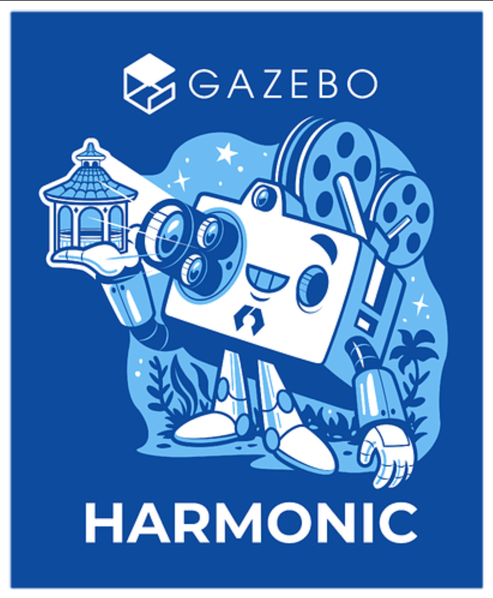
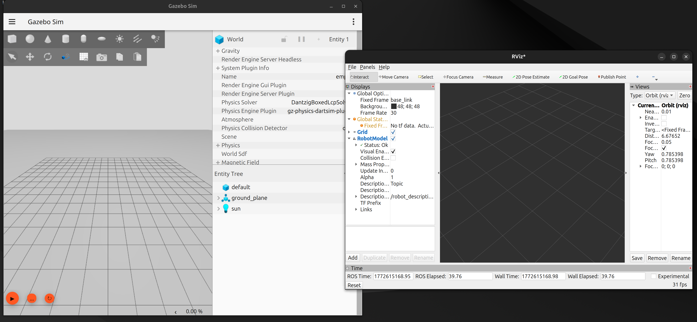

# Gazebo Basics - Robot Simulation

## BEFORE THE WORKSHOP

### Prerequisites Check

You should have already completed:

☐ **Linux Basics Workshop**  
☐ **Python for Robotics Workshop**  
☐ **ROS 2 Nodes and Topics Workshop**  
☐ **ROS 2 Services and Actions Workshop**  
☐ **URDF and Robot Visualization Workshop** ← Required!

### System Requirements

☐ **Ubuntu 24.04** installed and working  
☐ **ROS 2 Jazzy** installed  
☐ **Workspace `~/ros2_ws`** created  
☐ Robot URDF from previous workshop  
☐ Comfortable with RViz2 and URDF





### Verify ROS 2

```bash
ros2 --version
```

---

### Install Required Packages

```bash
sudo apt install ros-jazzy-ros-gz
sudo apt install ros-jazzy-gz-ros2-control
sudo apt install ros-jazzy-rqt-controller-manager

```

Verify Gazebo:

```bash
gz sim --version
```

**Expected output:**
```
Gazebo Sim, version 8.x.x
```

---

### Test Gazebo

Launch Gazebo to verify installation:

```bash
gz sim
```

**Expected:**  
Gazebo window opens with empty world (gray ground plane).

**Close Gazebo:**
```bash
pkill -f gz
```

Or press `Ctrl+C` in terminal.

---

## Table of Contents

- [Session Goal](#session-goal)
- [1. RViz2 vs Gazebo](#1-rviz2-vs-gazebo)
- [2. Gazebo Interface](#2-gazebo-interface)
- [3. Worlds](#3-worlds)
- [4. Models and SDF](#4-models-and-sdf)
- [5. Robot in Gazebo](#5-robot-in-gazebo)
- [6. Manual Control](#6-manual-control)
- [7. Task ](#7-task-mandatory)
- [Common Errors and Solutions](#common-errors-and-solutions)
- [Troubleshooting Checklist](#troubleshooting-checklist)
- [Quick Reference](#quick-reference)
- [Why This Matters](#why-this-matters)
- [Resources](#resources)
- [What's Next](#whats-next)

---

## Session Goal

Enable students to:

- Understand difference between RViz2 and Gazebo
- Launch and navigate Gazebo Harmonic
- Work with simulation worlds
- Spawn robots in Gazebo
- Control robot joints manually
- Observe physics behavior (gravity, collisions)

---

## 1. RViz2 vs Gazebo

### Key Difference

**RViz2:** Visualization only (shows what you tell it)  
**Gazebo:** Simulation with physics (calculates how things move)

---

### Comparison

| Aspect | RViz2 | Gazebo |
|--------|-------|--------|
| **Purpose** | Visualization | Simulation |
| **Physics** | No | Yes (gravity, forces) |
| **Sensors** | Display only | Generate data |
| **Collisions** | No | Yes |
| **Performance** | Fast | Slower |
| **Use** | Debugging, planning | Testing, training |

---

### Why Gazebo?

**Test before deploying to real robot:**

1. Test in Gazebo (safe, fast, repeatable)
2. Fix bugs in simulation
3. Deploy to hardware

**Advantages:**
- No hardware damage risk
- Faster iteration
- Test extreme scenarios
- Train algorithms

---

### Visual Difference

**RViz2:**
- Simple rendering
- No shadows
- Robot floats in space
- Instant movement

**Gazebo:**
- Realistic lighting
- Shadows and reflections
- Robot affected by gravity
- Physics-based movement

**Example:**  
In RViz2, robot arm stays in any position.  
In Gazebo, arm falls down if not supported (gravity).




---

## 2. Gazebo Interface

### Launch Empty World

```bash
gz sim
```

**Expected:**  
Gazebo window opens with gray ground plane.

---

### Interface Components

**Scene View (center):**
- 3D simulation environment
- Where robots and objects appear

**Insert Panel (left):**
- Add models from library
- Shapes, robots, objects

**World Panel (right):**
- Scene settings
- Physics properties
- Time controls

**Play Controls (bottom):**
- Play/Pause simulation
- Step simulation
- Real-time factor

---

### Camera Navigation

**Mouse controls:**

| Action | Control |
|--------|---------|
| Rotate view | Left click + drag |
| Pan view | Middle click + drag |
| Zoom | Scroll wheel |
| Context menu | Right click |

**Keyboard controls:**

| Key | Action |
|-----|--------|
| W | Move forward |
| A | Move left |
| S | Move backward |
| D | Move right |
| Q | Move up |
| E | Move down |

**Practice:** Navigate around the empty world using these controls.

---

## 3. Worlds

### What is a World?

A world is a simulation environment containing:
- Ground plane
- Lighting
- Models (objects, robots)
- Physics settings (gravity, time step)

---

### Empty World

```bash
gz sim empty.sdf
```

**Contains:**
- Gray ground plane
- Default lighting
- Nothing else

**Use:** Testing robots in isolation.

---

### World File Structure

Worlds are written in **SDF format** (Simulation Description Format).

**Basic structure:**

```xml
<?xml version="1.0"?>
<sdf version="1.9">
  <world name="my_world">
    <!-- Ground plane -->
    <model name="ground_plane">
      <static>true</static>
      ...
    </model>
    
    <!-- Lighting -->
    <light type="directional" name="sun">
      <pose>0 0 10 0 0 0</pose>
      <diffuse>1 1 1 1</diffuse>
    </light>
  </world>
</sdf>
```

**Note:** We won't create custom worlds today, just understand the concept.

---

## 4. Models and SDF

### What is a Model?

A model is any object in simulation:
- Robots
- Objects (boxes, balls)
- Furniture
- Obstacles

---

### SDF vs URDF

| Format | Purpose | Physics | Used In |
|--------|---------|---------|---------|
| **URDF** | Robot description | Basic | ROS 2 (RViz2, planning) |
| **SDF** | Simulation models | Advanced | Gazebo |

**Key difference:**  
- URDF → Simple, ROS-centric
- SDF → Advanced, Gazebo-native

**Good news:**  
URDF can be converted to SDF automatically by Gazebo.

---

### Add Models from GUI

**In Gazebo:**

1. Click "Insert" tab (left panel)
2. Browse available models
3. Select a model (e.g., "Box")
4. Click in scene to place it

**Try now:**
- Add a box
- Add a sphere
- Add a cylinder

---

### Model Properties

**Click on a model → Properties panel shows:**

| Property | Description |
|----------|-------------|
| Pose | Position (x, y, z) and rotation |
| Scale | Size multiplier |
| Static | Fixed in place (doesn't fall) |
| Physics | Mass, friction, collision |

---

### Test Physics

**Experiment:**

1. Add a box
2. Click Play button (bottom toolbar)
3. Watch box fall due to gravity

**This is real physics simulation!**

---

## 5. Robot in Gazebo

### Workspace Setup

Use existing workspace from URDF workshop:

```bash
cd ~/ros2_ws/src/my_robot_description
```

---

### URDF for Gazebo

**Key requirements for Gazebo:**

1. **Collision geometry** (for physics)
2. **Inertial properties** (mass, inertia)

Without these, robot won't behave correctly in simulation.

---

### Create Gazebo URDF

**File location:**
```
~/ros2_ws/src/my_robot_description/urdf/robot_arm_gazebo.urdf
```

```bash
cd ~/ros2_ws/src/my_robot_description/urdf
touch robot_arm_gazebo.urdf
nano robot_arm_gazebo.urdf
```

---

### Complete URDF Code

```xml
<?xml version="1.0"?>
<robot name="simple_arm">

  <!-- Base Link -->
  <link name="base_link">
    <!-- Visual: what you see -->
    <visual>
      <geometry>
        <cylinder length="0.1" radius="0.15"/>
      </geometry>
      <material name="blue">
        <color rgba="0 0 0.8 1"/>
      </material>
    </visual>
    
    <!-- Collision: for physics calculations -->
    <collision>
      <geometry>
        <cylinder length="0.1" radius="0.15"/>
      </geometry>
    </collision>
    
    <!-- Inertial: mass and inertia for dynamics -->
    <inertial>
      <mass value="1.0"/>
      <inertia ixx="0.01" ixy="0" ixz="0" iyy="0.01" iyz="0" izz="0.01"/>
    </inertial>
  </link>

  <!-- Joint 1: Base to Link 1 -->
  <joint name="joint_1" type="revolute">
    <parent link="base_link"/>
    <child link="link_1"/>
    <origin xyz="0 0 0.05" rpy="0 0 0"/>
    <axis xyz="0 0 1"/>
    <limit lower="-1.57" upper="1.57" effort="10" velocity="1.0"/>
  </joint>

  <!-- Link 1 -->
  <link name="link_1">
    <visual>
      <origin xyz="0 0 0.15" rpy="0 0 0"/>
      <geometry>
        <cylinder length="0.3" radius="0.05"/>
      </geometry>
      <material name="orange">
        <color rgba="1 0.5 0 1"/>
      </material>
    </visual>
    <collision>
      <origin xyz="0 0 0.15" rpy="0 0 0"/>
      <geometry>
        <cylinder length="0.3" radius="0.05"/>
      </geometry>
    </collision>
    <inertial>
      <mass value="0.5"/>
      <inertia ixx="0.005" ixy="0" ixz="0" iyy="0.005" iyz="0" izz="0.001"/>
    </inertial>
  </link>

  <!-- Joint 2: Link 1 to Link 2 -->
  <joint name="joint_2" type="revolute">
    <parent link="link_1"/>
    <child link="link_2"/>
    <origin xyz="0 0 0.3" rpy="0 0 0"/>
    <axis xyz="0 1 0"/>
    <limit lower="-1.57" upper="1.57" effort="10" velocity="1.0"/>
  </joint>

  <!-- Link 2 -->
  <link name="link_2">
    <visual>
      <origin xyz="0 0 0.1" rpy="0 0 0"/>
      <geometry>
        <cylinder length="0.2" radius="0.04"/>
      </geometry>
      <material name="green">
        <color rgba="0 0.8 0 1"/>
      </material>
    </visual>
    <collision>
      <origin xyz="0 0 0.1" rpy="0 0 0"/>
      <geometry>
        <cylinder length="0.2" radius="0.04"/>
      </geometry>
    </collision>
    <inertial>
      <mass value="0.3"/>
      <inertia ixx="0.003" ixy="0" ixz="0" iyy="0.003" iyz="0" izz="0.001"/>
    </inertial>
  </link>

  <!-- Joint 3: Link 2 to Link 3 -->
  <joint name="joint_3" type="revolute">
    <parent link="link_2"/>
    <child link="link_3"/>
    <origin xyz="0 0 0.2" rpy="0 0 0"/>
    <axis xyz="0 1 0"/>
    <limit lower="-1.57" upper="1.57" effort="10" velocity="1.0"/>
  </joint>

  <!-- Link 3 (End Effector) -->
  <link name="link_3">
    <visual>
      <origin xyz="0 0 0.075" rpy="0 0 0"/>
      <geometry>
        <cylinder length="0.15" radius="0.03"/>
      </geometry>
      <material name="red">
        <color rgba="0.8 0 0 1"/>
      </material>
    </visual>
    <collision>
      <origin xyz="0 0 0.075" rpy="0 0 0"/>
      <geometry>
        <cylinder length="0.15" radius="0.03"/>
      </geometry>
    </collision>
    <inertial>
      <mass value="0.2"/>
      <inertia ixx="0.002" ixy="0" ixz="0" iyy="0.002" iyz="0" izz="0.0005"/>
    </inertial>
  </link>

</robot>
```

---

### Code Explanation

**Visual vs Collision vs Inertial:**

```xml
<!-- Visual: what you see (rendering) -->
<visual>
  <geometry>
    <cylinder length="0.3" radius="0.05"/>
  </geometry>
</visual>

<!-- Collision: for physics calculations (contact detection) -->
<collision>
  <geometry>
    <cylinder length="0.3" radius="0.05"/>
  </geometry>
</collision>

<!-- Inertial: mass and inertia (dynamics) -->
<inertial>
  <mass value="0.5"/>
  <inertia ixx="0.005" ixy="0" ixz="0" iyy="0.005" iyz="0" izz="0.001"/>
</inertial>
```

**Why all three?**
- **Visual:** Gazebo knows what to draw
- **Collision:** Gazebo calculates contacts
- **Inertial:** Gazebo simulates motion

---

### Create Launch File

**File location:**
```
~/ros2_ws/src/my_robot_description/launch/gazebo.launch.py
```

```bash
cd ~/ros2_ws/src/my_robot_description/launch
touch gazebo.launch.py
nano gazebo.launch.py
```

---

### Launch File Code

```python
from launch import LaunchDescription
from launch.actions import IncludeLaunchDescription
from launch.launch_description_sources import PythonLaunchDescriptionSource
from launch_ros.actions import Node
from launch_ros.substitutions import FindPackageShare
import os


def generate_launch_description():

    pkg_share = FindPackageShare('my_robot_description').find('my_robot_description')

    urdf_file = os.path.join(pkg_share, 'urdf', 'my_robot_arm.urdf')

    with open(urdf_file, 'r') as file:
        robot_description = file.read()

    gazebo = IncludeLaunchDescription(
        PythonLaunchDescriptionSource([
            FindPackageShare('ros_gz_sim').find('ros_gz_sim'),
            '/launch/gz_sim.launch.py'
        ]),
        launch_arguments={'gz_args': '-r empty.sdf'}.items()
    )

    robot_state_publisher = Node(
        package='robot_state_publisher',
        executable='robot_state_publisher',
        parameters=[{
            'robot_description': robot_description,
            'use_sim_time': True
        }]
    )

    spawn_robot = Node(
        package='ros_gz_sim',
        executable='create',
        arguments=[
            '-name', 'simple_arm',
            '-topic', '/robot_description'
        ],
        output='screen'
    )

    clock_bridge = Node(
        package='ros_gz_bridge',
        executable='parameter_bridge',
        arguments=['/clock@rosgraph_msgs/msg/Clock[gz.msgs.Clock']
    )

    return LaunchDescription([
        gazebo,
        robot_state_publisher,
        spawn_robot,
        clock_bridge
    ])
```

---

### Code Explanation

**Three main nodes:**

```python
# 1. Launch Gazebo
gazebo = IncludeLaunchDescription(...)
# Starts Gazebo with empty world

# 2. Publish robot description
robot_state_publisher = Node(...)
# Publishes URDF and TF

# 3. Spawn robot in simulation
spawn_robot = Node(package='ros_gz_sim', executable='create')
# Creates robot entity in Gazebo
```

---

### Update CMakeLists.txt

Ensure launch files are installed:

```bash
nano ~/ros2_ws/src/my_robot_description/CMakeLists.txt
```

Verify this line exists:

```
# Install all resource directories
install(DIRECTORY urdf launch rviz config
  DESTINATION share/${PROJECT_NAME}/
)
```

---

### Build and Source

```bash
cd ~/ros2_ws
colcon build --packages-select my_robot_description
source install/setup.bash
```

**Expected output:**
```
Starting >>> my_robot_description
Finished <<< my_robot_description [X.Xs]

Summary: 1 package finished
```

⚠️ **You must repeat `build + source` every time you change URDF or launch files.**

---

### Launch Robot

```bash
cd ~/ros2_ws
source install/setup.bash
ros2 launch my_robot_description gazebo.launch.py
```

**Expected:**
- Gazebo window opens
- Robot arm appears in simulation
- Robot is affected by gravity

**If robot appears, you've successfully spawned it in Gazebo!**

---

**This is realistic physics!**

**Compare:**
- **RViz2:** Arm stays in any position (no physics)
- **Gazebo:** Arm falls due to gravity (physics simulation)

---

## 7. Task 

[Adding objects inside Gazebo environment](tasks/task.md)


---

## Common Errors and Solutions

| Error | Cause | Solution |
|-------|-------|----------|
| Gazebo not found | Not installed | `sudo apt install ros-jazzy-ros-gz` |
| URDF parsing error | Missing collision/inertial | Add physics tags to all links |
| Robot falls through ground | No collision geometry | Add `<collision>` tags |
| Robot explodes/flies | Bad inertia values | Use realistic mass/inertia |
| No Joint Controller | No joints defined | Check URDF has `<joint>` with limits |
| Robot not spawning | Wrong URDF path | Check path in launch file |
| Xacro error | Xacro not installed | `sudo apt install ros-jazzy-xacro` |

---

## Troubleshooting Checklist

Before asking for help, verify:

☐ **Gazebo installed?** (`gz sim --version`)  
☐ **Built and sourced?** (`colcon build && source install/setup.bash`)  
☐ **Collision tags in URDF?** (Required for physics)  
☐ **Inertial tags in URDF?** (Required for dynamics)  
☐ **Launch file paths correct?** (Check URDF path)  
☐ **Topics publishing?** (`ros2 topic list`)  
☐ **Xacro installed?** (If using xacro files)

---

## Quick Reference

### Gazebo Commands

| Command | Purpose |
|---------|---------|
| `gz sim` | Launch empty world |
| `gz sim world.sdf` | Launch specific world |
| `pkill -f gz` | Kill Gazebo |
| `gz model` | Model management |
| `gz topic` | Topic introspection |

---

### Camera Controls

| Action | Control |
|--------|---------|
| Rotate view | Left click + drag |
| Pan view | Middle click + drag |
| Zoom | Scroll wheel |
| Fly mode | WASD + QE |

---

### Important Topics

| Topic | Content |
|-------|---------|
| `/joint_states` | Joint positions/velocities |
| `/clock` | Simulation time |
| `/tf` | Dynamic transforms |
| `/tf_static` | Static transforms |

---

### URDF Requirements for Gazebo

**Every link must have:**

```xml
<link name="link_name">
  <!-- Visual: what you see -->
  <visual>...</visual>
  
  <!-- Collision: for physics -->
  <collision>...</collision>
  
  <!-- Inertial: mass and inertia -->
  <inertial>...</inertial>
</link>
```

---

## Why This Matters

| Concept | Real Robot Usage | Example |
|---------|------------------|---------|
| **Gazebo** | Safe testing | Test navigation without crashing |
| **Physics** | Realistic behavior | Understand arm movement under gravity |
| **Collision** | Prevent damage | Test grasp without breaking objects |
| **Sensors** | Algorithm validation | Test vision before real camera |
| **Repeatability** | Consistent testing | Same scenario, multiple runs |

---

### Real-World Workflow

```
1. Design robot (URDF)
   ↓
2. Visualize (RViz2)
   ↓
3. Simulate (Gazebo)
   ↓
4. Fix issues
   ↓
5. Deploy to hardware
```

**Gazebo saves time, money, and prevents damage!**

---

## Resources

### Official Documentation

- [Gazebo Tutorials](https://gazebosim.org/docs)
- [ROS 2 Gazebo Integration](https://github.com/gazebosim/ros_gz)
- [SDF Format](http://sdformat.org)

### Course Materials

- Previous workshops
- ROS 2 Cheat Sheet (PDF)

---

## What's Next?

**Next Workshop: Gazebo Sensors and RViz2 Integration**

You will learn:

- **Sensors:** Add cameras to robots
- **Data:** Read sensor topics
- **Visualization:** View sensors in RViz2
- **Integration:** Gazebo + RViz2 together

**Your robot will get "eyes" in the next session!**

---

## Workshop Complete!

**You now understand:**

1. **RViz2 vs Gazebo** - Visualization vs Simulation
2. **Worlds** - Simulation environments
3. **Models** - Objects in Gazebo
4. **Physics** - Gravity, collisions, dynamics
5. **Control** - Manual joint control
6. **Integration** - URDF in Gazebo

**Next:** Add sensors and connect Gazebo with RViz2!