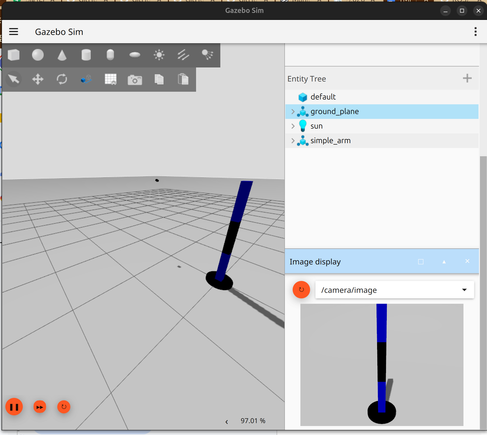
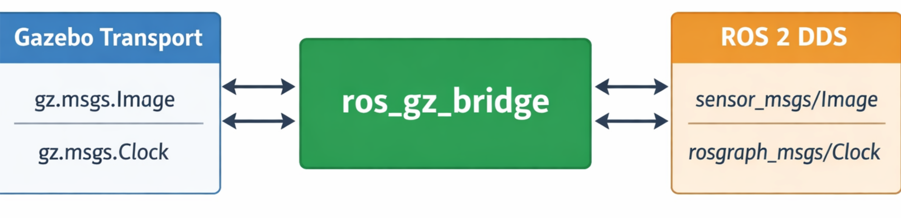
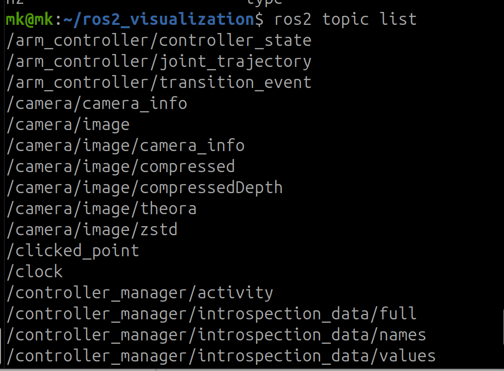
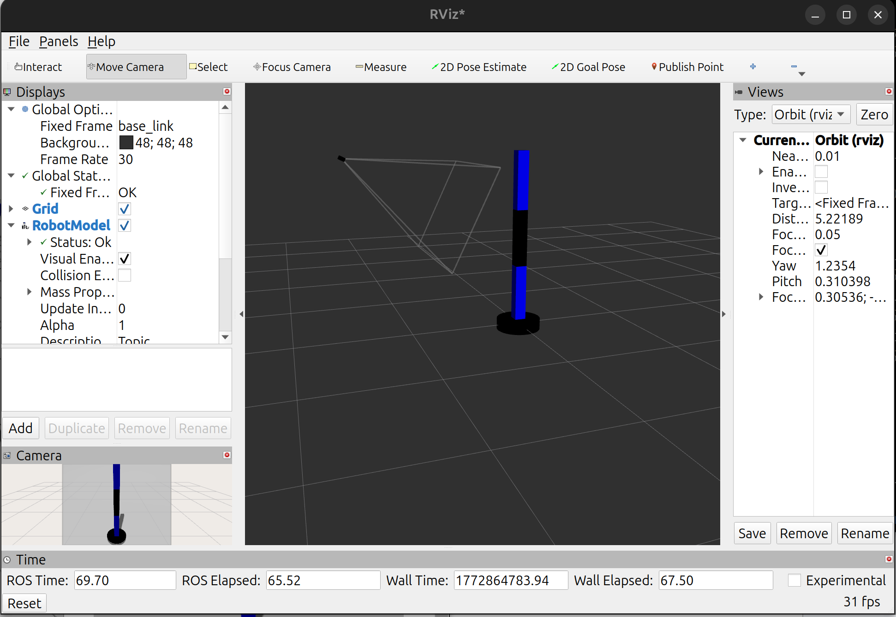
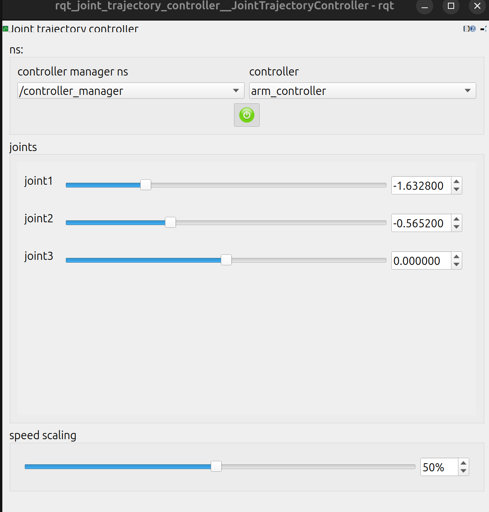
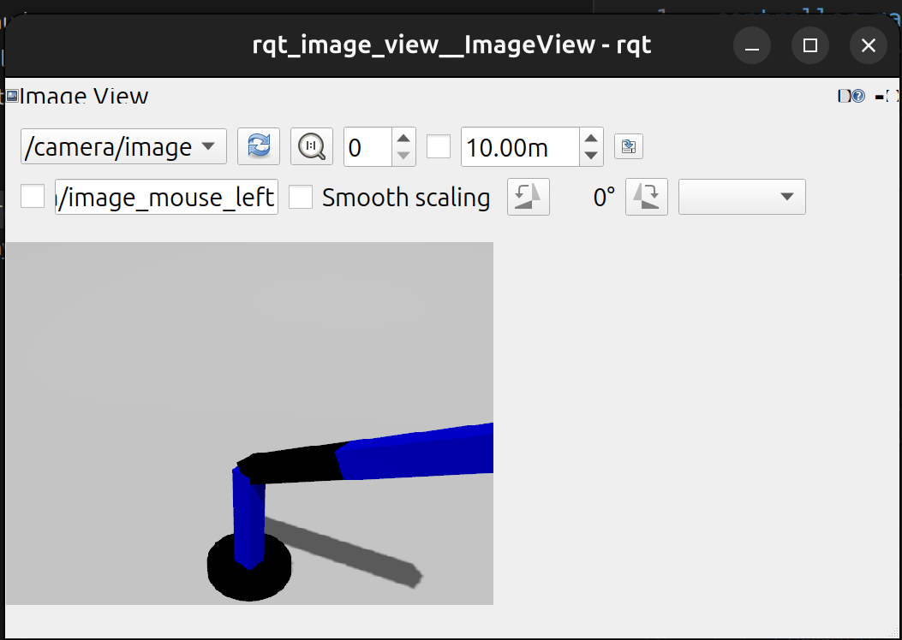

# Gazebo Sensors and RViz2 Integration
> ROS 2 Jazzy | Ubuntu 24.04 | Gazebo Harmonic

---

## ⚠️ BEFORE THE WORKSHOP

### Prerequisites Check

You should have already completed:

- [ ] Linux Basics Workshop
- [ ] Python for Robotics Workshop
- [ ] ROS 2 Nodes and Topics Workshop
- [ ] ROS 2 Services and Actions Workshop
- [ ] URDF and Robot Visualization Workshop
- [ ] Gazebo Basics Workshop ← Required!

### System Requirements 

- [ ] Ubuntu 24.04 installed and working
- [ ] ROS 2 Jazzy installed
- [ ] Workspace `~/ros2_visualization` exists
- [ ] Robot arm from previous workshop working in Gazebo
- [ ] Comfortable with Gazebo and RViz2

### Verify Installation
```bash
ros2 --version
gz sim --version
ls ~/ros2_visualization/src/arm_description
```

### Install Required Packages
```bash
sudo apt update

sudo apt install -y \
  ros-jazzy-ros2-control \
  ros-jazzy-ros2-controllers \
  ros-jazzy-gz-ros2-control \
  ros-jazzy-gz-ros2-control-demos \
  ros-jazzy-ros-gz-image \
  ros-jazzy-image-tools \
  ros-jazzy-ros-gz-bridge \
  ros-jazzy-rqt-image-view \
  ros-jazzy-rqt-robot-steering \
  ros-jazzy-rqt-joint-trajectory-controller \
  ros-jazzy-joint-state-publisher-gui \
  ros-jazzy-xacro \
  ros-jazzy-robot-state-publisher
```

Verify installation:
```bash
ros2 pkg list | grep ros_gz_image
ros2 pkg list | grep rqt
```

---

## Session Goal

Enable to:

- Add camera sensors to robots in URDF
- Read sensor data via ROS 2 topics
- Visualize sensor data in RViz2
- Control robots while viewing sensor feedback
- Use rqt tools for debugging and monitoring

---

## Workshop Structure

- Part 1: Camera Sensor Basics
- Part 2: Sensor Data and Topics
- Part 3: ROS 2 Controllers
- Part 4: RViz2 Integration
- Part 5: Interactive Tools
- Part 6: Practice and Task

---

## 1. Sensors in ROS 2

### What Are Sensors?

Sensors measure the environment and publish data:

| Sensor Type  | Measures                | ROS 2 Message Type                        |
|--------------|-------------------------|-------------------------------------------|
| Camera       | Images / video          | `sensor_msgs/Image`                       |
| Lidar        | Distance points         | `sensor_msgs/LaserScan` or `PointCloud2`  |
| IMU          | Orientation, accel      | `sensor_msgs/Imu`                         |
| GPS          | Position                | `sensor_msgs/NavSatFix`                   |
| Depth Camera | RGB + Depth             | `sensor_msgs/Image` + `PointCloud2`       |

### Sensors in Gazebo vs Real Robots

| Aspect   | Real Robot               | Gazebo Simulation          |
|----------|--------------------------|----------------------------|
| Hardware | Actual sensor device     | Simulated sensor           |
| Data     | Real-world measurements  | Generated data             |
| Noise    | Natural sensor noise     | Configurable noise model   |
| Cost     | Expensive                | Free                       |
| Testing  | Risk of damage           | Safe testing               |

**Key point:** Same ROS 2 topics and messages in both!

### Why Camera Sensor?

- Easy to visualize — humans understand images
- Common in robotics: vision systems, navigation
- Simple to add to URDF
- Works well in RViz2

---

## 2. Adding Camera to Robot

### Camera Sensor Concept

We will add a fixed camera to the `world` frame — simulating an external camera watching the robot arm from above.

### Open the URDF File
```bash
cd ~/ros2_visualization/src/arm_description/urdf
nano my_robot_arm.urdf.xacro
```

### Add Camera Links and Joints

Add the following before the closing `</robot>` tag:
```xml
<link name="camera_link">
  <visual>
    <geometry>
      <box size="0.05 0.05 0.03"/>
    </geometry>
    <material name="black"/>
  </visual>
  <collision>
    <geometry>
      <box size="0.05 0.05 0.03"/>
    </geometry>
  </collision>
  <inertial>
    <mass value="0.1"/>
    <inertia ixx="0.0001" ixy="0" ixz="0"
             iyy="0.0001" iyz="0"
             izz="0.0001"/>
  </inertial>
</link>

<joint name="camera_joint" type="fixed">
  <parent link="world"/>
  <child link="camera_link"/>
  <origin xyz="1.5 0 1.5" rpy="0 0.46 3.14"/>
</joint>

<joint name="camera_optical_joint" type="fixed">
  <origin xyz="0 0 0" rpy="-1.5707 0 -1.5707"/>
  <parent link="camera_link"/>
  <child link="camera_link_optical"/>
</joint>

<link name="camera_link_optical"/>
```

### Add Gazebo Camera Plugin

Add after the camera link definition:
```xml
<gazebo reference="camera_link">
  <sensor name="camera" type="camera">
    <camera>
      <horizontal_fov>1.047</horizontal_fov>
      <image>
        <width>640</width>
        <height>480</height>
        <format>R8G8B8</format>
      </image>
      <clip>
        <near>0.1</near>
        <far>100</far>
      </clip>
      <optical_frame_id>camera_link_optical</optical_frame_id>
      <camera_info_topic>camera/camera_info</camera_info_topic>
    </camera>
    <always_on>1</always_on>
    <update_rate>30</update_rate>
    <visualize>true</visualize>
    <topic>camera/image</topic>
  </sensor>
</gazebo>
```

### Code Explanation

**Camera link:**
- Small box (5 cm × 5 cm × 3 cm) representing the camera body

**Camera joint (`camera_joint`):**
- `type="fixed"` — camera does not move relative to the world
- `xyz="1.5 0 1.5"` — positioned 1.5 m to the side and 1.5 m above origin
- `rpy="0 0.46 3.14"` — angled downward toward the robot

**Optical joint (`camera_optical_joint`):**
- Applies the standard ROS camera convention: Z forward, X right, Y down
- `rpy="-1.5707 0 -1.5707"` — rotates from robot convention to camera convention

**Gazebo sensor:**
- `update_rate: 30` — 30 frames per second
- Resolution: 640 × 480 pixels (VGA)
- `<topic>camera/image</topic>` — becomes `/camera/image` after bridging
- `camera_info_topic: camera/camera_info` — calibration data

### Build and Source
```bash
cd ~/ros2_visualization
colcon build --packages-select arm_description
source install/setup.bash
```

> ⚠️ You must repeat build + source every time you change URDF.

---

## 3. Reading Sensor Data

### Launch Robot with Camera

Terminal 1:
```bash
cd ~/ros2_visualization
source install/setup.bash
ros2 launch arm_description sim.launch.py
```

Expected:
- Gazebo opens with the robot arm
- Small black box (`camera_link`) visible in the scene

> ⚠️ If camera not visible or launch fails, STOP and check Common Errors section.




### Check Camera Topics

Terminal 2:
```bash
ros2 topic list | grep camera
```

Expected output:
```
/camera/camera_info
/camera/image
```

✅ Camera is publishing data!

### Inspect Camera Topic
```bash
ros2 topic info /camera/image
```

Expected output:
```
Type: sensor_msgs/msg/Image
Publisher count: 1
Subscription count: 0
```

### Key Message Fields
```bash
ros2 interface show sensor_msgs/msg/Image
```

| Field    | Description                     |
|----------|---------------------------------|
| `width`, `height` | Image dimensions (640 × 480) |
| `encoding`        | Color format (`rgb8`)        |
| `data`            | Raw pixel data array         |

### Echo Camera Data (Brief Test)
```bash
ros2 topic echo /camera/image --once
```

Expected: large stream of numbers (pixel data). Not human-readable — we need visualization tools!

---

## 4. Gazebo-ROS Bridge




### What is the Bridge?

**Problem:**
- Gazebo uses Gazebo Transport (`gz` topics)
- ROS 2 uses DDS (ROS topics)
```bash
gz topic -l
```

**Solution:** `ros_gz_bridge` translates between them.
```
Gazebo Topic  →  Bridge  →  ROS 2 Topic
```

The launch file sets up two bridges:

- `clock_bridge` (`parameter_bridge`) — bridges `/clock` and `/camera/camera_info`
- `camera_image_bridge` (`ros_gz_image`) — bridges `/camera/image` with `image_transport` support (enables compressed streams automatically)

### Verify Bridge is Working
```bash
ros2 topic hz /camera/image
```

Expected output:
```
average rate: 30.000
  min: 0.033s max: 0.033s std dev: 0.001s window: 30
```

✅ 30 Hz = 30 images per second




### Camera Info Topic
```bash
ros2 topic echo /camera/camera_info --once
```

Expected: camera matrix, distortion coefficients, etc.
Needed for computer vision algorithms (depth perception, object recognition).

---

## 5. ROS 2 Controllers

### What is `joint_state_broadcaster`?

Reads joint positions from the simulation and broadcasts them on:
```
/joint_states  →  sensor_msgs/msg/JointState
```

This topic is consumed by `robot_state_publisher` to compute TF transforms and update the RViz2 model in real time.
**Without it, RViz2 has no information about joint positions — the robot visualization will not move.**

### What is `arm_controller` (JointTrajectoryController)?

Receives motion commands on:
```
/arm_controller/joint_trajectory  ←  trajectory_msgs/msg/JointTrajectory
```

Executes those commands on `joint1`, `joint2`, and `joint3` using position control, as defined in `controllers.yaml`:
```yaml
arm_controller:
  ros__parameters:
    joints:
      - joint1
      - joint2
      - joint3
    command_interfaces:
      - position
    state_interfaces:
      - position
      - velocity
```

### Controller Startup Order — Why It Matters
```
spawn_robot  →  joint_state_broadcaster  →  arm_controller
```

- If `arm_controller` starts before `joint_state_broadcaster`, joints may report no state
- If either starts before `spawn_robot`, `controller_manager` is not yet available → spawn fails

This is why the launch file uses `RegisterEventHandler` with `OnProcessExit` rather than launching all nodes simultaneously.

---

## 6. Launch RViz2 with Gazebo

### What sim.launch.py Does

| Node / Action             | Purpose                                                       |
|---------------------------|---------------------------------------------------------------|
| Gazebo                    | Loads `sensors_world.sdf` physics simulation                  |
| `robot_state_publisher`   | Publishes `/robot_description` and TF transforms              |
| `spawn_robot`             | Creates the robot in Gazebo from `/robot_description`         |
| `clock_bridge`            | Bridges `/clock` and `/camera/camera_info`                    |
| `camera_image_bridge`     | Bridges `/camera/image` (with `image_transport`)              |
| `relay_camera_info`       | Relays camera_info to `/camera/image/camera_info`             |
| `joint_state_broadcaster` | Launched after `spawn_robot` exits successfully               |
| `arm_controller`          | Launched after `joint_state_broadcaster` exits successfully   |
| RViz2                     | Launched after 8-second delay (prevents GPU/Ogre conflict)    |

### Build and Source
```bash
cd ~/ros2_visualization
colcon build --packages-select arm_description
source install/setup.bash
```

> ⚠️ You must repeat build + source every time you change launch files.

### Launch
```bash
cd ~/ros2_visualization
source install/setup.bash
ros2 launch arm_description sim.launch.py
```

Expected:
- Gazebo window opens with the robot arm
- RViz2 window opens after ~8 seconds (empty gray background initially)
- Both running simultaneously

---

## 7. Display Camera Feed in RViz2

### Configure RViz2

**Step 1 — Set Fixed Frame**
- Global Options → Fixed Frame → `base_link`

**Step 2 — Add RobotModel**
- Click "Add" → select `RobotModel` → OK
- Robot should appear in the 3D viewport

**Step 3 — Add Camera Display**
- Click "Add" → select `Camera` → OK

**Step 4 — Configure Camera Display**
- Image Topic: `/camera/image`
- Transport Hint: `compressed` (or `raw` — both work)

✅ Camera feed should appear after a moment.

### Arrange RViz2 Layout

- Drag the Camera display panel to the right side
- 3D robot view on the left, camera feed on the right




---

## 8. Simultaneous Control and Visualization

### Open Joint Controller
```bash
ros2 run rqt_joint_trajectory_controller rqt_joint_trajectory_controller
```




### Control and Observe

| Joint  | Effect in Gazebo       | Effect in Camera Feed         |
|--------|------------------------|-------------------------------|
| joint1 | Robot base rotates     | Camera view pans              |
| joint2 | First arm bends        | Objects rise/fall in frame    |
| joint3 | Second arm bends       | End-effector perspective changes |

**Data flow:**
```
Joint command
    ↓
Gazebo simulation
    ↓
Camera sensor update
    ↓
/camera/image published
    ↓
RViz2 displays updated frame
```

---

## 9. rqt Image View

### Launch rqt_image_view
```bash
ros2 run rqt_image_view rqt_image_view
```

Select `/camera/image` from the dropdown.

Features: zoom, snapshot, info overlay.




### rqt Monitoring Tools
```bash
ros2 run rqt_topic rqt_topic    # see all topics, rates, contents
ros2 run rqt_graph rqt_graph    # visualize node/topic graph
```

---

## 10. Task

[Running robots inside Gazebo environment task](tasks/task.md)


---


### Bonus Challenges (Optional)

**Easy:** Save snapshots from the camera at different robot poses using `rqt_image_view`

**Medium:** Add a second camera attached to `link1` or `link2`, publishing on `/camera2/image`

**Advanced:** Write a Python node that subscribes to `/camera/image` and publishes to `/arm_controller/joint_trajectory` to track a colored object

---

## Common Errors and Solutions

| Error | Cause | Solution |
|-------|-------|----------|
| Camera not visible in Gazebo | Geometry inside parent link | Check `<visual>` size in `camera_link` |
| No `/camera/image` topic | Plugin not loaded | Verify `<gazebo reference="camera_link">` and `<topic>camera/image</topic>` |
| Black screen in RViz2 camera | Wrong topic selected | Set Image Topic to `/camera/image` |
| RViz2 camera frozen | Topic not publishing | Run `ros2 topic hz /camera/image` |
| Gazebo crashes on launch | Bad URDF syntax | Run `check_urdf my_robot_arm.urdf.xacro` |
| `rqt_image_view` shows error | Image transport missing | Install `ros-jazzy-image-tools` |
| Controllers not spawning | `controller_manager` not ready | Do not skip `RegisterEventHandler` sequence in launch file |

> ⚠️ When restarting Gazebo multiple times, always kill previous instances first:
> ```bash
> pkill -f gz && pkill -f ros2
> ```

---

## Troubleshooting Checklist

Before asking for help, verify:

- [ ] Built and sourced? `colcon build --packages-select arm_description && source install/setup.bash`
- [ ] Camera plugin in URDF? Check `<gazebo reference="camera_link">` and `<topic>camera/image</topic>`
- [ ] Topic publishing? `ros2 topic hz /camera/image` — should show ~30 Hz
- [ ] RViz2 topic correct? Image Topic must be `/camera/image`
- [ ] Camera link in TF tree? `ros2 run tf2_tools view_frames`
- [ ] All dependencies installed? (`ros-gz-image`, rqt tools)
- [ ] `world` link present in URDF? (`camera_joint` parent is `world` — must exist in xacro)

---

## Quick Reference

### Camera Sensor Topics

| Topic | Message Type | Content |
|-------|-------------|---------|
| `/camera/image` | `sensor_msgs/Image` | Raw images (bridged from Gazebo) |
| `/camera/image/compressed` | `sensor_msgs/CompressedImage` | JPEG stream via `image_transport` |
| `/camera/camera_info` | `sensor_msgs/CameraInfo` | Calibration data |
| `/camera/image/camera_info` | `sensor_msgs/CameraInfo` | Relayed info for compressed topic in RViz2 |

### Useful Commands

| Command | Purpose |
|---------|---------|
| `ros2 topic hz /camera/image` | Check camera publish rate |
| `ros2 topic list \| grep camera` | List all camera topics |
| `ros2 run rqt_image_view rqt_image_view` | GUI camera feed viewer |
| `ros2 run rqt_graph rqt_graph` | Visualize node/topic graph |
| `ros2 topic echo /camera/image --once` | Inspect one image message |
| `ros2 run tf2_tools view_frames` | Generate TF tree PDF |
| `pkill -f gz && pkill -f ros2` | Force-kill all simulation processes |

---

## Why This Matters

| Concept | Real Robot Usage | Example |
|---------|-----------------|---------|
| Camera Sensors | Vision-based navigation | Self-driving cars, drones |
| Real-time Visualization | Remote operation | Teleop robots, inspection bots |
| Sensor Topics | Multi-sensor fusion | Camera + lidar + IMU |
| rqt Tools | Field debugging | Quick sensor checks without code |
| Gazebo + RViz2 | Sim-to-real pipeline | Test algorithms before deployment |

**Real-World Workflow:**
```
1. Design robot with sensors (URDF)
        ↓
2. Simulate in Gazebo (test sensor data)
        ↓
3. Visualize in RViz2 (validate data quality)
        ↓
4. Write vision algorithms (process camera data)
        ↓
5. Deploy to real robot — same ROS topics!
```

---

## Resources

- [Gazebo Sensors](https://gazebosim.org/docs/latest/sensors)
- [ROS 2 Image Pipeline](https://github.com/ros-perception/image_pipeline)
- [rqt Tools](https://docs.ros.org/en/jazzy/Concepts/About-RQt.html)

**Next Workshop: MoveIt2 Basics**
Motion planning, collision avoidance, and automatic path generation — using the same robot arm!