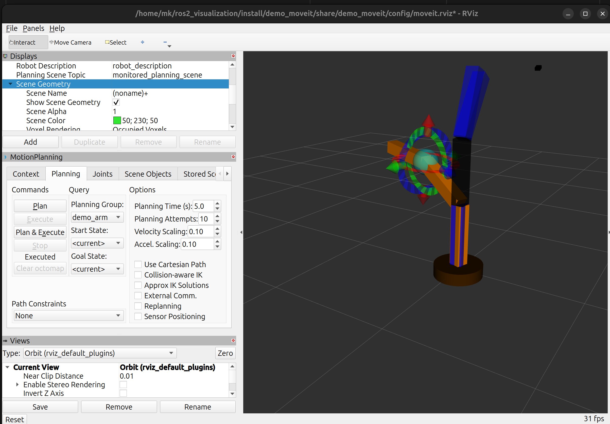

# MoveIt2 Basics — Motion Planning

<p align="center">
  
</p>

> ROS 2 Jazzy | Ubuntu 24.04 | MoveIt2

---

## ⚠️ Before the Workshop

### Prerequisites Check

- [ ] Linux Basics Workshop
- [ ] Python for Robotics Workshop
- [ ] ROS 2 Nodes and Topics Workshop
- [ ] ROS 2 Services and Actions Workshop
- [ ] URDF and Robot Visualization Workshop
- [ ] Gazebo Basics Workshop
- [ ] Gazebo Sensors and RViz2 Integration Workshop ← **Required!**

### System Requirements

- [ ] Ubuntu 24.04 installed and working
- [ ] ROS 2 Jazzy installed
- [ ] Workspace `~/ros2_visualization` exists
- [ ] Robot arm from previous workshops working
- [ ] Comfortable with RViz2, URDF, and Gazebo

### Verify Installation

```bash
ros2 --version
ls ~/ros2_visualization/src/arm_description
```

### Install MoveIt2

```bash
sudo apt install ros-jazzy-moveit
sudo apt install ros-jazzy-moveit-setup-assistant
sudo apt install ros-jazzy-moveit-visual-tools
sudo apt install ros-jazzy-moveit-ros-visualization
sudo apt install ros-jazzy-pilz-industrial-motion-planner
```

Verify:
```bash
ros2 pkg list | grep moveit
```

---

## Session Goal

By the end of this workshop you will be able to:

- Understand motion planning concepts
- Configure a robot for MoveIt2 using the Setup Assistant
- Define planning groups and end effectors
- Understand controller types
- Plan collision-free paths interactively
- Execute planned motions in RViz2
- Move the robot to target poses

---

## Workshop Structure

- Part 1: MoveIt2 Fundamentals
- Part 2: MoveIt2 Setup (Setup Assistant + Config Files)
- Part 3: Planning Groups and End Effector
- Part 4: Motion Planning in Action
- Part 5: Practice and Task

---

## 1. What is MoveIt2?

MoveIt2 is the most widely used motion planning framework in ROS 2. It provides:

- Motion planning algorithms
- Collision checking
- Forward and Inverse Kinematics
- Trajectory execution
- Perception integration
- Grasping and manipulation

### Why MoveIt2?

**Without MoveIt2:**
- Calculate end-effector position manually
- Calculate end-effector orientation manually
- Verify workspace limits manually

**With MoveIt2:**
- Computes end-effector position automatically ✅
- Computes end-effector orientation automatically ✅
- Checks robot model and workspace limits automatically ✅

### Manual Control vs MoveIt2

| Aspect | Manual (Previous Workshops) | MoveIt2 (This Workshop) |
|--------|-----------------------------|-------------------------|
| Control | Joint-by-joint angle setting | Joint states with full robot model |
| Path | You decide | MoveIt2 finds path |
| Obstacles | Might collide | Automatic avoidance |
| Complexity | Simple for few joints | Scales to many joints |
| Real Robots | Basic tasks | Complex manipulation |

### MoveIt2 Use Cases

**Industrial:** Pick and place, assembly, machine tending, welding

**Research:** Manipulation experiments, human-robot interaction, mobile manipulation, dual-arm coordination

**Service:** Warehouse automation, healthcare assistance, food service robots, inspection tasks

---

## 2. Motion Planning Concepts

### Core Concepts

**1. Configuration Space (C-Space)** — All possible joint positions of the robot.

For our 3-DOF arm:
```
C-Space = {(θ1, θ2, θ3) | θ1 ∈ [-π, π], θ2 ∈ [-π/2, π/2], θ3 ∈ [-π/2, π/2]}
```

**2. Workspace** — All `(x, y, z, roll, pitch, yaw)` positions the end effector can reach.

**3. Forward Kinematics** — Given joint angles → Calculate end effector position.
```
Input:  Joint angles (θ1, θ2, θ3)
Output: End effector pose (x, y, z, R, P, Y)
```

**4. Inverse Kinematics (IK)** — Given end effector position → Calculate joint angles. MoveIt2 solves this automatically.
```
Input:  End effector pose (x, y, z, R, P, Y)
Output: Joint angles (θ1, θ2, θ3)
```

### Motion Planning Pipeline

```
1. Start State  →  Current robot configuration
        ↓
2. Goal State   →  Desired end effector pose
        ↓
3. Planning     →  Find collision-free path
        ↓
4. Trajectory   →  Smooth path with velocities
        ↓
5. Execution    →  Send commands to robot
```

### Planning Algorithms

| Algorithm | Type | Best For |
|-----------|------|----------|
| RRT | Sampling-based | Fast, general purpose |
| RRTConnect | Sampling-based | Quick solutions |
| PRM | Sampling-based | Complex environments |
| OMPL | Library | Many algorithms |
| Pilz | Deterministic | Industrial, predictable |

Default: **OMPL with RRTConnect**

### Collision Checking

- **Self-collision:** Robot link collides with another robot link (e.g. `link2` hits `link1`)
- **Environment collision:** Robot collides with obstacles (e.g. arm hits table)
- **Planning scene:** Virtual representation of environment including obstacles and attached objects

---

## 3. MoveIt Setup Assistant

The MoveIt Setup Assistant is a GUI tool that generates the complete MoveIt2 configuration package for your robot — including planning groups, collision matrix, kinematic solver, and controller configuration.

👉 **[MoveIt2 Setup Assistant — Full Guide](../moveit2-basics/moveitsetupassistant.md)**

### Launch

```bash
ros2 launch moveit_setup_assistant setup_assistant.launch.py
```


### Final Result in RViz

The robot is fully loaded in RViz with the MoveIt MotionPlanning panel. The `demo_arm` planning group is available for interactive planning and execution.




### Summary of Steps Applied to This Robot

| Step | Action | Result |
|------|--------|-----------------------|
| 1 | Load URDF | `my_robot_arm.urdf` loaded |
| 2 | Self-Collisions | 10 disabled pairs generated |
| 3 | Virtual Joints | None (fixed base) |
| 4 | Planning Groups | `demo_arm` with `joint1`, `joint2`, `joint3` |
| 5 | Robot Poses | None defined |
| 6 | End Effectors | None (no gripper) |
| 7 | Passive Joints | None |
| 8 | ros2_control | `position` + `velocity` interfaces |
| 9 | ROS 2 Controllers | `demo_arm_controller` — JointTrajectoryController |
| 10 | MoveIt Controllers | `demo_arm_controller` — FollowJointTrajectory |
| 11 | Perception | None |
| 12 | Launch Files | All defaults kept |
| 13 | Author Info | Mohammad khalihah |
| 14 | Generate Package | Output: `src/demo_moveit` |

---

## 4. Configuration Files Overview

### Generated Package Structure

```
demo_moveit/
├── config/
│   ├── my_robot.srdf
│   ├── joint_limits.yaml
│   ├── kinematics.yaml
│   ├── moveit_controllers.yaml
│   ├── moveit.rviz
│   ├── my_robot.ros2_control.xacro
│   ├── my_robot.urdf.xacro
│   ├── pilz_cartesian_limits.yaml
│   ├── ros2_controllers.yaml
│   └── initial_positions.yaml
├── launch/
│   ├── demo.launch.py
│   ├── move_group.launch.py
│   ├── moveit_rviz.launch.py
│   ├── rsp.launch.py
│   ├── setup_assistant.launch.py
│   ├── spawn_controllers.launch.py
│   ├── static_virtual_joint_tfs.launch.py
│   └── warehouse_db.launch.py
├── CMakeLists.txt
└── package.xml
```

### Key Config Files

**`config/my_robot.srdf`** — Semantic Robot Description: planning groups and disabled collision pairs.

**`config/kinematics.yaml`**
```yaml
demo_arm:
  kinematics_solver: kdl_kinematics_plugin/KDLKinematicsPlugin
  kinematics_solver_search_resolution: 0.005
  kinematics_solver_timeout: 0.005
  position_only_ik: true
```

**`config/joint_limits.yaml`**
```yaml
default_velocity_scaling_factor: 0.1
default_acceleration_scaling_factor: 0.1
joint_limits:
  joint1:
    has_velocity_limits: true
    max_velocity: 1.0
    has_acceleration_limits: true
    max_acceleration: 1.0
  joint2:
    has_velocity_limits: true
    max_velocity: 1.0
    has_acceleration_limits: true
    max_acceleration: 1.0
  joint3:
    has_velocity_limits: true
    max_velocity: 1.0
    has_acceleration_limits: true
    max_acceleration: 1.0
```

**`config/ros2_controllers.yaml`**
```yaml
controller_manager:
  ros__parameters:
    update_rate: 100  
    demo_arm_controller:
      type: joint_trajectory_controller/JointTrajectoryController
    joint_state_broadcaster:
      type: joint_state_broadcaster/JointStateBroadcaster
demo_arm_controller:
  ros__parameters:
    joints:
      - joint1
      - joint2
      - joint3
    command_interfaces:
      - position
      - velocity
    state_interfaces:
      - position
      - velocity
    allow_nonzero_velocity_at_trajectory_end: true
```

**`config/moveit_controllers.yaml`**
```yaml
moveit_controller_manager: moveit_simple_controller_manager/MoveItSimpleControllerManager
moveit_simple_controller_manager:
  controller_names:
    - demo_arm_controller
  demo_arm_controller:
    type: FollowJointTrajectory
    action_ns: follow_joint_trajectory
    default: true
    joints:
      - joint1
      - joint2
      - joint3
```

**`config/initial_positions.yaml`**
```yaml
initial_positions:
  joint1: 0
  joint2: 0
  joint3: 0
```

**`config/pilz_cartesian_limits.yaml`**
```yaml
cartesian_limits:
  max_trans_vel: 1.0
  max_trans_acc: 2.25
  max_trans_dec: -5.0
  max_rot_vel: 1.57
```

### Build the Package

```bash
cd ~/ros2_visualization
colcon build --packages-select demo_moveit
source install/setup.bash
```

> ⚠️ Repeat build + source every time you change configuration files.

---

## 5. Planning Groups Concept

A **Planning Group** is a set of joints that move together for a common task.

**Our robot — `demo_arm` group:**
```
demo_arm
  ├── world_joint  (virtual, fixed)
  ├── joint1       (base rotation)
  ├── joint2       (shoulder)
  └── joint3       (elbow)
```

### Three Ways to Define a Group

**1. Kinematic Chain**  — Base link → Tip link, includes all joints in between.

**2. Joint List** *(used here)* — Explicitly list joints: `[joint1, joint2, joint3]`

**3. Link List** — Explicitly list links; joints connecting them are included automatically.

### Planning Group in Action

When you command:
```python
move_group.set_pose_target([x, y, z, roll, pitch, yaw])
```

MoveIt2:
1. Uses IK to find joint values for all joints in the group
2. Plans path from current to target configuration
3. Checks collisions for all links in the group
4. Executes coordinated motion

---

## 6. End Effector Configuration

An **End Effector** is the tool or gripper at the end of the robot arm. It defines where to place the interactive marker in RViz2 and the reference frame for goal poses.

**For this robot:** No end effector defined. `link3` is the physical tip. When you command a goal pose, MoveIt2 moves `link3` to that position.

### End Effector Types

| Type | Description | Example |
|------|-------------|---------|
| Fixed Tool | No movable parts | Welding tip, camera |
| Gripper | Movable fingers | Parallel gripper, vacuum |
| Multi-fingered | Complex grasping | Anthropomorphic hand |

---

## 7. Launch MoveIt2 with RViz2

```bash
cd ~/ros2_visualization
source install/setup.bash
ros2 launch demo_moveit demo.launch.py
```

**Expected:**
- RViz2 opens with MoveIt2 MotionPlanning panel
- Robot model visible with planning group `demo_arm` selected
- Interactive marker at the tip of `link3`

> ⚠️ If launch fails, check the Common Errors section below.

### RViz2 Interface Components

| Component | Location | Purpose |
|-----------|----------|---------|
| 3D View | Center | Robot model + planned path visualization |
| Motion Planning Panel | Left | Plan/Execute controls, goal pose |
| Planning Scene | Right tab | Add obstacles, collision objects |

### Initial Configuration in Motion Planning Panel

1. **Planning Group:** Select `demo_arm`
2. **Planning Library:** OMPL
3. **Planning Algorithm:** RRTConnect (default)

---

## 8. Interactive Planning

### Set a Goal Pose

**Method 1 — Drag Interactive Marker:** Click and drag the marker at the robot tip to set a target position.

**Method 2 — Random Valid Goal:**
Motion Planning panel → Planning tab → "Select Goal State" → `< random valid >` → Update

**Method 3 — Named Pose:**
Motion Planning panel → "Select Goal State" → select saved pose → Update

### Plan a Motion

1. Set goal using any method above
2. Click **"Plan"** — orange trajectory appears after 1–3 seconds
3. Click **"Execute"** — robot moves to goal
4. Or click **"Plan & Execute"** to do both at once

### RViz2 Color Reference

| Color | Meaning |
|-------|---------|
| White/Gray | Current robot state |
| Orange/Ghost | Goal state |
| Orange Trail | Planned path |
| Red | Collision detected |
| Green | Valid configuration |

### Planning Parameters

| Parameter | Default | When to Change |
|-----------|---------|----------------|
| Planning Time | 5s | Increase for complex scenes |
| Planning Attempts | 10 | Increase if planning often fails |
| Velocity Scaling | 1.0 | Reduce for safer testing (e.g. 0.5) |
| Accel. Scaling | 0.1 | Defined in `joint_limits.yaml` |

---

## 9. Plan and Execute Motion

### Full Cycle Workflow

```
1. Set goal (drag marker or select pose)
        ↓
2. Click "Plan"
        ↓
3. Review planned trajectory (orange path)
        ↓
4. Click "Execute"
        ↓
5. Robot moves to goal ✅
```

### Move to Specific Coordinates

In Motion Planning panel → Goal Pose fields:
```
Position:    x: 0.3   y: 0.0   z: 0.4
Orientation: x: 0     y: 0     z: 0    w: 1
```
Click **Update** → **Plan & Execute**

---

## 10. Task


[Moveit2 Package Task](tasks/task.md)


---

## Common Errors and Solutions

| Error | Cause | Solution |
|-------|-------|----------|
| Setup Assistant crashes | Missing dependencies | Install all MoveIt2 packages |
| IK solver not found | Missing KDL plugin | `sudo apt install ros-jazzy-kdl-parser` |
| Planning fails repeatedly | Unreachable goal | Try different goal or increase planning time |
| No interactive marker | End effector not configured | Check Setup Assistant Step 6 |
| Robot doesn't move on Execute | Controller not configured | Fake controller is OK for demo |
| Collision detected (red) | Invalid configuration | Choose different goal pose |
| Launch file not found | Package not built | `colcon build && source install/setup.bash` |

### Error 1: MoveIt Cannot Find a Controller

**Error message:**
```
Returned 0 controllers in list
Unable to identify any set of controllers that can actuate the specified joints
```

**Cause:** MoveIt does not know which controller to use to move the robot.

**Fix:** Make sure `config/moveit_controllers.yaml` contains:
```yaml
moveit_controller_manager: moveit_simple_controller_manager/MoveItSimpleControllerManager

moveit_simple_controller_manager:
  controller_names:
    - demo_arm_controller

  demo_arm_controller:
    type: FollowJointTrajectory
    action_ns: follow_joint_trajectory
    default: true
    joints:
      - joint1
      - joint2
      - joint3
```

### Error 2: Missing Action Namespace

**Error message:**
```
No action namespace specified for controller
```

**Cause:** MoveIt needs to know the Action server name for the controller.

**Fix:** Add `action_ns: follow_joint_trajectory` to the controller entry in `moveit_controllers.yaml`. This tells MoveIt the controller exposes the action:
```
/demo_arm_controller/follow_joint_trajectory
```

### Error 3: Missing Acceleration Limits

**Error message:**
```
No acceleration limit was defined for joint
```

**Cause:** MoveIt requires acceleration limits to compute trajectory timing.

**Fix:** Make sure `config/joint_limits.yaml` defines limits for every joint:
```yaml
joint_limits:
  joint1:
    has_velocity_limits: true
    max_velocity: 1.0
    has_acceleration_limits: true
    max_acceleration: 1.0
  joint2:
    has_velocity_limits: true
    max_velocity: 1.0
    has_acceleration_limits: true
    max_acceleration: 1.0
  joint3:
    has_velocity_limits: true
    max_velocity: 1.0
    has_acceleration_limits: true
    max_acceleration: 1.0
```

---

## Troubleshooting Checklist

- [ ] All MoveIt2 packages installed? `ros2 pkg list | grep moveit`
- [ ] Package built? `colcon build --packages-select demo_moveit`
- [ ] Workspace sourced? `source install/setup.bash`
- [ ] URDF loaded in Setup Assistant? (robot should appear in 3D view)
- [ ] Planning group `demo_arm` created?
- [ ] Valid goal state? (ghost robot should be green, not red)

---

## Quick Reference

### Important Commands

| Command | Purpose |
|---------|---------|
| `ros2 launch demo_moveit demo.launch.py` | Launch MoveIt2 + RViz2 |
| `ros2 topic list \| grep controller` | Check active controllers |
| `ros2 topic list \| grep joint` | Check joint state topics |

### Important Launch Files

| File | Purpose |
|------|---------|
| `demo.launch.py` | MoveIt2 + RViz2 (fake simulation) |
| `move_group.launch.py` | Planning server only |
| `moveit_rviz.launch.py` | RViz2 with MoveIt2 config |
| `spawn_controllers.launch.py` | Start ros2_control controllers |

### MoveIt2 Components

| Component | Purpose |
|-----------|---------|
| `move_group` | Main planning node |
| Planning Scene | Environment representation |
| Motion Planning Panel | RViz2 interface |
| Interactive Marker | Goal pose specification |
| Trajectory Execution | Execute planned paths |

---

## Why This Matters

| Concept | Real Robot Usage | Example |
|---------|-----------------|---------|
| Motion Planning | Autonomous manipulation | Pick objects without manual programming |
| Collision Avoidance | Safe operation | Work near humans and obstacles |
| IK Solving | Task-space control | "Move gripper here" vs "set joint angles" |
| Trajectory Optimization | Smooth motion | Energy-efficient, natural movements |
| MoveIt2 Framework | Industry standard | Used by most professional robot arms |

### Real-World Workflow

```
1. Define robot in URDF
        ↓
2. Configure with MoveIt Setup Assistant
        ↓
3. Test planning in RViz2
        ↓
4. Add obstacles/scene
        ↓
5. Integrate with perception (cameras)
        ↓
6. Deploy to real robot
        ↓
7. Autonomous manipulation! 
```

---

## Resources

- [MoveIt2 Documentation](https://moveit.picknik.ai/main/index.html)
- [MoveIt2 Python API](https://moveit.picknik.ai/main/doc/api/python_api.html)
- [ros2_control Documentation](https://control.ros.org)

---

**Next:** MoveIt2 Programming — controlling the robot programmatically using the MoveIt2 Python API as this **[demo code](code/examples/src/demo_moveit/scripts)**.