# MoveIt Setup Assistant

## Overview

The MoveIt Setup Assistant is a graphical user interface for configuring any robot for use with MoveIt. Its primary function is generating a **Semantic Robot Description Format (SRDF)** file for your robot, along with all necessary configuration files for the MoveIt pipeline.

In this workshop, the Setup Assistant was used to configure a custom **3-DOF robot arm** (`my_robot_arm`) defined in a URDF file, resulting in a fully functional MoveIt configuration package (`demo_moveit`).

> **Robot used:** `my_robot_arm`
> **URDF path:** `src/arm_description/urdf/my_robot_arm.urdf`
> **Output package:** `src/demo_moveit`

---

## Getting Started

Launch the Setup Assistant:

```bash
ros2 launch moveit_setup_assistant setup_assistant.launch.py
```

---

## Step 1: Start — Load URDF

Click **Create New MoveIt Configuration Package**, then browse to your robot's URDF file and click **Load Files**.

**For this robot:**
- URDF loaded from: `src/arm_description/urdf/my_robot_arm.urdf`
- The robot preview appeared in the right panel on successful load.

| Load URDF | Loaded Successfully |
|-----------|-------------------|
| 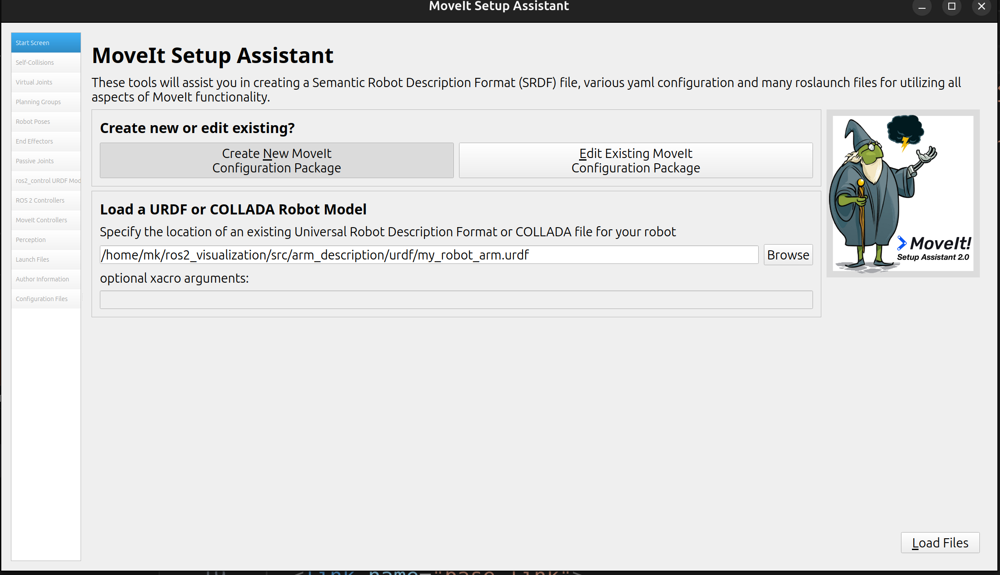 | 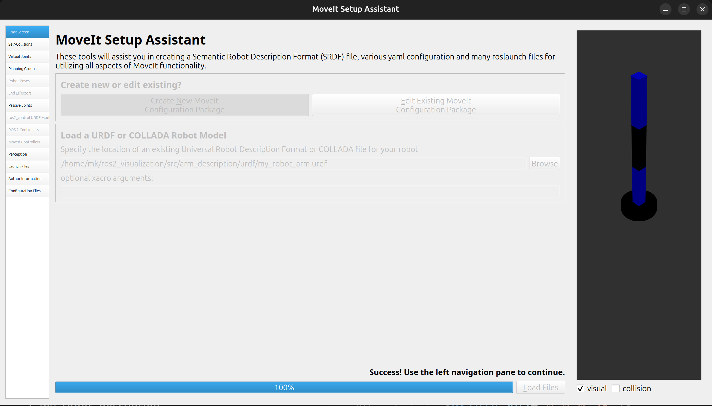 |

---

## Step 2: Generate Self-Collision Matrix

This step searches for pairs of robot links that can safely skip collision checking, reducing motion planning computation time. Links that are always in collision, never in collision, in default-pose collision, or adjacent on the kinematic chain are identified and disabled.

**For this robot (sampling density: 69000):**

| Link A | Link B | Reason Disabled |
|--------|--------|-----------------|
| base_link | link1 | Adjacent Links |
| base_link | link2 | Never in Collision |
| base_link | link3 | Never in Collision |
| camera_link | base_link | Adjacent Links |
| camera_link | link1 | Never in Collision |
| camera_link | link2 | Never in Collision |
| camera_link | link3 | Never in Collision |
| link1 | link2 | Adjacent Links |
| link1 | link3 | Never in Collision |
| link2 | link3 | Adjacent Links |

| Before Generation | After Generation |
|-------------------|-----------------|
| 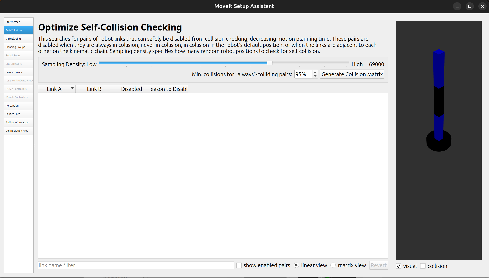 | 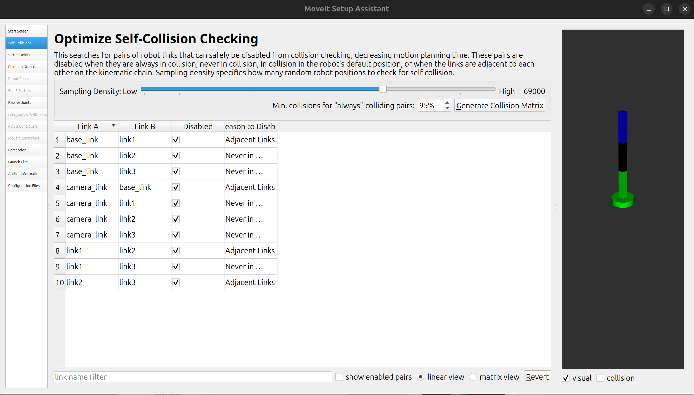 |

---

## Step 3: Virtual Joints

Virtual joints connect the robot base to the world frame. They are especially useful for mobile robots to model base movement.

**For this robot:** No virtual joints were added. The robot's base is assumed to be fixed in the world by its URDF definition.

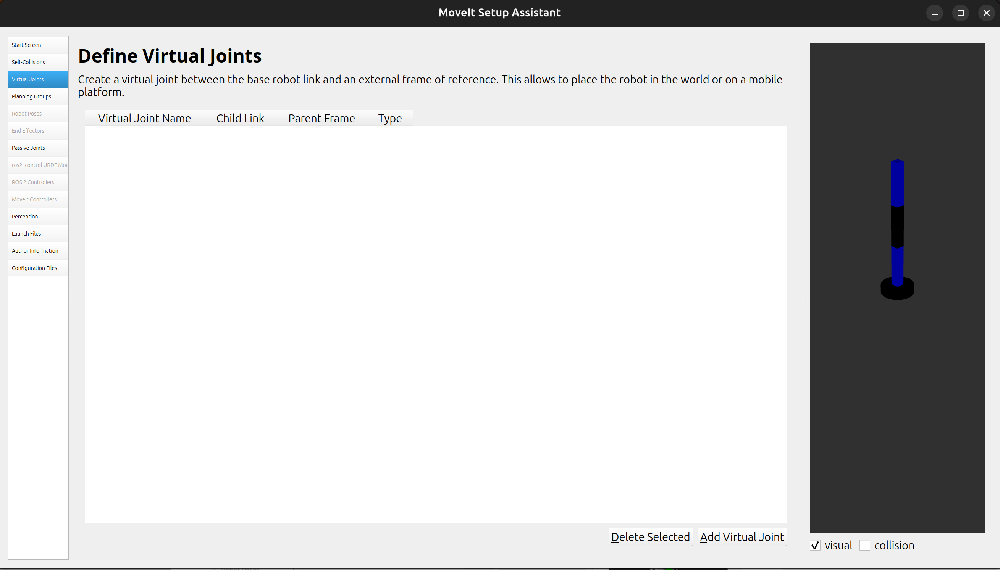

---

## Step 4: Add Planning Groups

Planning groups semantically describe parts of the robot for motion planning. Each group can be defined by joints, links, a kinematic chain, or subgroups.

**For this robot — one planning group was created:**

| Setting | Value |
|---------|-------|
| Group Name | `demo_arm` |
| Kinematic Solver | `kdl_kinematics_plugin/KDLKinematicsPlugin` |
| Kin. Search Resolution | `0.005` |
| Kin. Search Timeout | `0.005` |
| Default Planner | `RRT` |
| Selected Joints | `world_joint`, `joint1`, `joint2`, `joint3` |

| Group Config | Joint Selection |
|--------------|----------------|
| 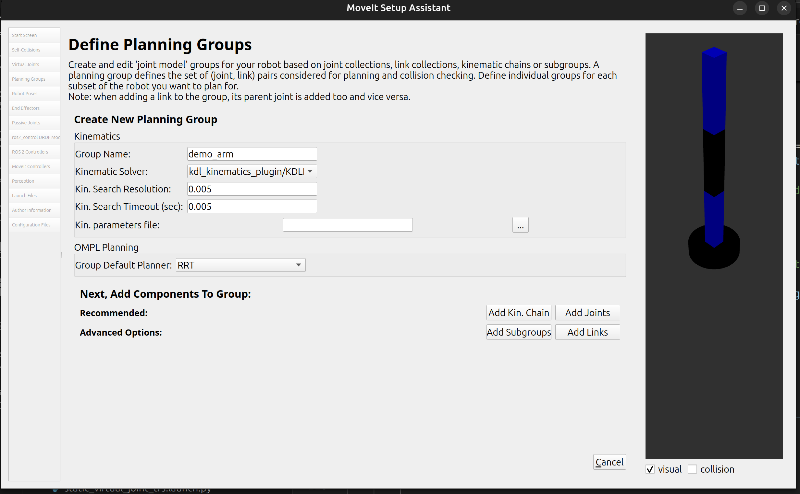 | 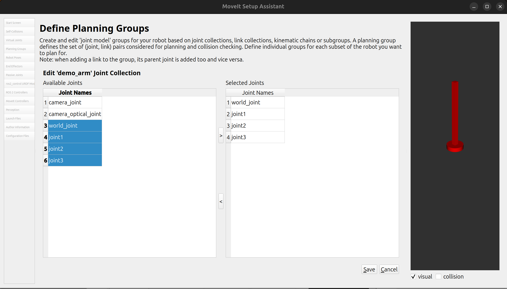 |

---

## Step 5: Add Robot Poses

Predefined poses allow commanding the robot to known configurations via the MoveIt API. The first defined pose becomes the robot's initial pose in simulation.

**For this robot:** No predefined poses were defined. The robot uses its default pose (all joints at zero).

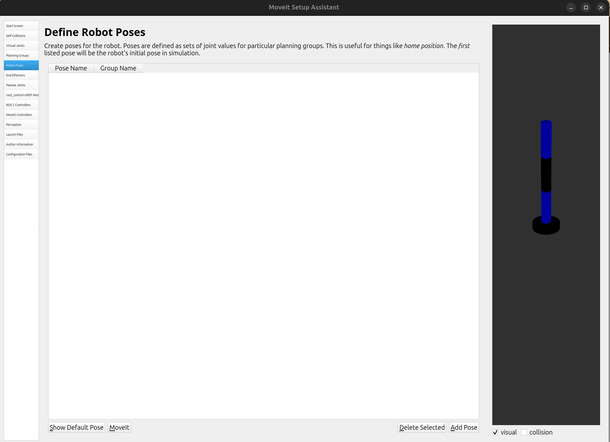

---

## Step 6: Label End Effectors

Designating a group as an end effector enables special MoveIt operations such as attaching objects during pick-and-place tasks.

**For this robot:** No end effectors were defined. The robot does not have a gripper or tool attached.

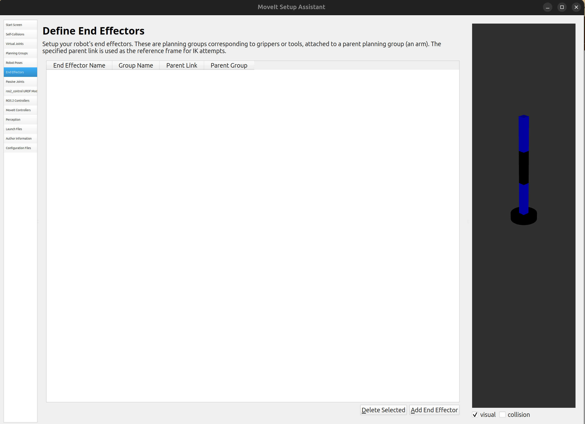

---

## Step 7: Add Passive Joints

Passive joints are unactuated joints that cannot be directly controlled. Specifying them prevents the planner from trying to include them in trajectories.

**For this robot:** All 3 joints (`joint1`, `joint2`, `joint3`) are active. No passive joints were defined.

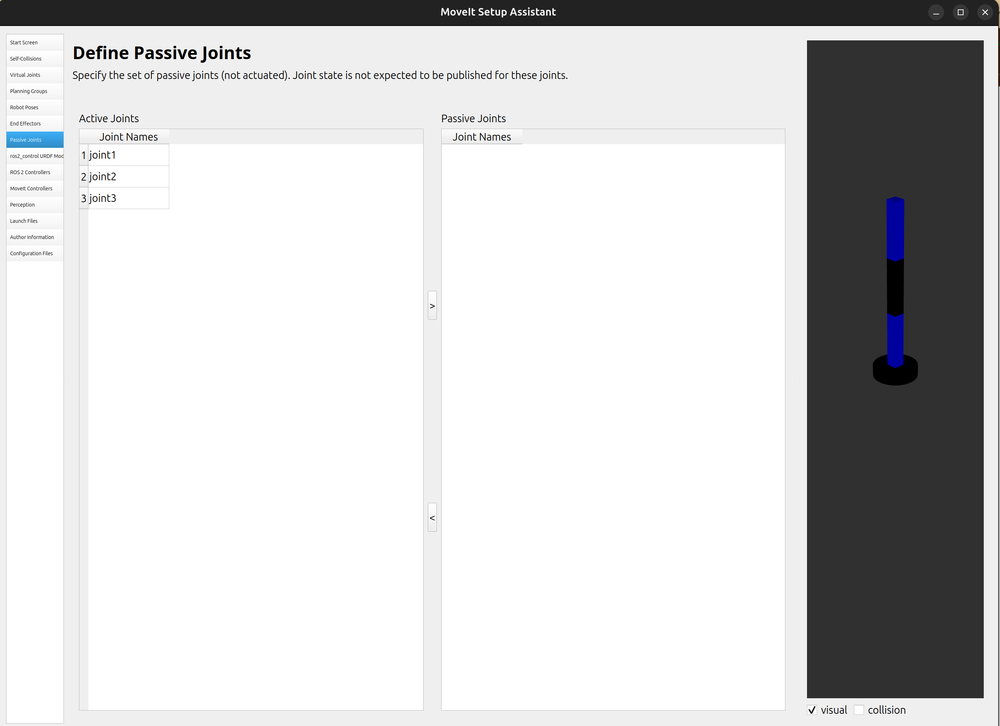

---

## Step 8: ros2_control URDF Modification

This step adds `ros2_control` tags to the URDF, defining command and state interfaces for each joint.

**For this robot — applied to `joint1`, `joint2`, `joint3`:**

| Interface Type | Interfaces Selected |
|----------------|-------------------|
| Command Interfaces | `position`, `velocity` |
| State Interfaces | `position`, `velocity` |

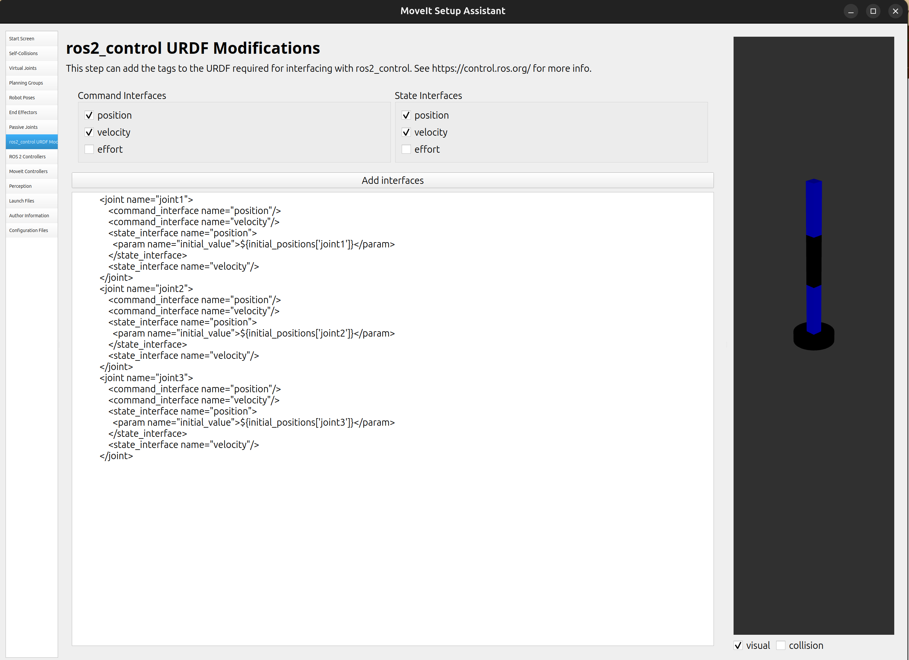

---

## Step 9: ROS 2 Controllers

ROS 2 Controllers manage real-time joint actuation. They are auto-generated for simulation using `ros2_control` fake components.

**For this robot:**

| Controller Name | Type | Joints |
|-----------------|------|--------|
| `demo_arm_controller` | `joint_trajectory_controller/JointTrajectoryController` | `joint1`, `joint2`, `joint3` |

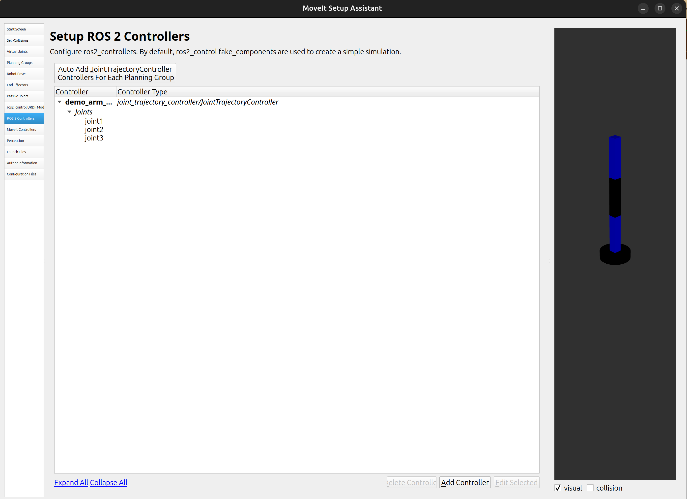

---

## Step 10: MoveIt Controllers

MoveIt Controllers bridge MoveIt's motion plans to the ROS 2 hardware controllers via a `FollowJointTrajectory` action interface.

**For this robot:**

| Controller Name | Type | Joints |
|-----------------|------|--------|
| `demo_arm_controller` | `FollowJointTrajectory` | `joint1`, `joint2`, `joint3` |

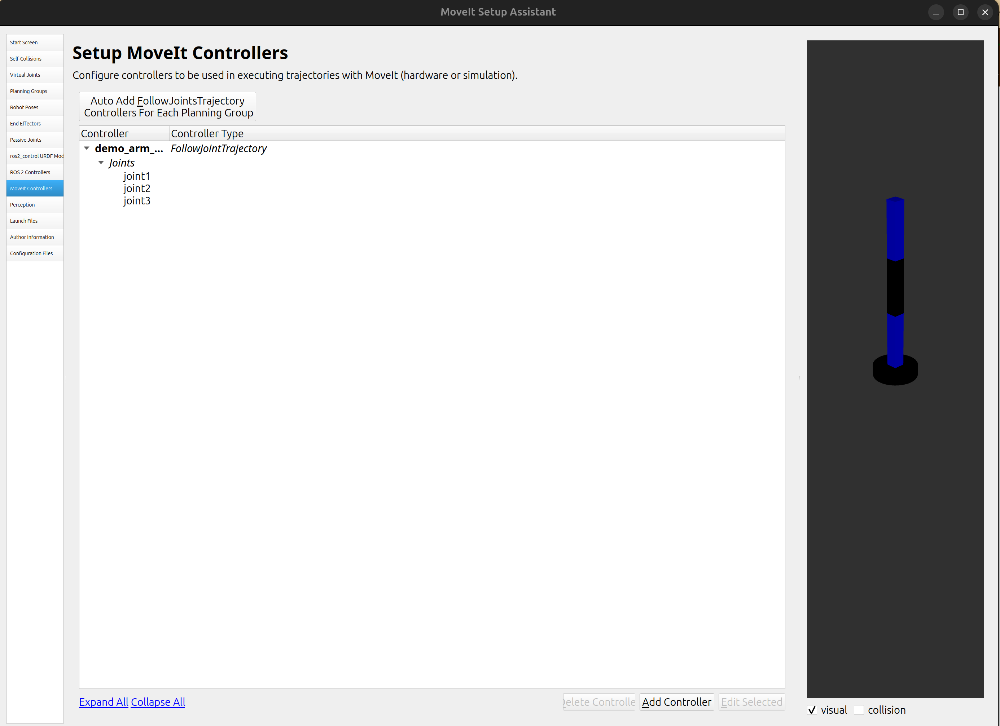

---

## Step 11: Perception

3D sensor configuration for obstacle awareness and environment perception. Settings are saved in `sensors_3d.yaml`.

**For this robot:** Set to **None**. No 3D sensors are attached to this robot.

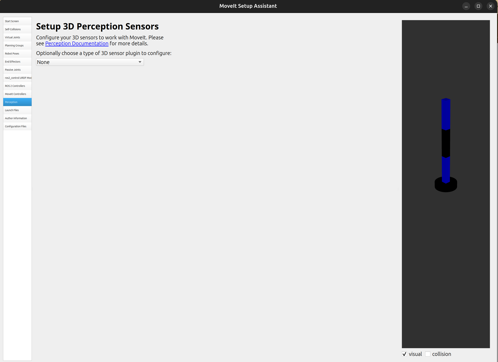

---

## Step 12: Launch Files

The Setup Assistant generates all necessary launch files. All default options were kept.

**Generated launch files:**

- `launch/rsp.launch.py` — Robot State Publisher
- `launch/moveit_rviz.launch.py` — RViz with MoveIt config
- `launch/move_group.launch.py` — MoveGroup node
- `launch/static_virtual_joint_tfs.launch.py` — Static TF
- `launch/spawn_controllers.launch.py` — Spawn Controllers
- `launch/demo.launch.py` — Full demo
- `launch/setup_assistant.launch.py` — Reopen Setup Assistant
- `launch/warehouse_db.launch.py` — Warehouse DB

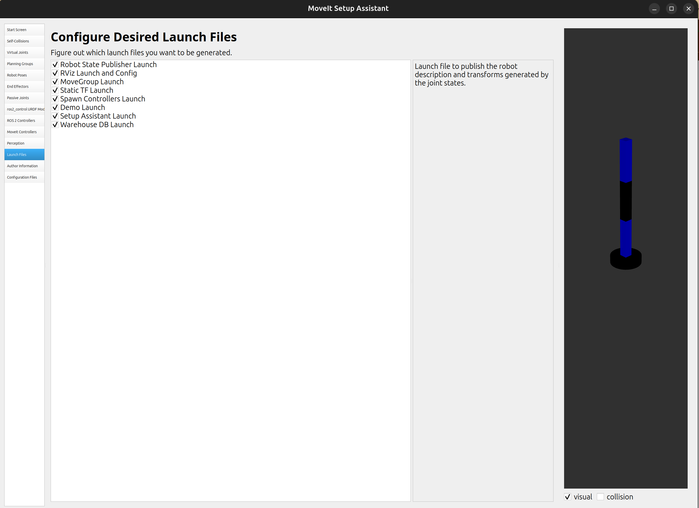

---

## Step 13: Add Author Information

Author information is required for the `package.xml` of the generated ROS 2 package.

| Field | Value |
|-------|-------|
| Name | Mohammad khalihah |
| Email | mohammadcyberai@gmail.com |

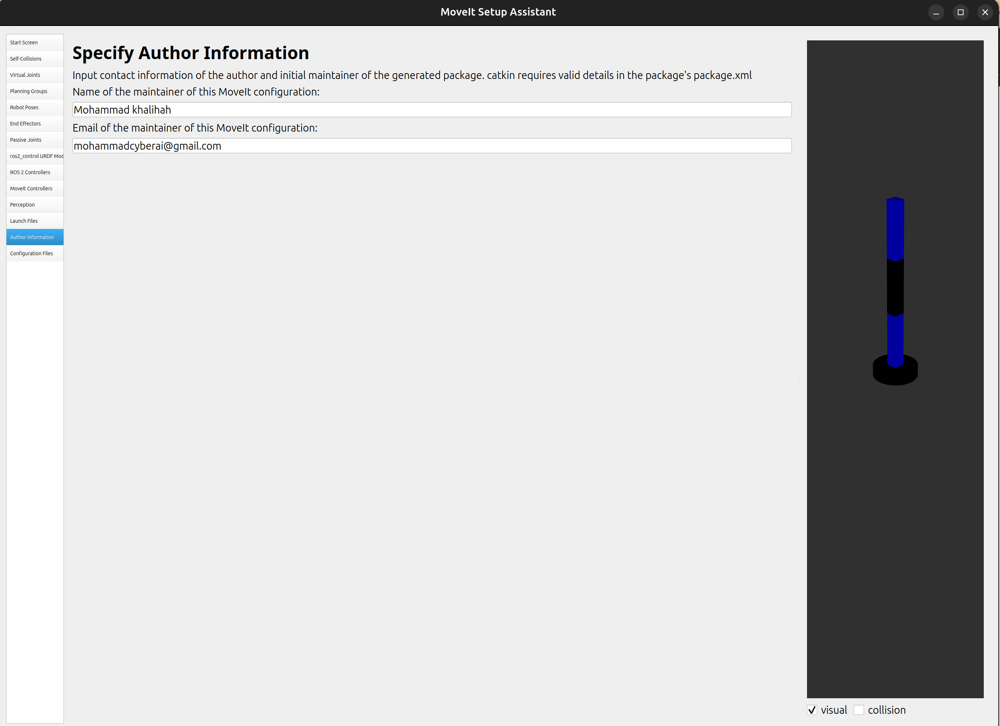

---

## Step 14: Generate Configuration Files

Click **Generate Package** to create all configuration files. The output package is saved to the specified directory.

**For this robot:**
- Output path: `/home/mk/ros2_visualization/src/demo_moveit`

**Generated files include:**

| File | Purpose |
|------|---------|
| `config/my_robot.srdf` | Semantic Robot Description Format |
| `config/joint_limits.yaml` | Joint velocity/acceleration limits |
| `config/kinematics.yaml` | IK solver configuration |
| `config/ros2_controllers.yaml` | ROS 2 controller parameters |
| `config/moveit_controllers.yaml` | MoveIt controller manager config |
| `config/my_robot.ros2_control.xacro` | ros2_control hardware interfaces |
| `config/initial_positions.yaml` | Default joint positions |
| `config/pilz_cartesian_limits.yaml` | Cartesian planning limits |

| Configuration Files | Generation Complete |
|--------------------|-------------------|
| 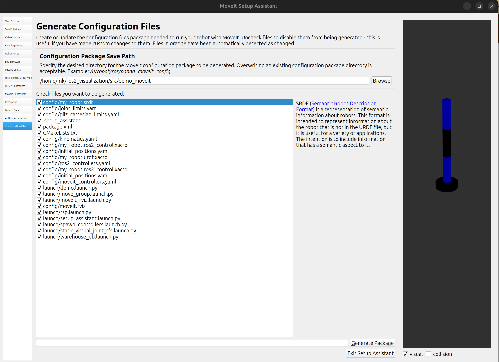 | 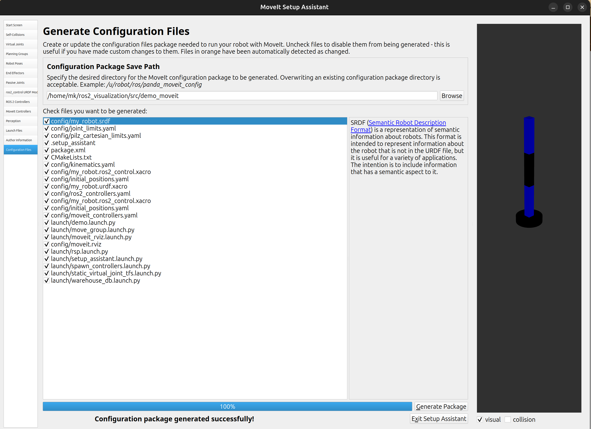 |

---

## Build and Run the Demo

```bash
cd ~/ros2_visualization
colcon build --packages-select demo_moveit
source install/setup.bash
ros2 launch demo_moveit demo.launch.py
```

### Final Result in RViz

The robot is fully loaded in RViz with the MoveIt MotionPlanning panel. The `demo_arm` planning group is available for interactive planning and execution.


---

## Robot Summary

| Property | Value |
|----------|-------|
| Robot Name | `my_robot_arm` |
| DOF | 3 |
| Active Joints | `joint1`, `joint2`, `joint3` |
| Links | `base_link`, `link1`, `link2`, `link3`, `camera_link` |
| Planning Group | `demo_arm` |
| IK Solver | KDL |
| Default Planner | RRT |
| End Effector | None |
| 3D Perception | None |
| Passive Joints | None |
| Virtual Joints | None |
| Output Package | `demo_moveit` |
| Maintainer | Mohammad khalihah |