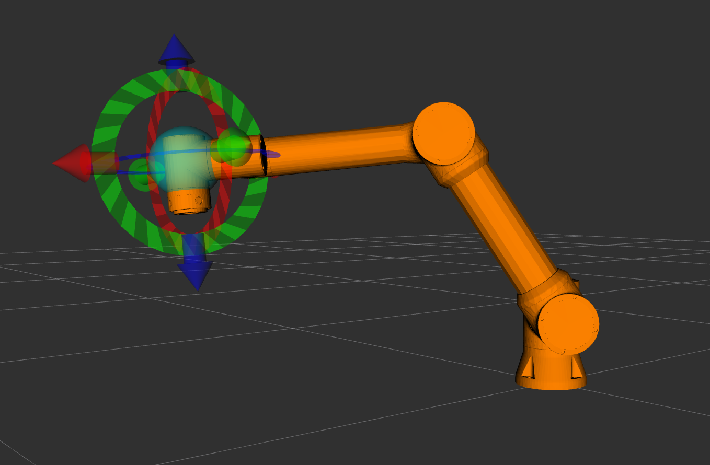
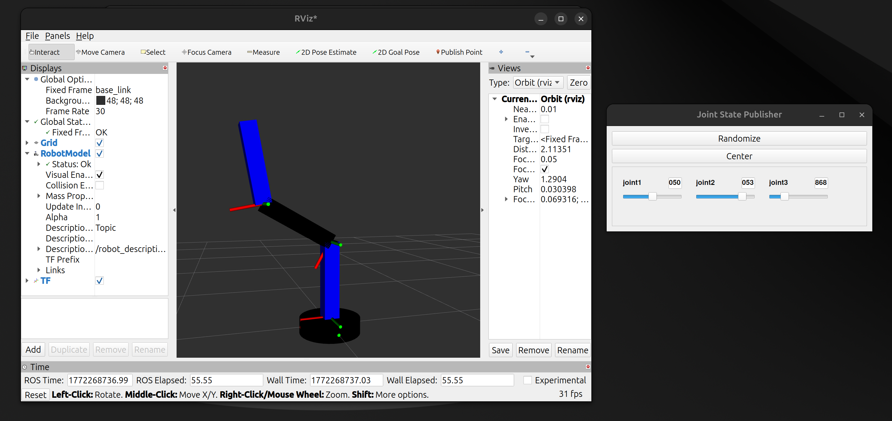

# URDF and Robot Visualization (RViz2)

## BEFORE THE WORKSHOP

### Prerequisites Check

You should have already completed:

☐ **Linux Basics Workshop**  
☐ **Python for Robotics Workshop**  
☐ **ROS 2 Nodes and Topics Workshop**  
☐ **ROS 2 Services and Actions Workshop**

### System Requirements

☐ **Ubuntu 24.04** installed and working  
☐ **ROS 2 Jazzy** installed  
☐ **Workspace `~/ros2_ws`** created  
☐ Comfortable with ROS 2 communication patterns

### Verify ROS 2

```bash
ros2 --version
```

---

### Install Required Packages

```bash
sudo apt install ros-jazzy-joint-state-publisher-gui
sudo apt install ros-jazzy-xacro
sudo apt install ros-jazzy-rviz2
```

Verify installation:

```bash
ros2 pkg list | grep joint_state_publisher
ros2 pkg list | grep xacro
ros2 pkg list | grep rviz
```

**Expected output:**
```
joint_state_publisher
joint_state_publisher_gui
xacro
rviz2
...
```

---

## Table of Contents

- [Session Goal](#session-goal)
- [1. What is URDF?](#1-what-is-urdf)
- [2. Links and Joints](#2-links-and-joints)
- [3. Workspace Setup](#3-workspace-setup)
- [4. URDF Structure](#4-urdf-structure)
- [5. Creating Robot Description](#5-creating-robot-description)
- [6. Launch File](#6-launch-file)
- [7. Testing in RViz2](#7-testing-in-rviz2)
- [8. Understanding TF](#8-understanding-tf)
- [9. Interactive Control](#9-interactive-control)
- [10. Task (Mandatory)](#10-task-mandatory)
- [Common Errors and Solutions](#common-errors-and-solutions)
- [Troubleshooting Checklist](#troubleshooting-checklist)
- [Quick Reference](#quick-reference)
- [Why This Matters](#why-this-matters)
- [Resources](#resources)
- [What's Next](#whats-next)

---

## Session Goal


- Understand URDF robot description format
- Differentiate between links and joints
- Create robot descriptions from scratch
- Visualize robots in RViz2
- Control robot joints interactively
- Understand coordinate frame transformations (TF)

---

## 1. What is URDF?

### Definition

**URDF (Unified Robot Description Format):**
- XML format for describing robots
- Standard across all ROS 2 applications
- Defines geometry, kinematics, and appearance

---

### What URDF Describes

**Geometry:** Shape and size of robot parts  
**Kinematics:** How parts connect and move  
**Appearance:** Colors and materials  
**Physics:** Mass and inertia (for simulation)

---

### Why URDF?

**One description, multiple uses:**
- Visualization in RViz2
- Simulation in Gazebo
- Motion planning with MoveIt2
- Hardware control

**Write once, use everywhere.**

---

### URDF vs Code

**Before URDF:**
```
"My robot has a base, two arms, and a gripper..."
```

**With URDF:**
```xml
<robot name="my_robot">
  <link name="base_link"/>
  <joint name="joint1" type="revolute"/>
  <link name="link1"/>
  ...
</robot>
```

The XML code becomes a 3D model automatically.





---

## 2. Links and Joints

### Link

**A link is a rigid body part that doesn't deform.**

**Examples:**
- Robot base (chassis)
- Arm segment
- Wheel
- Camera mount

**In URDF:**
```xml
<link name="base_link">
  <visual>
    <geometry>
      <cylinder radius="0.2" length="0.1"/>
    </geometry>
    <material name="black">
      <color rgba="0 0 0 1"/>
    </material>
  </visual>
</link>
```

---

### Joint

**A joint connects two links and defines how they move relative to each other.**

**In URDF:**
```xml
<joint name="joint1" type="revolute">
  <parent link="base_link"/>
  <child link="link1"/>
  <origin xyz="0 0 0.05" rpy="0 0 0"/>
  <axis xyz="0 0 1"/>
  <limit lower="-3.14" upper="3.14" effort="5.0" velocity="1.0"/>
</joint>
```

---

### Joint Types

| Type | Movement | Example |
|------|----------|---------|
| **fixed** | No movement | Camera mount |
| **revolute** | Rotation (limited angle) | Robot arm joint |
| **continuous** | Rotation (unlimited) | Wheel |
| **prismatic** | Linear (sliding) | Elevator, linear actuator |


---

### Link vs Joint

**Link:**
- Has shape (geometry)
- Has appearance (color)
- Cannot move on its own

**Joint:**
- Has no shape
- Connects two links
- Defines movement type and limits

---

### Robot Structure Example

```
base_link (fixed to world)
    ↓ joint1 (revolute, Z-axis)
link1
    ↓ joint2 (revolute, Y-axis)
link2
    ↓ joint3 (revolute, Y-axis)
link3
```

Each joint adds one **degree of freedom (DOF)**.

---

### Installing Dependencies 

```bash
sudo apt install ros-jazzy-robot-state-publisher
sudo apt install ros-jazzy-joint-state-publisher-gui
sudo apt install ros-jazzy-rviz2
sudo apt install ros-jazzy-xacro
```


## 3. Workspace Setup

### Create Workspace

```bash
mkdir -p ~/ros2_visualization/src
cd ~/ros2_visualization
colcon build
source install/setup.bash
```

**Expected output:**
```
Summary: 0 packages finished [0.2s]
```

---

### Create Package

```bash
cd ~/ros2_visualization/src
ros2 pkg create my_robot_description --build-type ament_cmake
```

**Expected output:**
```
going to create a new package
package name: my_robot_description
...
```

---

### Create Directory Structure

```bash
cd ~/ros2_visualization/src/my_robot_description
mkdir urdf launch rviz
```

**Expected structure:**
```
my_robot_description/
├── CMakeLists.txt
├── package.xml
├── urdf/
├── launch/
└── rviz/
```

Verify:
```bash
tree
```

---

## 4. URDF Structure

### Basic Elements

**Every URDF has:**
1. Robot declaration
2. Links (parts)
3. Joints (connections)
4. Materials (colors)

---

### Minimal URDF

```xml
<?xml version="1.0"?>
<robot name="my_robot">

  <!-- Material definition -->
  <material name="black">
    <color rgba="0 0 0 1"/>
  </material>

  <!-- Base link -->
  <link name="base_link">
    <visual>
      <geometry>
        <cylinder radius="0.2" length="0.1"/>
      </geometry>
      <material name="black"/>
    </visual>
  </link>

</robot>
```

---

### Geometry Types

| Shape | Syntax |
|-------|--------|
| Box | `<box size="x y z"/>` |
| Cylinder | `<cylinder radius="r" length="h"/>` |
| Sphere | `<sphere radius="r"/>` |
| Mesh | `<mesh filename="package://..."/>` |

---

## 5. Creating Robot Description

### File Location

Create the URDF file:
```
~/ros2_visualization/src/my_robot_description/urdf/my_robot_arm.urdf
```

```bash
cd ~/ros2_visualization/src/my_robot_description/urdf
touch my_robot_arm.urdf
nano my_robot_arm.urdf
```

---

### Complete URDF Code

```xml
<?xml version="1.0"?>
<robot name="my_robot" xmlns:xacro="http://www.ros.org/wiki/xacro">

  <!-- Materials -->
  <material name="black">
    <color rgba="0 0 0 1"/>
  </material>
  <material name="blue">
    <color rgba="0 0 1 1"/>
  </material>

  <!-- Base link -->
  <link name="base_link">
    <visual>
      <geometry>
        <cylinder radius="0.2" length="0.1"/>
      </geometry>
      <material name="black"/>
    </visual>
    <collision>
      <geometry>
        <cylinder radius="0.2" length="0.1"/>
      </geometry>
    </collision>
    <inertial>
      <mass value="1.0"/>
      <inertia ixx="0.1" iyy="0.1" izz="0.1" ixy="0.0" ixz="0.0" iyz="0.0"/>
    </inertial>
  </link>

  <!-- Link 1 -->
  <link name="link1">
    <visual>
      <geometry>
        <box size="0.1 0.1 0.5"/>
      </geometry>
      <origin xyz="0 0 0.25"/>
      <material name="blue"/>
    </visual>
    <collision>
      <geometry>
        <box size="0.1 0.1 0.5"/>
      </geometry>
      <origin xyz="0 0 0.25"/>
    </collision>
    <inertial>
      <mass value="0.5"/>
      <inertia ixx="0.02" iyy="0.02" izz="0.02" ixy="0" ixz="0" iyz="0"/>
    </inertial>
  </link>

  <!-- Joint1: revolute around Z -->
  <joint name="joint1" type="revolute">
    <parent link="base_link"/>
    <child link="link1"/>
    <origin xyz="0 0 0.05" rpy="0 0 0"/>
    <axis xyz="0 0 1"/>
    <limit lower="-3.14" upper="3.14" effort="5.0" velocity="1.0"/>
  </joint>

  <!-- Link 2 -->
  <link name="link2">
    <visual>
      <geometry>
        <box size="0.1 0.1 0.5"/>
      </geometry>
      <origin xyz="0 0 0.25"/>
      <material name="black"/>
    </visual>
    <collision>
      <geometry>
        <box size="0.1 0.1 0.5"/>
      </geometry>
      <origin xyz="0 0 0.25"/>
    </collision>
    <inertial>
      <mass value="0.5"/>
      <inertia ixx="0.02" iyy="0.02" izz="0.02" ixy="0" ixz="0" iyz="0"/>
    </inertial>
  </link>

  <!-- Joint2: revolute around Y -->
  <joint name="joint2" type="revolute">
    <parent link="link1"/>
    <child link="link2"/>
    <origin xyz="0 0 0.5" rpy="0 0 0"/>
    <axis xyz="0 1 0"/>
    <limit lower="-1.57" upper="1.57" effort="5.0" velocity="1.0"/>
  </joint>

  <!-- Link 3 -->
  <link name="link3">
    <visual>
      <geometry>
        <box size="0.1 0.1 0.5"/>
      </geometry>
      <origin xyz="0 0 0.25"/>
      <material name="blue"/>
    </visual>
    <collision>
      <geometry>
        <box size="0.1 0.1 0.5"/>
      </geometry>
      <origin xyz="0 0 0.25"/>
    </collision>
    <inertial>
      <mass value="0.5"/>
      <inertia ixx="0.02" iyy="0.02" izz="0.02" ixy="0" ixz="0" iyz="0"/>
    </inertial>
  </link>

  <!-- Joint3: revolute around Y -->
  <joint name="joint3" type="revolute">
    <parent link="link2"/>
    <child link="link3"/>
    <origin xyz="0 0 0.5" rpy="0 0 0"/>
    <axis xyz="0 1 0"/>
    <limit lower="-1.57" upper="1.57" effort="5.0" velocity="1.0"/>
  </joint>

</robot>
```


All values in URDF and TF use **SI Units (International System of Units)**.

| Quantity           | Unit (English)          | Symbol |
|--------------------|------------------------|--------|
| Length             | meter                  | m      |
| Angle              | radian                 | rad    |
| Mass               | kilogram               | kg     |
| Inertia            | kilogram meter squared | kg·m²  |
| Torque             | Newton meter           | Nm     |
| Angular velocity   | radian per second      | rad/s  |
| Linear velocity    | meter per second       | m/s    |
| Time               | second                 | s      |


---

### Code Explanation

**Materials:**
```xml
<color rgba="0 0 1 1"/>
<!-- Red Green Blue Alpha (0-1 range) -->
<!-- Blue: R=0, G=0, B=1, A=1 -->
```

**Link Geometry:**
```xml
<geometry>
  <box size="0.1 0.1 0.5"/>
</geometry>
<!-- Box: width=0.1m, depth=0.1m, height=0.5m -->

<origin xyz="0 0 0.25"/>
<!-- Visual offset: center the box on joint -->
```

**Joint Configuration:**
```xml
<parent link="base_link"/>
<child link="link1"/>
<!-- Connects base_link to link1 -->

<origin xyz="0 0 0.05" rpy="0 0 0"/>
<!-- Joint position: x=0, y=0, z=0.05m -->
<!-- Orientation: roll=0, pitch=0, yaw=0 -->

<axis xyz="0 0 1"/>
<!-- Rotation axis: Z-axis (vertical) -->

<limit lower="-3.14" upper="3.14" effort="5.0" velocity="1.0"/>
<!-- Range: -180° to +180° (in radians) -->
<!-- Max torque: 5 Nm, Max speed: 1 rad/s -->
```

**Key difference between joints:**
- joint1: `<axis xyz="0 0 1"/>` → rotates around Z (vertical)
- joint2: `<axis xyz="0 1 0"/>` → rotates around Y (side-to-side)
- joint3: `<axis xyz="0 1 0"/>` → rotates around Y

---

## 6. Launch File

### File Location

Create launch file:
```
~/ros2_visualization/src/my_robot_description/launch/display.launch.py
```

```bash
cd ~/ros2_visualization/src/my_robot_description/launch
touch display.launch.py
nano display.launch.py
```

---

### Launch File Code

```python
from launch import LaunchDescription
from launch_ros.actions import Node
import os
from ament_index_python.packages import get_package_share_directory


def generate_launch_description():
    # Get package path
    pkg_path = get_package_share_directory('my_robot_description')
    
    # Get URDF file path
    urdf_file = os.path.join(pkg_path, 'urdf', 'my_robot_arm.urdf')

    return LaunchDescription([
        # Robot State Publisher: publishes robot_description and TF
        Node(
            package='robot_state_publisher',
            executable='robot_state_publisher',
            output='screen',
            parameters=[{'robot_description': open(urdf_file).read()}]
        ),
        
        # Joint State Publisher GUI: control joints with sliders
        Node(
            package='joint_state_publisher_gui',
            executable='joint_state_publisher_gui',
            name='joint_state_publisher_gui'
        ),
        
        # RViz2: 3D visualization
        Node(
            package='rviz2',
            executable='rviz2',
            name='rviz2',
            output='screen'
        )
    ])
```

---

### Code Explanation

**robot_state_publisher:**
- Publishes `/robot_description` topic
- Publishes TF for all links
- Updates in real-time

**joint_state_publisher_gui:**
- Provides GUI with sliders
- Publishes `/joint_states` topic
- One slider per joint

**rviz2:**
- 3D visualization tool
- Subscribes to robot_description and joint_states
- Displays robot model

---

### Configure CMakeLists.txt

**File:** `~/ros2_visualization/src/my_robot_description/CMakeLists.txt`

```bash
nano ~/ros2_visualization/src/my_robot_description/CMakeLists.txt
```

Replace content with:

```cmake
cmake_minimum_required(VERSION 3.8)
project(my_robot_description)

if(CMAKE_COMPILER_IS_GNUCXX OR CMAKE_CXX_COMPILER_ID MATCHES "Clang")
  add_compile_options(-Wall -Wextra -Wpedantic)
endif()

# Find dependencies
find_package(ament_cmake REQUIRED)
find_package(rclcpp REQUIRED)
find_package(urdf REQUIRED)
find_package(xacro REQUIRED)
find_package(robot_state_publisher REQUIRED)
find_package(rviz2 REQUIRED)

# Install directories
install(DIRECTORY urdf launch rviz
  DESTINATION share/${PROJECT_NAME}/
)

if(BUILD_TESTING)
  find_package(ament_lint_auto REQUIRED)
  set(ament_cmake_copyright_FOUND TRUE)
  set(ament_cmake_cpplint_FOUND TRUE)
  ament_lint_auto_find_test_dependencies()
endif()

ament_package()
```

---

### Build and Source

```bash
cd ~/ros2_visualization
colcon build --packages-select my_robot_description
source install/setup.bash
```

**Expected output:**
```
Starting >>> my_robot_description
Finished <<< my_robot_description [X.Xs]

Summary: 1 package finished
```

⚠️ **You must repeat `build + source` every time you change URDF or launch files.**

---

## 7. Testing in RViz2

### Launch Robot

```bash
cd ~/ros2_visualization
source install/setup.bash
ros2 launch my_robot_description display.launch.py
```

**Expected:**
- RViz2 window opens
- Joint State Publisher GUI window opens
- Robot model might not be visible yet

---

### Configure RViz2

**In RViz2 window:**

1. **Add RobotModel:**
   - Click "Add" button (bottom left)
   - Select "RobotModel"
   - Click "OK"

2. **Set Fixed Frame:**
   - In "Global Options"
   - Change "Fixed Frame" to `base_link`

3. **Add TF display:**
   - Click "Add"
   - Select "TF"
   - Click "OK"

**Expected result:**  
You should now see your 3DOF robot arm with colored coordinate frames.





---

## 8. Understanding TF

### What is TF?

**TF (Transform):** The relationship between coordinate frames.

Every link has its own coordinate frame with:
- **Position:** Where it is (x, y, z)
- **Orientation:** How it's rotated (roll, pitch, yaw)

---

### Why TF Matters

**Without TF:**
```
"Where is link3 end point in world coordinates?"
→ Manual calculation required
→ Error-prone
```

**With TF:**
```
"Where is link3 end point in world coordinates?"
→ TF automatically calculates: base_link → link1 → link2 → link3
→ Result: (x, y, z) in base_link frame
```

---

### TF Tree Structure

```
base_link
  └── link1 (via joint1)
      └── link2 (via joint2)
          └── link3 (via joint3)
```

ROS 2 automatically:
- Publishes TF for each joint
- Calculates all frame relationships
- Updates in real-time as joints move

---

### View TF Tree

**Open new terminal:**

```bash
cd ~/ros2_visualization
source install/setup.bash
ros2 run tf2_tools view_frames
```

**Expected output:**
```
Listening to tf data...
Generating graph in frames.pdf...
```

**View the PDF:**
```bash
evince frames.pdf
```

Shows all coordinate frames and their relationships.

---

### Real-World Usage

**Example queries TF answers:**
- "Where is the camera relative to robot base?"
- "Where is the gripper relative to the object?"
- "Transform this point from sensor frame to world frame"

**This is how robots know where everything is in 3D space.**

---

## 9. Interactive Control

### Joint State Publisher GUI

In the GUI window, you should see 3 sliders:
- **joint1** → rotates base (Z-axis)
- **joint2** → bends first arm (Y-axis)
- **joint3** → bends second arm (Y-axis)

---

### Test Each Joint

**Joint 1:**
- Range: -3.14 to +3.14 radians (-180° to +180°)
- Effect: Robot rotates around vertical axis
- Color: Blue link1 rotates

**Joint 2:**
- Range: -1.57 to +1.57 radians (-90° to +90°)
- Effect: Link2 bends up/down
- Color: Black link2 tilts

**Joint 3:**
- Range: -1.57 to +1.57 radians (-90° to +90°)
- Effect: Link3 bends up/down
- Color: Blue link3 tilts

---

### Try Different Poses

**Pose 1 - Straight Up:**
```
joint1 = 0
joint2 = 0
joint3 = 0
```

**Pose 2 - Bent Forward:**
```
joint1 = 0
joint2 = 1.0
joint3 = -1.0
```

**Pose 3 - Rotated:**
```
joint1 = 1.57
joint2 = 0.5
joint3 = 0.5
```

Watch TF frames update in real-time in RViz2.

---

## 10. Task (Mandatory)

[Visualize URDF in RVIZ2](tasks/task.md)


---

## Common Errors and Solutions

| Error | Cause | Solution |
|-------|-------|----------|
| Package not found | Not built or sourced | `colcon build && source install/setup.bash` |
| URDF file not found | Incorrect path | Check `urdf_file` path in launch file |
| XML parsing error | Syntax error in URDF | Check all tags are closed properly |
| Robot not visible | Fixed Frame not set | Set Fixed Frame to `base_link` |
| No joint sliders | GUI not installed | `sudo apt install ros-jazzy-joint-state-publisher-gui` |
| Links floating | Joint origins wrong | Check `<origin xyz/>` in joints |
| CMake error | Missing dependencies | Install all packages from BEFORE section |

---

## Troubleshooting Checklist

Before asking for help, verify:

☐ **Built and sourced?** (`colcon build && source install/setup.bash`)  
☐ **URDF syntax correct?** (All tags closed, proper nesting)  
☐ **File paths correct?** (Check urdf_file path)  
☐ **RViz2 Fixed Frame set?** (Should be `base_link`)  
☐ **All packages installed?** (joint_state_publisher_gui, rviz2, xacro)  
☐ **Launch file executable?** (Check permissions if needed)

---

## Quick Reference

### URDF Basic Structure

```xml
<robot name="robot_name">
  <!-- Material -->
  <material name="color_name">
    <color rgba="r g b a"/>
  </material>
  
  <!-- Link -->
  <link name="link_name">
    <visual>
      <geometry><!-- shape --></geometry>
      <material name="color_name"/>
    </visual>
  </link>
  
  <!-- Joint -->
  <joint name="joint_name" type="revolute">
    <parent link="parent"/>
    <child link="child"/>
    <origin xyz="0 0 0" rpy="0 0 0"/>
    <axis xyz="0 0 1"/>
    <limit lower="0" upper="1.57" effort="5" velocity="1"/>
  </joint>
</robot>
```

---

### Common Shapes

| Shape | Syntax |
|-------|--------|
| Box | `<box size="x y z"/>` |
| Cylinder | `<cylinder radius="r" length="h"/>` |
| Sphere | `<sphere radius="r"/>` |
| Mesh | `<mesh filename="package://pkg/meshes/file.stl"/>` |

---

### Joint Types

| Type | Movement | Range |
|------|----------|-------|
| fixed | None | N/A |
| revolute | Rotation | Limited |
| continuous | Rotation | Unlimited |
| prismatic | Linear | Limited |

---

### Useful Commands

| Command | Purpose |
|---------|---------|
| `ros2 launch pkg launch_file.py` | Start visualization |
| `ros2 run tf2_tools view_frames` | Generate TF tree PDF |
| `ros2 topic echo /joint_states` | View joint positions |
| `ros2 topic echo /robot_description` | View URDF content |
| `check_urdf file.urdf` | Validate URDF syntax |

---

## Why This Matters

| Concept | Real Robot Usage | Example |
|---------|------------------|---------|
| **URDF** | Robot description standard | Any ROS 2 robot needs URDF |
| **Links** | Physical parts | Arms, chassis, wheels, sensors |
| **Joints** | Moving connections | Arm joints, wheel axles |
| **TF** | Spatial relationships | "Where is gripper relative to base?" |
| **RViz2** | Debugging & planning | Visualize state, plan motions, debug |

---

### Real-World Workflow

```
1. Design robot → Write URDF
2. Visualize in RViz2 → Test kinematics
3. Simulate in Gazebo → Test physics
4. Deploy to hardware → Same URDF!
```

**URDF is the foundation of ROS 2 robotics.**

---

## Resources

### Official Documentation

- [URDF Tutorial](https://docs.ros.org/en/jazzy/Tutorials/Intermediate/URDF/URDF-Main.html)
- [RViz2 Guide](https://github.com/ros2/rviz)
- [TF2 Tutorial](https://docs.ros.org/en/jazzy/Tutorials/Intermediate/Tf2/Introduction-To-Tf2.html)

### Tools

- URDF Validator: `check_urdf robot.urdf`
- URDF to Graph: `urdf_to_graphiz robot.urdf`

### Course Materials

- Previous workshops
- ROS 2 Cheat Sheet (PDF)
- Example URDF Repository

---

## What's Next?

**Next Workshop: Gazebo Simulation**

You will learn:

- **Gazebo Harmonic:** Physics-based simulation
- **Worlds:** Simulation environments
- **Sensors:** Add cameras, lidars
- **Control:** Move robots with commands

**Your URDF from this workshop will be used directly in Gazebo!**

---

## Workshop Complete!

**You now understand:**

1. **URDF** - Robot description format
2. **Links** - Rigid body parts
3. **Joints** - Moving connections
4. **TF** - Coordinate frame relationships
5. **RViz2** - 3D visualization

**Next:** Learn to simulate robots with physics in Gazebo!